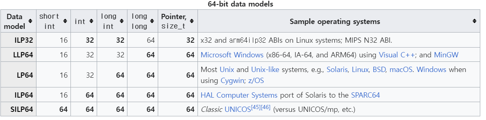
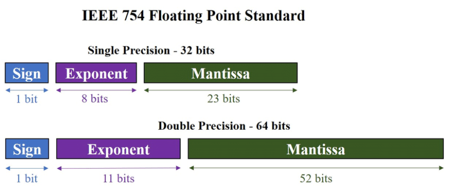

# 컴퓨터의 처리 단위

현재 가장 많이 사용되는 컴퓨터의 기본 처리 단위는 64비트다. 64비트 프로세서와 운영체제가 대중 컴퓨팅 시장에서 주류가 되었다.

인텔과 AMD의 최신 프로세서는 대부분 64비트 x86-64 아키텍처를 사용한다. 마이크로소프트 윈도우, 리눅스, macOS 등 주요 데스크톱 운영체제도 64비트 버전을 주력으로 사용한다.

고성능 컴퓨팅이 필요한 서버와 워크스테이션에서는 64비트 프로세서와 운영체제가 표준이다.

최신 스마트폰, 태블릿에 사용되는 ARM 프로세서(Snapdragon, Apple 실리콘, 엑시노스 등)는 64비트 AArch64 아키텍처를 기반으로 한다.

고성능 요구사항이 있는 임베디드 시스템에서 점점 64비트 프로세서를 채택하는 추세다.


## 64-Bit 데이터 모델



### 리눅스, macOS 에서 Data model은?

유닉스 계열 운영체제와 리눅스, macOS는 LP64 모델을 사용한다.

LP64 모델의 구조는 다음과 같다.

L: long 타입과 포인터 타입이 64비트 (8바이트)

P: 포인터 타입이 64비트

6: int 타입이 32비트 (4바이트)

4: char, short 등 작은 데이터 타입이 8비트 (1바이트)


### Window의 Data model은?

윈도우는 64비트 데이터 모델 중 LLP64 모델을 사용한다.

LLP64 모델의 구조는 다음과 같다.

- L: long 타입은 32비트(4바이트)
- L: long long 타입은 64비트(8바이트)
- P: 포인터 타입은 64비트(8바이트)
- 6: int 타입은 32비트(4바이트)
- 4: char, short 등 작은 데이터 타입은 8비트(1바이트)

이 모델에서 long long 타입만 64비트이고, 포인터와 정수 데이터 타입은 32비트를 유지하면서 메모리 주소는 64비트로 확장되었다.

LP64 모델인 Linux에서는 `long` 타입이 64비트(8바이트)이지만, LLP64 모델인 Windows에서는 `long` 타입이 32비트(4바이트)로 동작한다.

따라서, Linux와 Windows 모두에서 동작하는 프로그램을 작성할 때, `long` 타입을 사용하는 경우에는 데이터 크기에 대한 주의가 필요하다. 데이터 크기를 일관성 있게 유지하려면 `int64_t`와 같은 표준 정수 타입을 사용하는 것이 좋다.


# 부동 소수점

부동 소수점(Floating Point)은 컴퓨터에서 실수를 표현하는 표준 방식이다.

대부분의 현대 컴퓨터 시스템은 IEEE 754 표준을 따르는 부동 소수점 형식을 사용한다. 

이 표준에서는 아래 두 형식을 정의한다.

* 32비트 단정밀도(Single precision) 형식
  * 대략 7자리 10진수 정밀도를 제공
  * C에서 float 타입
* 64비트 배정밀도(double precision) 형식
  * 대략 16자리 10진수 정밀도를 제공
  * C에서 double 타입



1. **부호 비트** (Sign bit): 부호를 나타냄
   - 0이면 양수이고, 1이면 음수.
2. **지수** (Exponent): 부동소수점 수의 지수 부분
   - 지수는 바이너리 포맷에서 이진수로 표현되며, 특정 바이어스 값으로 조정됨
   - 소숫점이 몇 칸 움직일지를 나타냄 (32비트 환경에서 왼쪽 6칸 움직이면 지수값은 133을 이진수로 표현하면됨)
   - Bias와의 차이를 움직일 칸의 개수로 나타냄
3. **가수** (Mantissa): 수의 유효숫자를 나타냄.
   - 가수는 소수점 이후의 이진수로 표현됨.


### IEEE 754 표준

| 타입                    | 부호 | 지수부 | 가수부 | 총 비트수 |
| ----------------------- | ---- | ------ | ------ | --------- |
| Half precision (fp16)   | 1    | 5      | 10     | 16        |
| Single precision (fp32) | 1    | 8      | 23     | 32        |
| Double precision        | 1    | 11     | 52     | 64        |
| x86 extended precision  | 1    | 15     | 64     | 80        |
| Quad precision          | 1    | 15     | 112    | 128       |


## 부동소수점의 정규화

부동소수점의 정규화(Normalization)는 부동소수점 수를 일관된 방식으로 표현하는 과정이다. 이를 통해 계산의 정확도와 효율성을 높일 수 있다.

32비트에서는 bias는 127이다. 배정밀도에서는 1023.


숫자 6.75를 예로 들어보겠다. 이를 부동소수점으로 정규화하면 다음과 같다. (32비트 환경임을 가정)

1. 6.75를 이진수로 표현하면 `110.11`이다. 이를 `1.1011` 로 변환하기 위해선 소숫점을 왼쪽으로 두 칸 이동한다.

2. 이를 

   `1.1011 x 2^2` 로 정규화하면:

   - 𝑠=0: 양수
- 𝑚=1011: 가수 부분
   - 𝑒=129: 지수 부분 (왼쪽두칸 + 2이므로, E-bias = E-127 = 2에서 E=129)

```
_ _______ ________ ________ ________
0 1000000 1 (지수부분 - 129를 표현)
           1011 (가수부분)
0 1000000 11011000 00000000 00000000 (최종)
```


숫자 0.1을 예로 들자면. 0.1을 이진수로 표현하면 `0.000110011...` 무한소수가된다. 이를 `1.100110011...`로 변환하기 위해 소숫점을 오른쪽으로 4칸 이동시켜야한다.

* s = 0
* m = 10011001...
* e = 123

```
_ _______ ________ ________ ________
0 0111101 1 (지수부분 - 123을 표현)
           1001100 11001100 11001100 (가수부분)
0 0111101 11001100 11001100 11001100 (최종)
```


## 지수부 값 해석

단정밀도 환경에서는

* 지수 = 0 & 가수 = 0
  * 0을 나타냄
* 지수 = 0 & 가수 != 0
  * 비정규화된 수

* 0 < 지수 < 255
  * 정규화된 값
* 가수의 정수부는 항상 1로 예측가능하여 생략되었음.
  
* 지수 = 255 & 가수 = 0
  * 무한대

* 지수 = 255 & 가수 != 0 
  * NaN (Not a Number)


## Biased Exponent

편향된 지수란 부동소수점 표현에서 실제 지수 값에 편향값(Bias)을 더한 값을 지수부에 저장하는 방식이다.

EEE 754 부동소수점 표준에서는 다음과 같이 편향값을 정의한다.

* 단정밀도(32비트) 편향값 = 127 (2^(8-1)-1)
* 배정밀도(64비트) 편향값 = 1023 (2^(11-1)-1)


# 인공지능 분야에서 부동소수점 표현

## bf16, fp16, fp32

https://arxiv.org/abs/1905.12322

https://cloud.google.com/tpu/docs/bfloat16?hl=ko

| 타입                               | 부호 | 지수부 | 가수부 | 총 비트수 |
| ---------------------------------- | ---- | ------ | ------ | --------- |
| fp16                               | 1    | 5      | 10     | 16        |
| fp32                               | 1    | 8      | 23     | 32        |
| bf16 (brain Floating Point Format) | 1    | 8      | 7      | 16        |


### fp16(Float Point 16)

- 16비트로 숫자를 표현하는 반정밀도 부동 소수점 형식
- 메모리 사용량이 fp32의 절반 수준
- 일부 연산에서 성능 저하가 있을 수 있음


### fp32(Float Point 32)

* 32비트로 숫자를 표현하는 단정밀도 부동 소수점 형식
* 정확도가 높고 범위가 넓은 만큼 메모리 사용량이 많고 계산 비용이 높음


### bf16(Brain Floating Point 16)

- 구글에서 2021년에 도입한 숫자 표현 방식
- 기존 fp16보다 동적 범위가 넓고 정확도가 높음
- 최신 GPU와 TPU에서 하드웨어 가속화 지원
- 정확도가 중요한 대규모 모델에 적합


## 학습과 추론 두 단계에서 모두 사용됨

### 학습(Training)

학습 단계에서는 대량의 데이터를 사용하여 모델의 가중치를 업데이트한다. 높은 정밀도가 중요하므로 fp32를 주로 사용한다.

bf16을 사용하면 메모리 사용량을 줄일 수 있다. fp32보다 메모리 사용량이 작지만 정밀도가 더 낮다. 모델 학습시 fp32 대비 메모리 사용량을 약 50% 줄일 수 있으며, 정확도 손실이 크지 않은 경우에 사용된다.


### 추론(Inference)

추론은 이미 학습된 모델을 사용하여 새로운 데이터에 대한 예측을 수행하는 단계이다. 일반적으로 높은 성능과 메모리 효율성이 중요하므로 bf16이나 fp16을 사용하는 것이 유리하다.


## Mixed Precision

Mixed Precision이란 딥러닝 모델의 학습 및 추론 과정에서 서로 다른 정밀도(precision)의 데이터 유형을 혼합하여 사용하는 기법을 말한다.

일부 모델은 낮은 정밀도 값으로 더 높은 정확도에 도달할 수도 있다.

일반적으로 딥러닝 모델은 32비트 부동소수점(FP32) 데이터 유형을 사용하지만, 메모리 사용량과 계산 비용이 크다. 반면에 16비트 부동소수점(FP16)은 메모리와 계산 효율이 높지만, 정확도가 낮아질 수 있다
