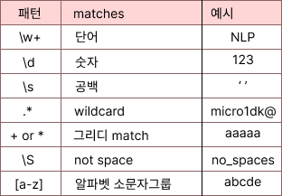

# 개요

## 자연언어

자연언어(Natural Language)는 사람들이 일상적으로 사용하는 언어로, 사회적/문호적 맥락에서 발전하고 사용되는 언어를 말한다.  자연언어는 사람들 간의 의사소통과 정보 전달을 위해 사용되며, 언어의 발화, 문장, 문서 등 다양한 형태로 표현될 수 있다.

흥미로운 NLP의 영역은 NLP 영역은 주제 식별, 챗봇, 텍스트 분류, 번역, 감정 분석등이다.

## 정규 표현식 Regular Expression

정규 표현식을 사용하면 특정 규칙이 있는 텍스트 데이터를 빠르게 정제할 수 있다. 

정규식을 사용하여 웹 페이지에서 링크 찾기, 전자 메일 주소 구문 분석, 원하지 않는 문자열 또는 문자 제거 등의 작업을 수행할 수 있다. 

정규 표현식은 **regex**라고 하며 python의 **re** 라이브러리를 통해 사용한다.

가장 많이 사용하는 유형이다.  다음은 python에서 제공하는 re 모듈 함수이다.

* `re.split(pattern, string)`
  * 문자열을 분할하는 역할을 한다. 
  * 정규 표현식 패턴을 기준으로 문자열을 분리하고, 분리된 부분을 리스트로 반환한다.
* `re.findall(pattern, string)`
  - 문자열에서 패턴과 일치하는 모든 부분을 찾아 리스트로 반환한다.
  - 일치하는 모든 부분을 리스트로 반환하며, 각 일치하는 부분은 문자열의 순서에 따라 리스트에 포함된다.
* `re.match(pattern, string)`
  - 주어진 문자열의 시작 부분에서 패턴과 일치하는지 검사한다
  - 일치하는 패턴이 문자열의 시작에 있으면 `Match` 객체를 반환하고, 일치하지 않으면 `None`을 반환한다.
* `re.search(pattern, string)`
  - 문자열 전체에서 패턴과 일치하는 첫 번째 부분을 검색한다.
  - 일치하는 패턴을 찾으면 `Match` 객체를 반환하고, 일치하지 않으면 `None`을 반환한다.