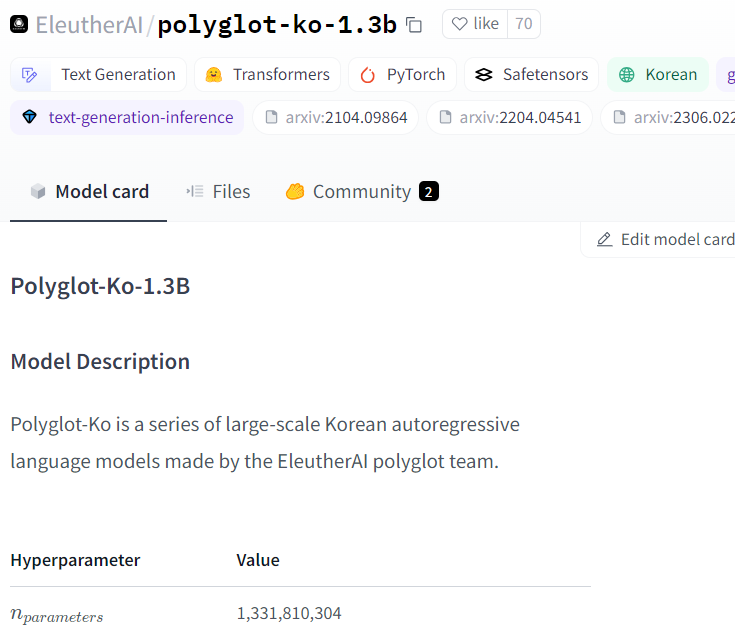
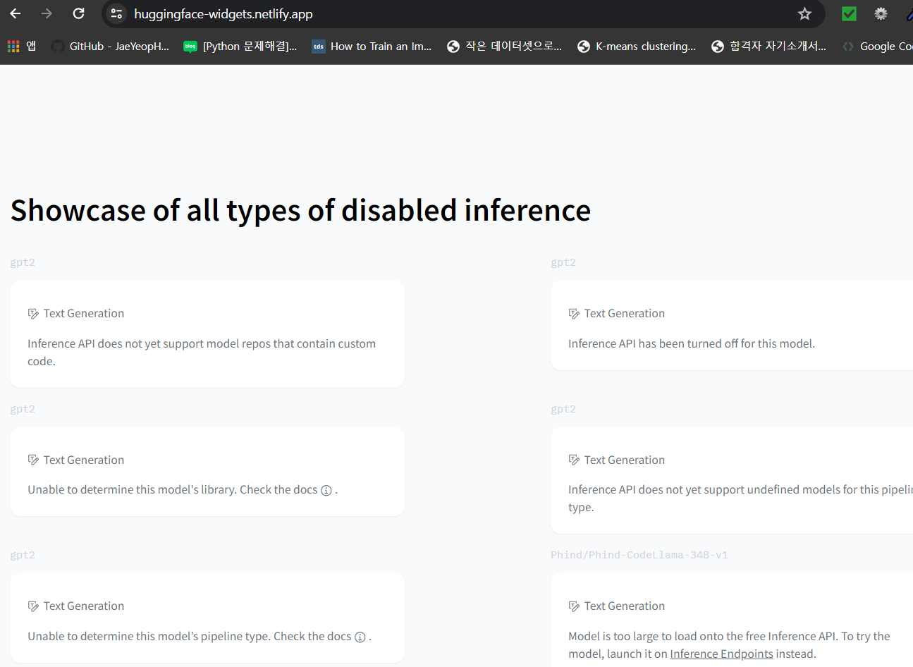

# 🤗Huggingface	

허깅페이스는 크게 라이브러리와 허브로 구성된다. 

* 라이브러리 - 코드를 제공
* 허브 - 사전 훈련된 모델 가중치, 데이터셋, 평가지표를 위한 스크립트

## 🤗 허브

### 모델카드, 데이터셋 카드

허브는 모델과 데이터셋 내용을 문서화한 모델카드와 데이터셋 카드를 제공한다. 자신에게 적합한지 여부를 결정하는데 도움이 된다.

### Widget

허브는 다양한 작업에서 인터액티브한 위젯을 통해 모델을 직접 테스트하는 기능이 있다. 

## 🤗 토크나이저

🤗토크나이저는 다양한 토큰화 전략을 제공한다. 러스트 백엔드 덕분에 텍스트 토큰화가 매우 빠르다. 또한 입력을 정규화하거나 적절한 모델 출력포맷등 전처리/후처리를 제공한다. 

## 🤗 데이터셋

🤗은 데이터셋을 로드/처리/저장하는 과정에 대한 표준 인터페이스를 제공한다.

### Memory mapping

메모리 매핑이라는 특별한 매커니즘을 활용하여 램의 메모리 부족현상을 피한다. 메모리 매핑은 파일 내용을 가상 메모리에 저장한다.

### 평가지표

🤗 데이터셋은 많은 평가 지표를 위한 스크립트를 제공하여 실험의 재현 가능성과 결과의 신뢰성을 높인다.

## 🤗 엑셀러레이트

🤗엑셀러레이트는 기계학습 모델의 훈련 과정을 더 효율적으로 관리하고 가속화하기 위해 설계된 라이브러리이다. 🤗 엑셀러레이트는 사용자 정의 로직을 처리하는 일반적인 훈련 루프에 필요한 추상화 층을 추가한다.

### 다양한 컴퓨팅 환경에서 사용

이 라이브러리는 복잡한 훈련 루프를 단순화하여 개발자가 다양한 컴퓨팅 환경에서 쉽게 모델을 훈련시킬 수 있도록 돕는다. 사용자가 CPU, GPU, 또는 TPU 등 어떤 하드웨어에서 훈련을 진행하더라도 코드 변경 없이 최적화된 훈련이 가능하도록 지원한다.

## 트랜스포머의 주요 도전과제

### 언어

다중언어(multilingual) 트랜스포머와 제로샷교차언어전이 (zero-shot cross-lingual transfer)를 수행해야 할 땐?

### 데이터 가용성

레이블링된 데이터가 없거나 소량인 경우는 어떻게 해야하나?

### 긴 문서 처리

텍스트의 길이와 비용은 비례관계다. 이를 완화하는 방법은?

### 불투명성

모델이 그렇게 예측한 이유를 설명해라고 할 때는? 트랜스 포머 모델의 오류를 조사하는 방법은?

### 편향

트랜스포머 모델은 주로 인터넷의 텍스트 데이터를 사용해 사전훈련을 한다. 이런 데이터에 있는 편향이 고스란히 전이된다. 인종차별, 성차별, 정치 .. 이런 문제를 완화하는 방법은?

