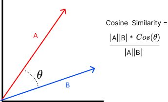

# Word Embedding

Word Embedding은 단어를 고정된 크기의 실수 벡터로 표현하는 방법이다. 이러한 표현은 단어의 의미와 관련성을 반영하고, 단어 간의 유사성을 측정할 수 있도록 도와준다.

기존의 텍스트 데이터는 기계 학습 모델에 직접 입력할 수 없으며, 숫자 형태로 변환해야 한다. 이때 단어 Embedding은 텍스트 데이터를 수치형으로 표현하는 중요한 단계이다. Word Embedding을 사용하면 단어가 수치적으로 표현되므로, 기계 학습 모델은 단어를 이해하고 처리할 수 있다.

Word Embedding의 주요 특징은

* **의미반영**

  비슷한 의미를 가진 단어들은 벡터 공간에서 가까이 위치한다. 예를들어 "king - man + woman"과 같은 연산을 수행하면 "queen"과 같은 유사한 벡터를 얻는다.

* **차원축소**

  이전의 원핫 인코딩 방식보다 훨씬 낮은 차원으로 단어를 표현할 수 있다. 메모리에서 이득을 본다.

* **유연한 표현**

  단어 간의 관련성을 반영할 수 있다.

## 유사도 측정

### Cosine similarity

코사인 유사도는 두 벡터 사이의 각도를 측정하여 유사성을 계산한다. 

코사인의 특징

* 90도일 때 = cos(0) = 1   A와 B는 완전히 일치
* 0도 일때 = cos(90) = 0   A와 B는 전혀 관계없음

