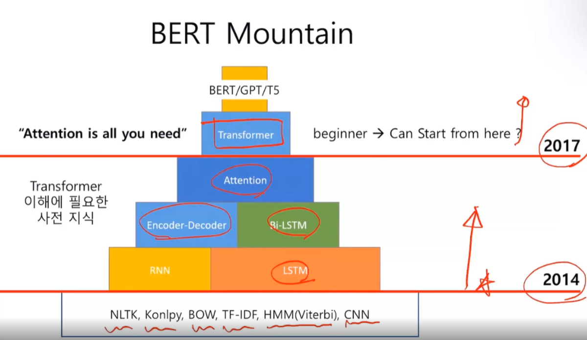
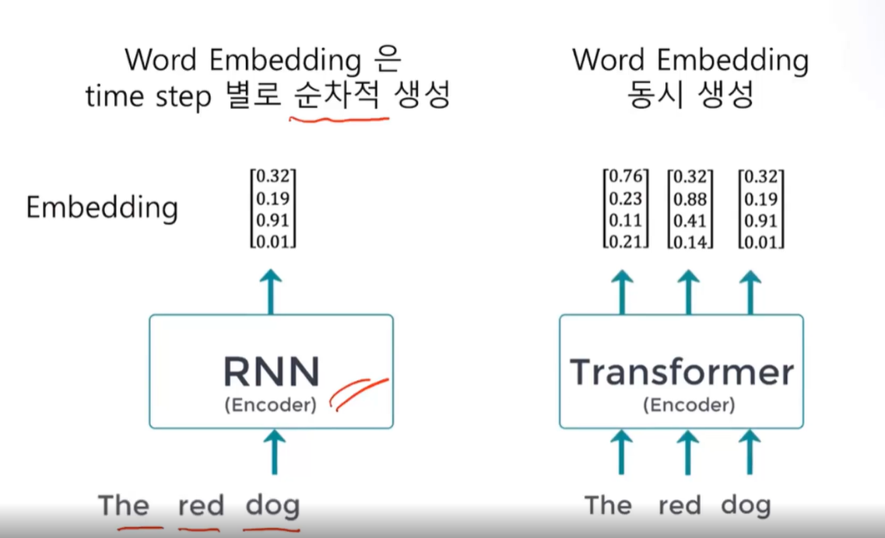
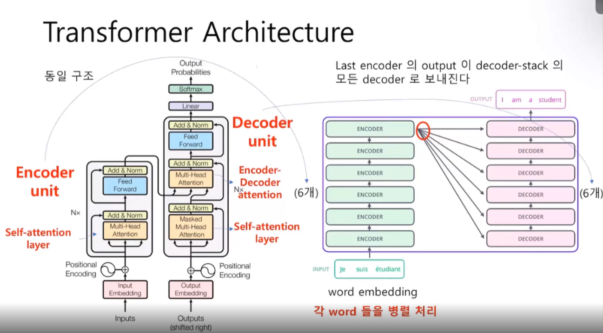
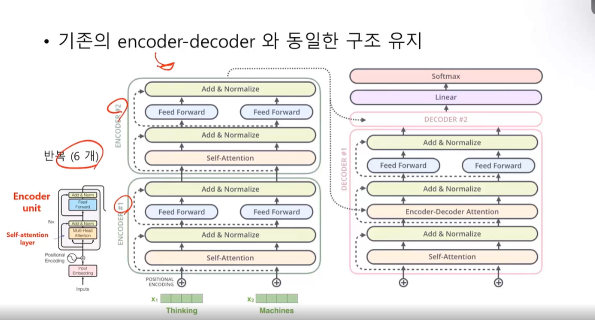

# Transformers

현대 딥러닝의 획을 그은 기념비적인 **Model**

구글에서 발표한 인공지능 모델이다.

최근의 NLP 발전과정을 보자면

* 2014 - RNN 기반 seq-to-seq 모델(인코더디코더) (조현경)
* 2015 - Attention Mechanism 발표
* 2017 - **Transformer** 구글에서 발표했다. 현대 모델은 Transformer에 기반을 두고 있다. (**RNN을 사용하지 않음**) 모두 Dense 모델로 이루어짐. **"Attention is all you need"**
* 2018.2 - ELMo (Embedding from Language Models - **마지막의 RNN 모델**) 처음으로 전이학습을 염두해두고 만든 모델이다. 임베딩 잘만들어놓을 테니 쓸사람은 이걸로 튜닝해서 써라. 얼마못감 4개월 천하
* 2018.6 - OpenAI회사의 GPT 모델 (Generative Pre-Training) 구글 딥마인드와 쌍벽을 이루는 회사. 트랜스포머 모델을 사용함. 얼마못감 5개월 천하
* 2018.11 - Google의 BERT 모델. 트랜스포머를 기반으로 만듬. SOTA (state of the art)라고 그때 까지의 최첨단 기록을 다 갈아치움.
* 2019.2 - OpenAI의 GPT-2 모델. BERT의 기록을 갈아치움
* 2019.6 - Google의 XLNet (extra-long version of BERT) bert의 확장판
* 2019.11 - Google의 T5
* 2020.5 - OpenAI의 GPT-3 - 1750억 개의 parameter size. SOTA를 갈아치운것이아니라 전 세계를 뒤 흔듬
* 2021.1 - Switch Transformer (예고) - 1.6조개의 parameter size. 

대용량의 모델을 추구하는 방향으로 가고있음. 모든 연구의 중심이 (자연어처리에서) 새로운 모델에 대한 연구는 큰 기업에서 만드는 방향으로 가고있음.

### RNN부터 차근차근 배워야하는 이유

처음엔 나만의 고유모델을 만들어보면서 개념을 이해하자. 이후 전이학습시대로 넘어가자.  

Transformer부터는 전이학습 모델이된다. 수십억개의 데이터로 학습된 모델의 성능을 우리는 능가할 수 없다. 따라서 우리가 가져다가 튜닝해야한다. 

RNN에 기초한 테크닉을 알아야 논문을 볼 수 있다. 자연어처리의 테크닉을 알아야함.

처음에 Transformer부터 배우면 되지않느냐할 수 있는데, 트랜스포머의 개념을 이해하기 위해서는 처음부터 하는 것이 좋다.  동작원리를 공부하기 위해서는 공부해보는 것도 나쁘진 않다.

하지만 정답은 없다. 성과를 내기위해서는 바로 트랜스포머부터 시작하면된다.

## LSTM을 이용한 NLP network의 한계

**Very Long Gradient Path**

LSTM도 기울기소실을 개선했다고 하지만 여전히 문제가 발생

100개 단어로 구성된 문장의 LSTM 처리는 100-layer network 깊이에 해당하므로 ..

LSTM 은 게이트마다 sigmoid, tanh가 들어간다.

**Tranfer Learning** 을 하기 어려움

전이학습이 어렵다. 그때그때 만들어야함

**특정 Task마다 별도로 label된 dataset이 필요**

감성분석, 챗봇, 품사태깅. 이런데이터의 별도 레이블이 필요함. 

**RNN은 time step 순으로 순차처리하므로 GPU를 완전히 활용못함**

## Transformer Model의 특징

RNN 또는 CNN을 이용하여 sequence-align 하지 않은 최초의 **self-attention model**

다 필요없고 Attention 만 있으면된다.

* 기존의 **encoder-decoder** 구조 유지 - 논문에서는 인코더디코더 모델을 안다는 전제하에 작성된것이 많다.
* **RNN을 제거**하면서 병렬처리가 가능해진다. (GPU 효율 극대화)
  * Matrix 연산으로 엄청난 데이터를 처리

RNN을 없애면서 3개의 time stamp를 동시에 처리한다. 대신 구조가 복잡해짐

인코더 디코더 방식이며, RNN LSTM만 사용하지 않았다. BERT GPT들에서 Transformer의 인코더부분으로 만든것이 BERT이다. 디코더는 안썼다.

그리고 디코더부분으로 만든것이 GPT1,2,3이다. 

Transformer는 구글에서 만들었다. 구글에서는 인코더부분에서 OpenAI는 디코더부분을 많이 사용함

I LOVE U 인풋으로 받으면, 이것을 인코딩해서 문맥벡터를 만들어서 디코더에 넘겨줌. 디코더에서 이것의 함축적인 의미를 파헤침

* **인코더는** 의미파악부분. BERT 계열의 모델들은 문장의 의미파악을 굉장히 잘한다.
* **디코더는** 문장해석부분. GPT 계열은 문장을 기막히게 잘쓴다. 글을 인간보다 더 잘쓴다.

트랜스포머는 엔코더 디코더의 층을 쌓을 수 있는 구조로 만들어져있다.

그림에서는 인코더 디코더 6개를 사용해서 만들었다. 이는 하드웨어만 서포드된다면 엄청나게 큰 모델을 만들 수 있다. GPT는 작은모델은 12개 큰 모델은 24개를 쌓는다. 이들을 채워줄 초대량의 데이터를 처리할 수 있다.

인코더의 **Self attension** 1개 디코더에서 2개가 있다.

기존의 인코더-디코더 와 동일한 구조를 유지한다. 모든 언어모델은 Embedding 레이어부터 시작한다.

### Positional Encoding

rnn이 없어지고 이것이 생겼다. RNN은 순서데이터를 처리하기 위해 만들어진 모델이다. 그렇기 때문에 처음에 들어온 데이터가 히든스테이트와 합쳐저서 새로운 기억이 만들어지고. 그 기억과 다음데이터를 합쳐서 새로운 기억이 만들어진다. (순차적 반복) 자동적으로 단어의 위치정보가 인식된다.

그런데 RNN을 없애버리니. 모든 단어가 동시에 입력되면 어떤게 먼저들어오는지 모르기 때문에 순서가 흐트러진다. 그래서 순서정보를 주입하는 과정이 Positional Encoding이다.

### Self Attension

### Add & Normalize

Selft Attension의 출력과 입력 단어의 정보를 섞어서 정규화하는 과정이다. Add 했기 때문에 원래의 데이터를 잊지 않는다.

Resnet 구조와 동일한 구조다. Resnet은 현재의 정보를 잊어먹지 않게하기위해 만들어졌다.

### Feed Forward

학습이된다. 가중치가 있음

### Softmax

softmax를 통과하여 확률분포를 만들고 정답과 비교한다.

