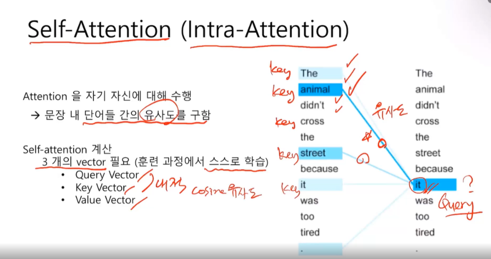
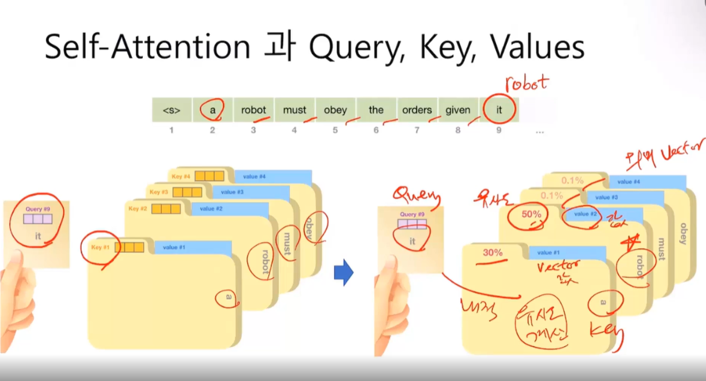
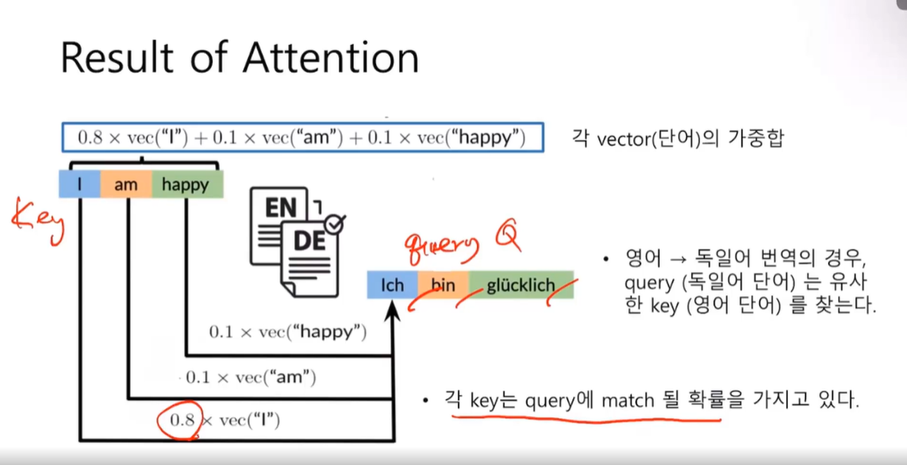

# Self-Attention (Intra-Attention) 

Attention을 자기 자신에 대해 수행

문장 내 단어들 간의 유사도를 구함

it이라는것이 무엇을 의미하냐? 기계가 어떻게 알 수 있을까? 그 방법을 찾은 것이 Self-Attention이다.

얼마나 vector공간에서 가깝게 있는지. animal이 가장큰 값, street이 두번째로 큰 값. 따라서 저 it은 animal이구나라고 판단함. it이 무엇인지 알았기 때문에 번역의 품질이 올라감

* 쿼리 벡터 (오른쪽 it)
* 키 벡터 (왼쪽)
* 밸류 벡터

역전파와 경사하강법에 의해 학습한다. Query- key -value

질의한다. it이 query다. query가 각 key에 물어본다. Query 벡터와 Key 벡터의 내적을 구한다. (Cosine 유사도)

it이 robot이구나. 사람은 아는데 기계는 어떻게 아느냐? 내적을 통해 비교를 해본다. Robot이 제일큰 값으로 50%가 나왔다.

그렇다면 값은 무엇을 가져와야하느냐? 그에 해당되는 value vector를 가져오도록 구성되어있다. 

Query key는 유사도를 측정할 때 사용하는 벡터.

Value는 실제의미. 키가 가지고 있는 의미벡터를 간직하고 있다.

영문 -> 독일어 번역모델에서 영어는 key, 독일어는 query가 된다.

