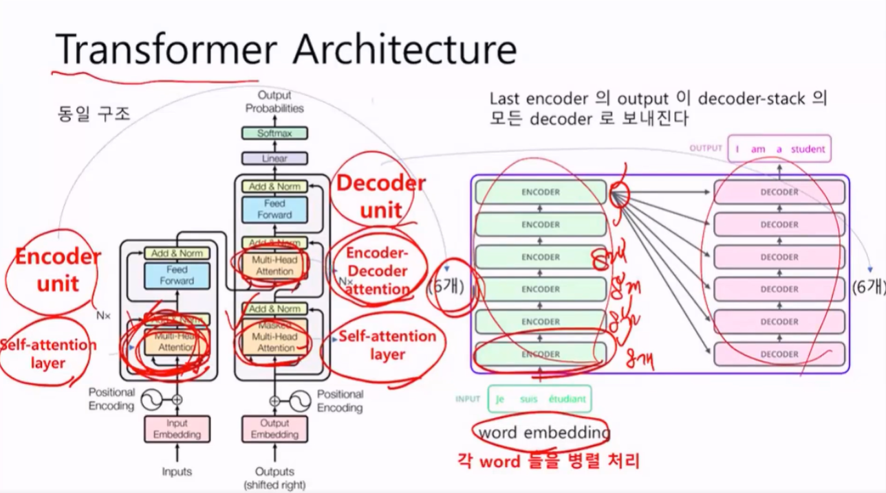

# Self Attention 계산

## 1단계

Q, K, V vector ()

(10000, 512) Embedding 매트릭스를 만든다.

가중치 행렬 Q, K, V을 만들고 가중치를 Dot연산해서 통과시킨다.

Q_student, K_student, V_student = 훈련과정에서 학습된다.


simple하다. Dense Layer만 구성된다.

Transformer에서는 512를 64차 8개로 나눈다.  그 뒤 8개의 평균을 낸다. 하나로하는 것보다 정확할 수 있다.


## 2단계

Q_student, K_student, V_student을 만들어서 스코어링을 해야함.


모든 K_vector에 대하여 attention score를 구해야함

처음. Query가 I다. 쿼리와  K.Transpose()를 연산하여 Attention Score를 구할 수 있다.

내적의 값이 크면클수록 비슷한 값이다. 트랜스포머에서는 스케일링을한다. `q k / sqrt(n)`

왜 스케일링하냐면 나중에 소프트맥스를 통과해야하는데, 분모에 지수Sum부분이 매우큰 값이되면 0에 수렴하기 때문임


## 3단계 4단계

softmax로 Attention의 확률분포를 구한 후


softmax 분포를 구하고 가중합을 구함.


## All in one


## 일괄처리


## 공식 Scaled dot product attention formula

```
Attention(Q, K, V) = softmax(QK.Transpose()/sqrt(d_k))V
```


## Multi-Head Attention

아까 8개로 나눈다고했다. 그 이유를 설명함.


입력행렬 크기와 결과행렬(concat 한)의 크기는 동일하다.

다시 계산하자면

(seq_len, d_model)  dot (d_model, d_model) = (seq_len, d_model)

입력크기 = 출력크기. 크기가 유지되어야 다음 인코더의 입려그로 이용가능



인코더가 6층이니.  각 인코더마다 8개로 나누어지고 합쳐져서 입력과 같은 크기가 되었다가.  다시 다음 인코더로 넘어가서 입력이되고.. 이것이 6번 반복되는 셈이다.

하나의 인코더에는 num_heads(8)개 만큼의 가중치가 있다. 48개의 가중치 행렬이 생성이 되어있다.


BERT 모델에서는 차원이 768차원을 사용한다. head는 12개 (12 X 64)