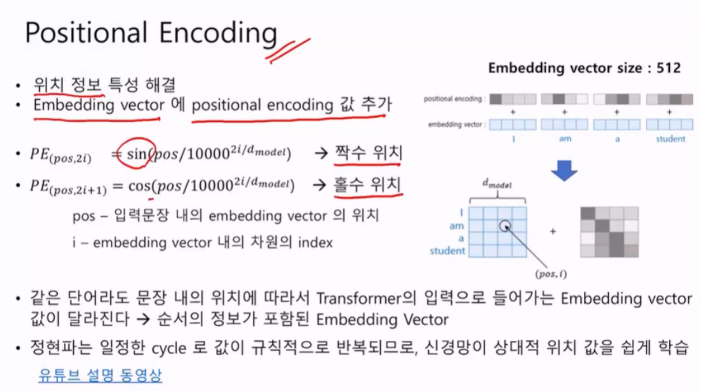
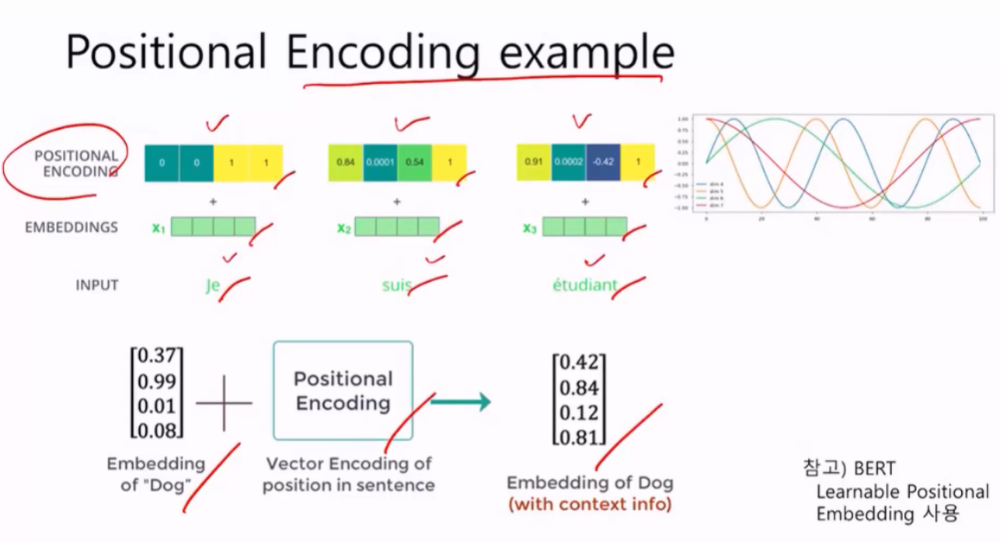
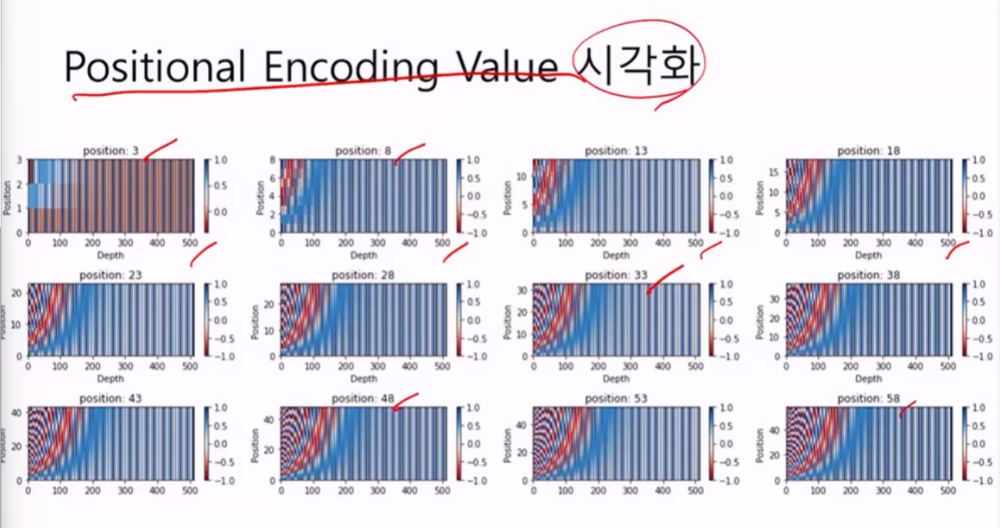

# Positional Encoding

RNN을 없애면서 대용량의 데이터를 빠른시간내 훈련하는 방법은 찾았지만.. Position 정보가 없어지면서 엔지니어들이 고민에 빠졌다. 

* 위치 정보 특성 해결
* Embedding vector에 positional encoding 값 추가
* 짝수위치와 홀수위치 = 사인파, 코사인파
* 값이 엇갈리게됨.

다음 시각화를 해보면

position 마다 vector값이 다르다. 이런 값들을 섞어준다. 패턴정보를 해석하는 것은 딥러닝은 전문이기 때문에 위치정보를 알 수 있다.

