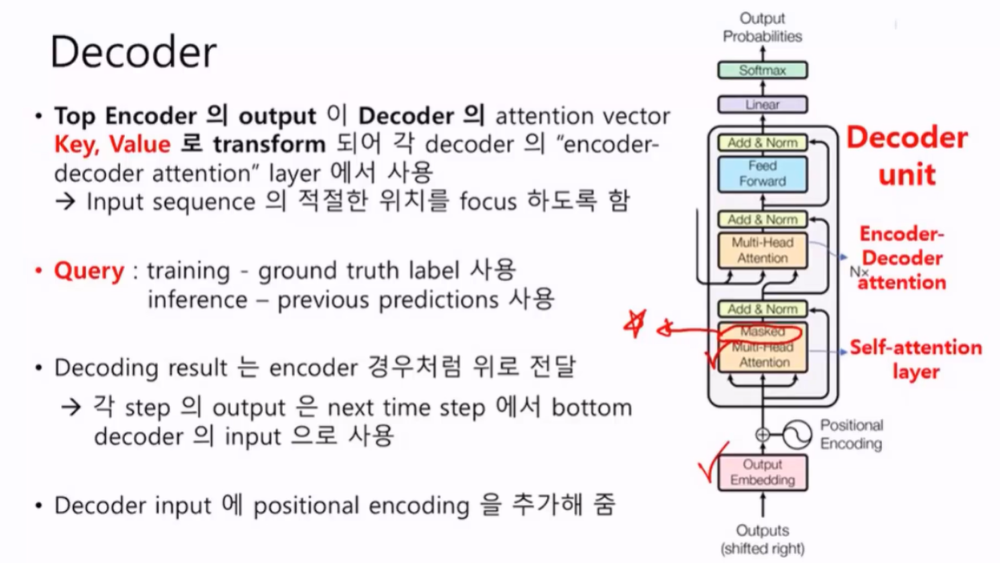
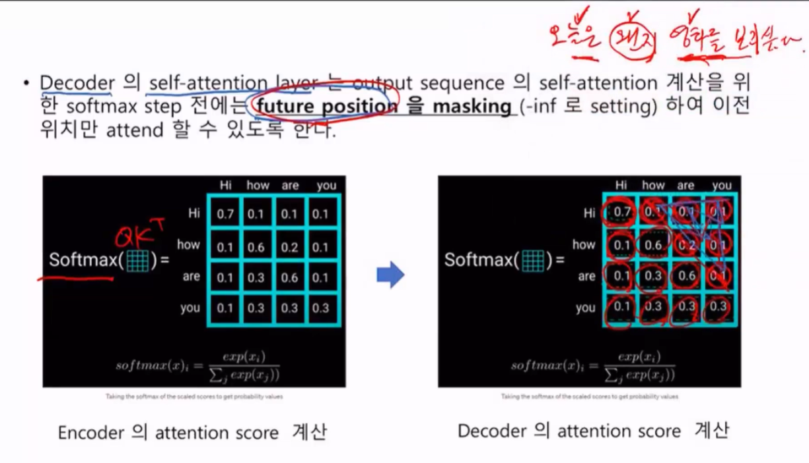
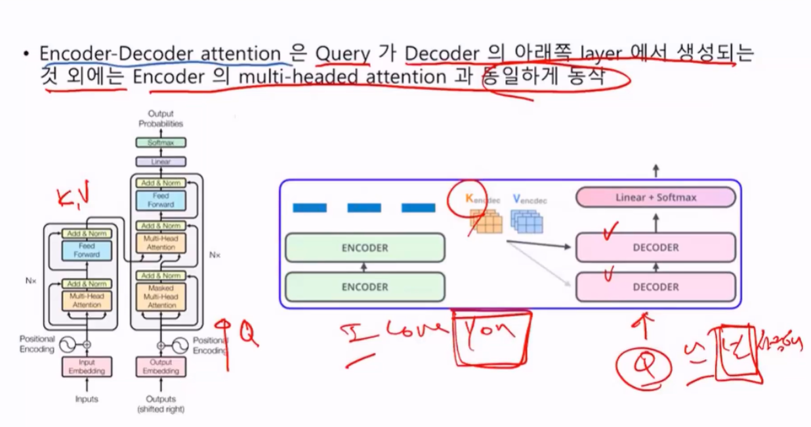
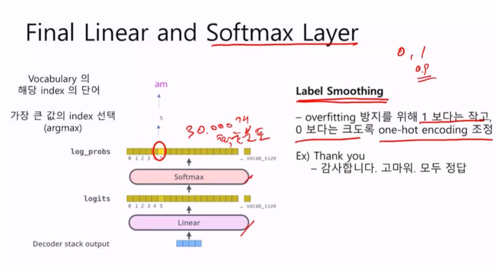

# Decoder

Masked Self attention, Multi-head Attention 빼고는 Encoder와 흡사하다.

인코더는 key, Value vector를 디코더에 공급해주는 역할을 한다. (RNN에서는 thought vector를 넘겨주었다. 같은 구조)

I love you의 key, value vector가 디코더에 넘어간다.

I [k,v ] love[k,v] you[k,v]의 벡터가 생겼다.

디코더의 정답으로 "난, 널, 사랑해"  이것이 Query가 된다.

난(Q) 과 어떤것이 비슷한가? 

* Query
  * Training - ground truth label 사용 (Teacher Forcing)
  * inference - previous predictions 사용

디코딩 결과도 encoding과 마찬가지로 위로 전달한다.

디코더도 input에 positional encoding을 추가해준다.

## Masked Self Attention

"오늘은 왠지 영화를 보고싶다." 문장이 있다.

인코더에서는 각각의 단어에 대해 서로가 어느만큼 상관관계가 있는지 쿼리와 키벡터를 내적한다.

디코더쪽에서는 앞에나오는 단어를 가지고 다음 단어를 예측하게 되는데 (Teacher Forcing은 정답) (뒤에 머가나올지 알면안됨 사실) 

그림의 빨간부분에서 처음엔 HI밖에 못봄. how에는 HI하고 HOw하고 두 부분, Are 가나오면 3부분을 볼수있고. you가 나오면 못 보고..

디코더는 Text generation역할이기 때문에 뒤에 뭐가나올지 볼 수 없다.

따라서 보지못하는 뒷부분은 -inf 값을 넣어준다. 그렇게되면 softmax를 통과하면 값은 0이된다.

"널"과 I LOVE YOU의 각 키값을 비교해보니 YOU가 유사도가 높았다. "널"을 할때 you를 attention을 한다.

언어모델에서는 Label Smoothing 고급기술을 사용한다. 그렇게 논문에나온다.