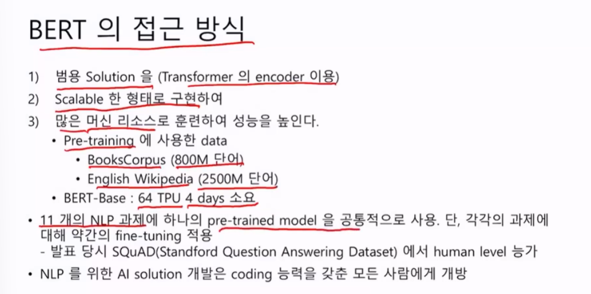
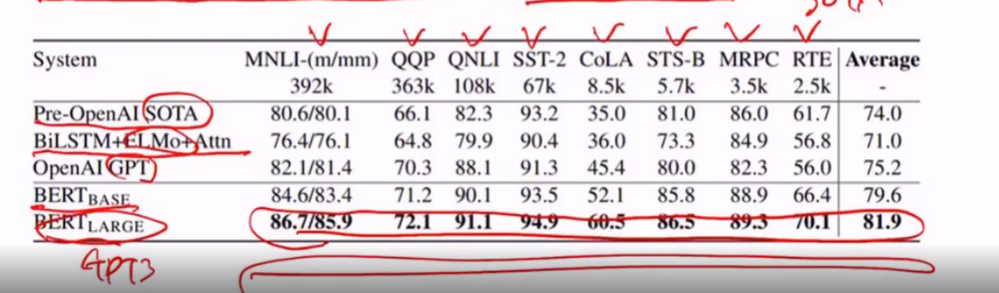
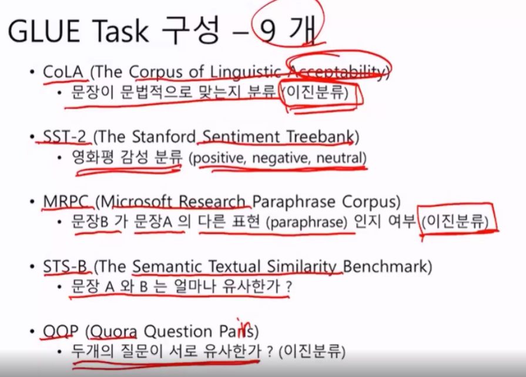
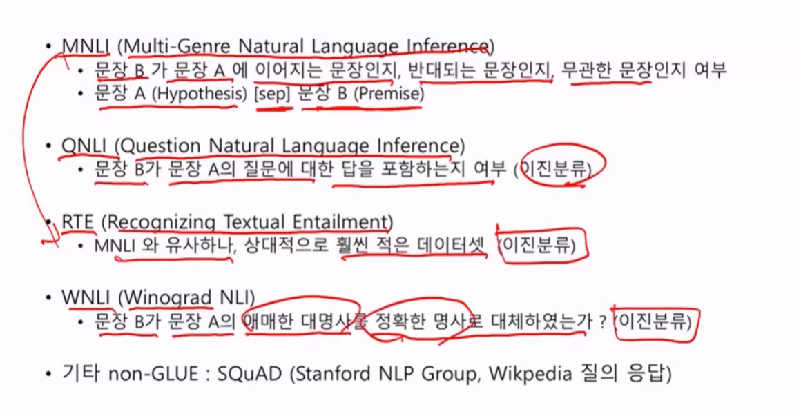
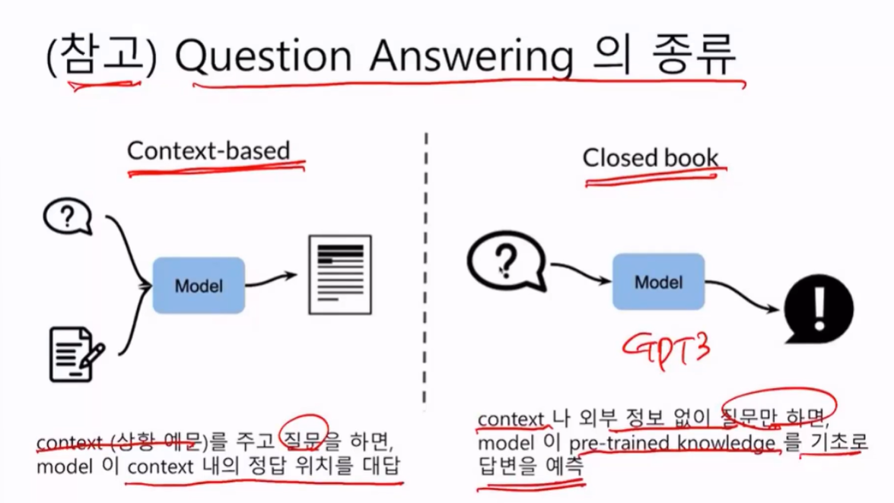

# Bert

* 18년에 발표.
  * 104개 multi-language model 동시 발표. 수십년동안 했던 한글 형태소 번역기보다 성능이 뛰어남. 즉 도메인 지식이 필요없다.
  * ALBERT, RoBERTA, TinyBERT, DistilBERT, and SpanBERT 등 다양한 변종
* 질의 응답 시스템, 감성분석등의 다양한 GLUE task 에서 SOTA 달성
* Pre-trained token embedding (WordPiece) 사용
  * 30000(영문 version), 11만개의 subwords 104개국어 버전
* BERT-Base Model: Transformer layer 12개, Total parameters 110M
* BERT-Large model: Transformer layer 24개, Toltal parameters 340M

## 접근 방식

범용 Solution을

Scalable 한 형태로 구현

많은 머신 리소스로 훈련하여 성능을 높인다.

Pre training에 사용한 data

BERT-Base : 64 TPU (TPU는 구글 클라우드컴퓨터에서 사용하는 단어이며, 주문형 반도체다. Tensorflow에 최적화됨)

마지막 줄이 주요하다.

코딩능력만 갖추면 모든사람에게 개방되었다. 이제는 

## BERT 전략

Pre-training이 BERT를 만들때

* 비지도 지도학습. 사람이 레이블을 지정하지 않았지만 알고리즘은 지도학습이다.
* 대규모 corpus 사용한다. 8억개의 단어(Book Corpus) 25억개(English Wikipedia)의 단어
* 대규모 Resource 사용한다.

Fine-Tuning은 사용할 때이다.

* 다양한 downstream NLP task에 적용 (하나하나 )
* MNLI
* Name Entity Recongnition (개체인식)
* SQuAD (질의응답)

## BERT 적용범위

그렇다면 BERT가 만능이냐? 그렇지 않다.

모든 NLP 문제에는 적용되지 않아.

### 잘하는 것

Calssification 분류문제,

NER: Many to Many Case

품사태깅 (POS Tagging): Many to Many Case

Question Answering

즉 문맥의 의미 이해가 필요하는 것들. 이것이 인코더가 잘하는것

### 잘 못하는것

Language Model (next word): 이건 디코더가 하는일이다. 

Text Generation: 텍스트 생성 이것도 디코더가 하는일

Translation: Transformer가 잘하는 일

## 성능측정 - GLUE Benchmark

General Language Understaning Evaluation 는 한 개의 자연어 처리 모델에 대해 여러 태스크들을 훈련시키고, 그 성능을 평가 및 비교 분석하기 위한 데이터 셋들로 구성

모델들의 자연어 이해 능력을 평가하기 위해 다양하고 해결하기 어려운 9개 Task Dataset으로 구성

BERT와 같은 전이학습 모델들을 평가하기 위한 **필수적인 벤치마크**

이 벤치마크에서 SOTA를 찍었다는 건데. 

## 9개의 GLUE Task 구성

## Question Answering의 종류

GPT3가 Closed book