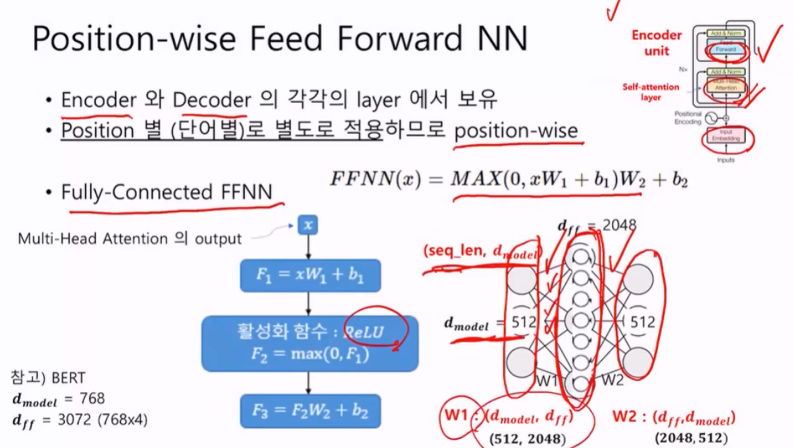
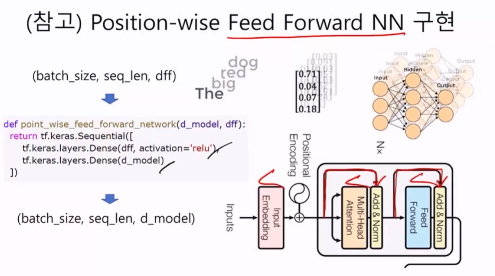
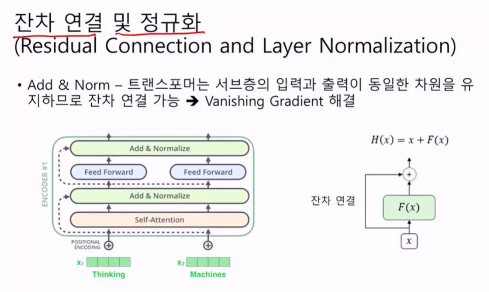
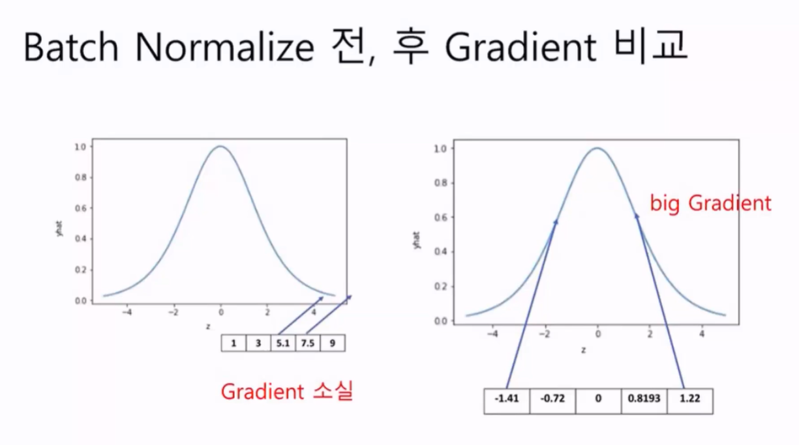
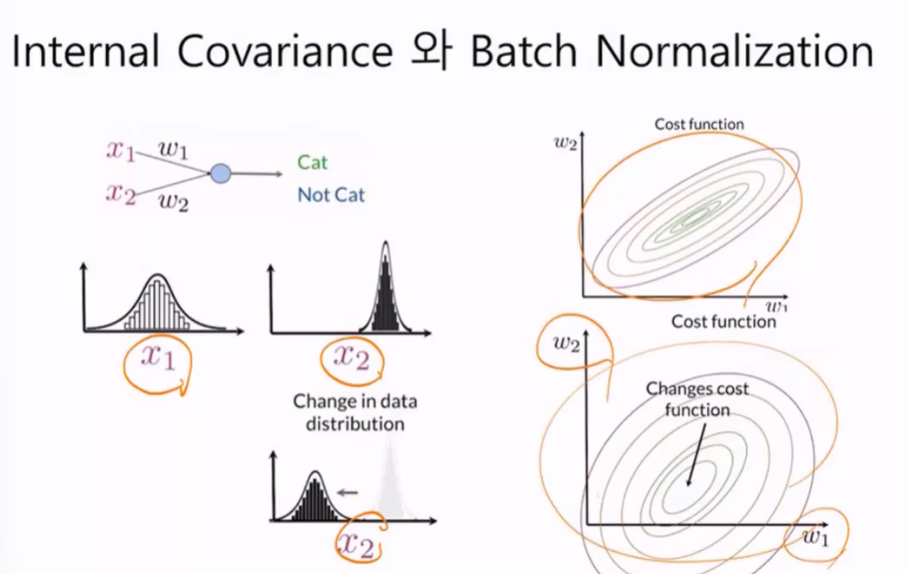
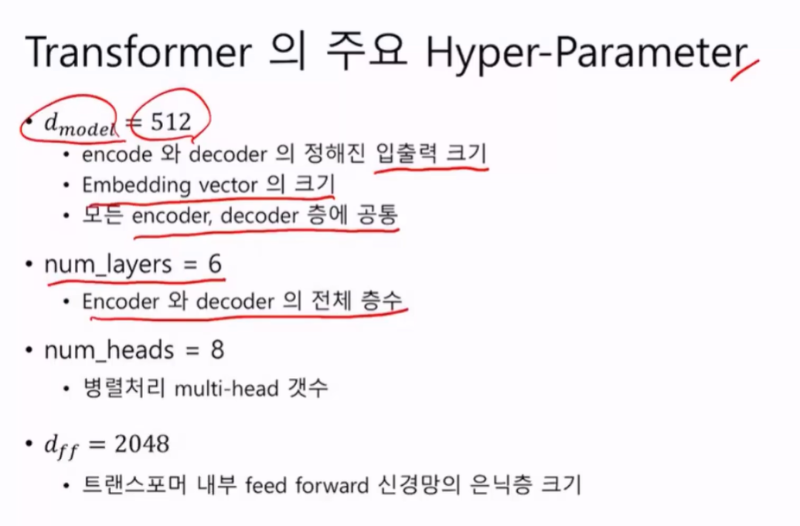

# Position-wse Feed Forward NN

인코더와 디코더의 각각의 Layer에서 보유.

position 별 단어 별로 별도로 적용한다.

전결합 Dense로 구성되있음. ReLU를 적용함.

## Resnet

컴퓨터비전쪽에서 나왔다 이 개념을 적용한다. Network 가 깊어질수록 원래의 입력을 잊어서, 경사하강법 적용하려면 미분의 기울기가 나와야하는데 기울기가 소실되는 문제를 해결

원래의 input값을 더해줘.. 역전파과저에서는 F(x) 부분만 이용하는 것이다.

## Batch Normalization

### Internel Covariance Shift

* 네트워크의 각 층이나 Activation 마다 input의 분포가 달라지는 현상
* 최초 Input Layer의 normalization 효과가 Hidden Layer를 거치면서 희석된다.

각 층의 Input의 distribution을 평균을 0, 표준편차가 1인 input으로 normalize 한다. = 표준 정규분포

층을 통과하면 할수록 데이터들이 한쪽으로 쏠린다. 이렇게되면 w1과 w2를 시각화 해쓸 때 찌그러지면 경사하강법에서 경사찾기가 힘들다. 따라서 아래 그림처럼 동그란형태의 분포를 만들어줄 수 있어야함.

이렇게되면 훈련이 쉽다!!

구글엔지니어들이 6개가 제일 낫더라.. 