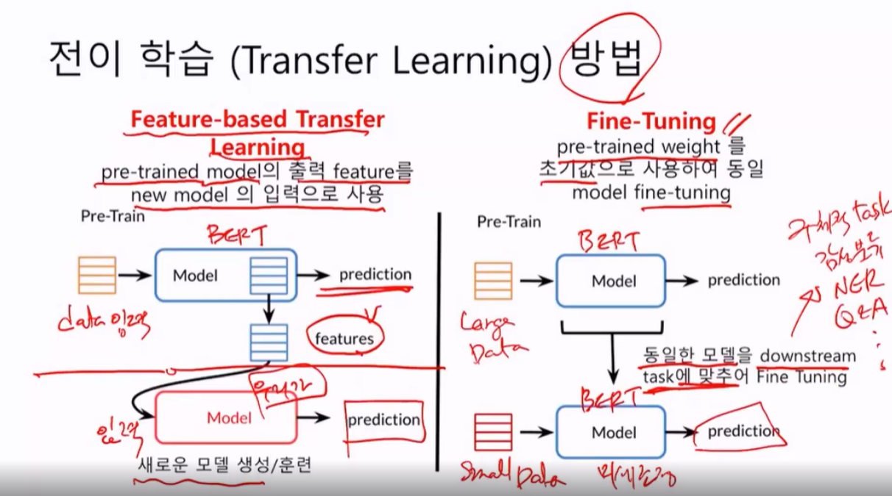
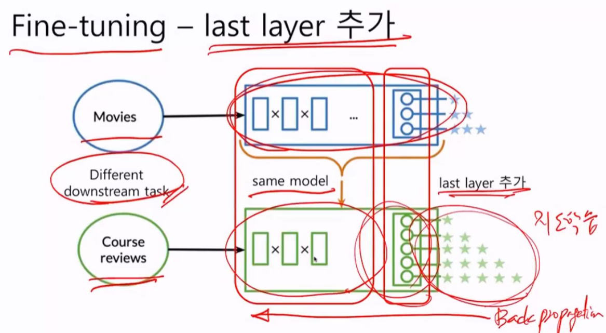
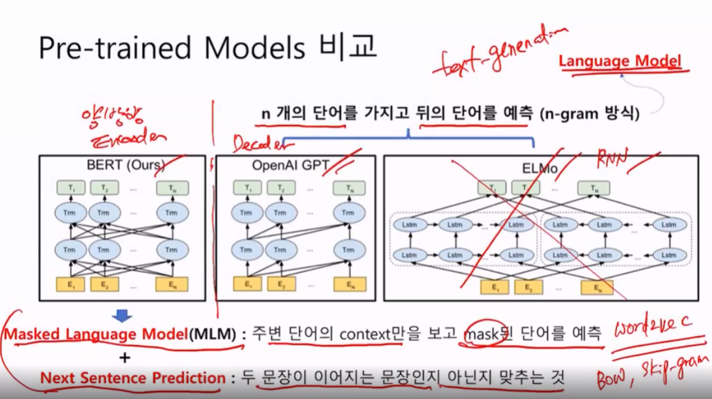

# Transfer Learning

GPT BERT는 전이학습을 염두해두고 처음부터 만듬

이 모델들은 수십억의 비용이들며 2~3달 개발

전이학습으로 **Small Dataset**으로 첨단 performance를 구현할 수 있다.

## Transfer Learning 방법

### Feature-based Transfer Learning

pre-trained model의 출력 feature를 new model의 입력으로 사용한다.

새로운 독립적인 모델을 만드는 방법이다.

### Fine-Tuning

pre-trained weight를 초기값으로 사용하여 동일 model fine-tuning

미세조정 방법이다. 

Large Data셋으로 만들어졌다면

Small Data셋을 넣어서 이미 훈련받은 모델을 미세조정하는 것이다.

downstream? 구체적 Task.. 감성분류 NER QNA

우리는 FIne-Tuning을 집중적으로 파고들것이다.

## Fine-tuning 방법 - last layer 추가

## 이점

BERT에는 이미 우리 언어의 많은 것이 **인코딩** 되어있다. 따라서

* 빠른 개발
* 필요한 데이터 감소
* 더 나은 결과를 얻을 수 있음

## 단점

* Large size
* Slow fine-tuning
* Slow inferencing
* 특정 domain 에 특화된 단어를 모름

BERT의 스펙은..

| Layer                           | Weights             |
| ------------------------------- | ------------------- |
| Embedding Layer                 | ~24M                |
| Transformers (x 12 인코더 블록) | ~7M ea. x 12 = ~85M |
| TOTAL is                        | ~109M (417MB)       |

너무커..

## Pre-trained Models 과의 비교

ELMo가 마지막 RNN모델인데. 처음에 아예 큰 모델을 만듬

미리 만들어놓은 모델을 FIne Tuning새서 써라가 최근 트렌드

GPT와 ELMo Language 모델 방식이다. n개의 단어를 가지고 뒤의 단어를 예측한다 (n -gram 방식)

BERT는 양방향으로 앞뒤를 다보는 방식이다. 변형된 랭귀지모델 mask 랭귀지 모델이라한다.

BERT는 양방향 인코더, GPT는 디코더

Maksed Language Model (MLM) 주변 단어의 context만을 보고 mask된 단어를 예측 => 지도학습이냐라고 물어본다면. 문장 중간에 마스킹해서 가리고 가린단어를 맞추는 지도학습이라 할 수 있다.

또 Word2Vec을 훈련시켰을 때 방식하고 비슷하다.

Word2Vec은 BOW, Skip-gram이라는 것이있다. (주변단어 -중심이냐 중심- 주변단어냐)

BERT는 또 Next Sentence Prediction 두 문장이 이어지는 문장인지 아닌지 맞추는 것

