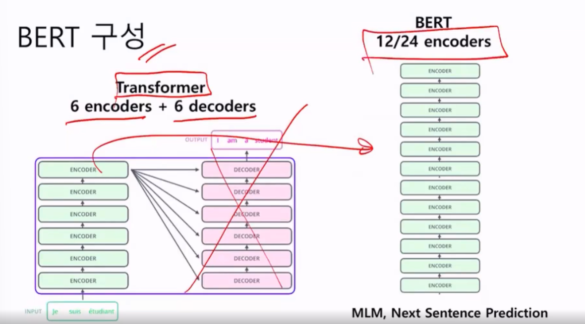
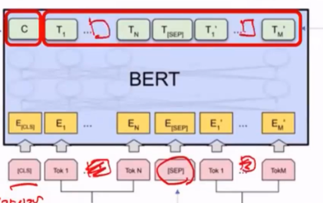
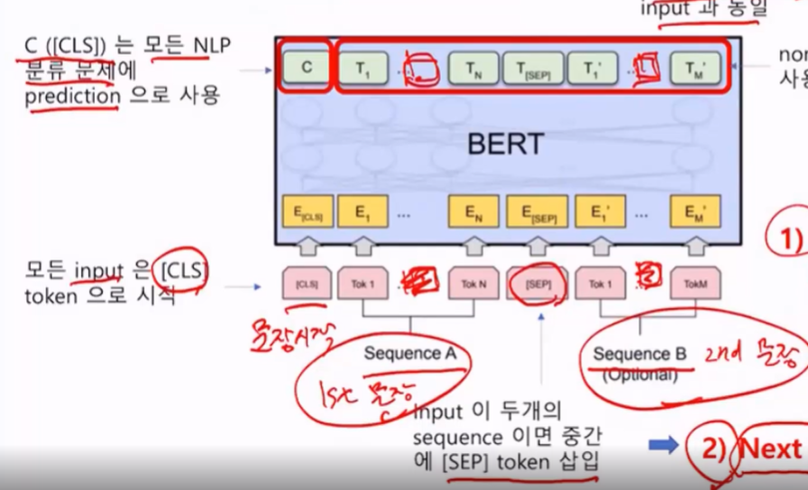
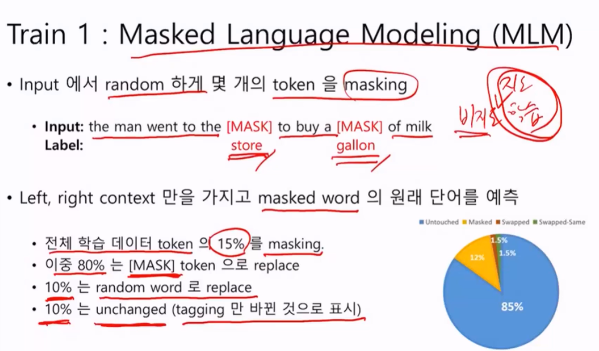
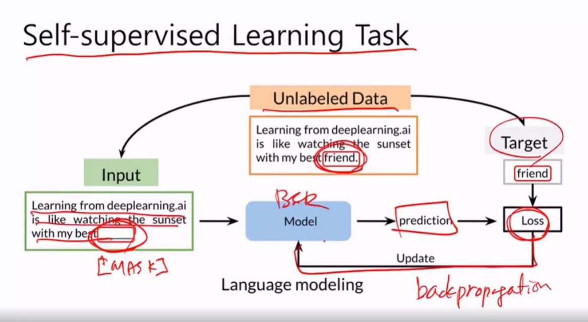
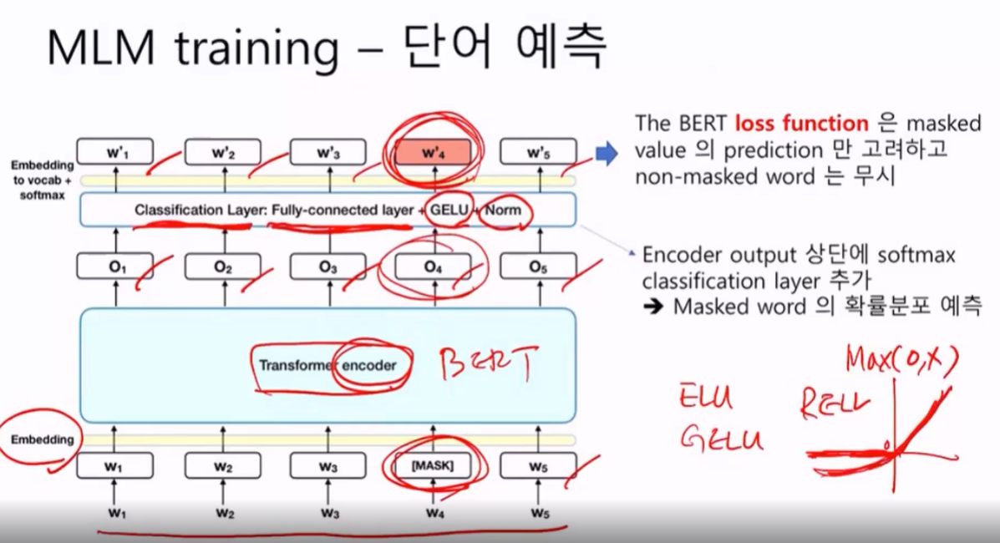
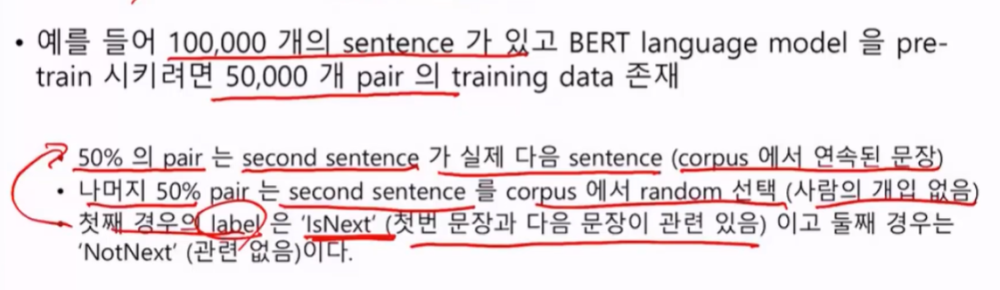
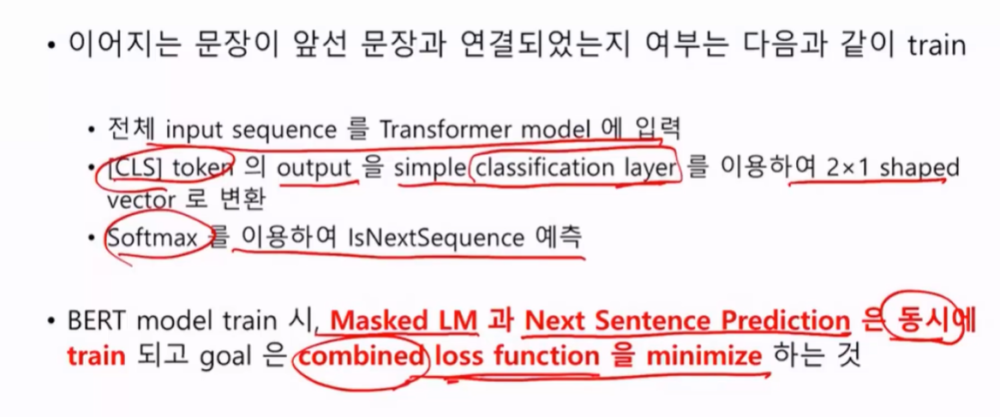
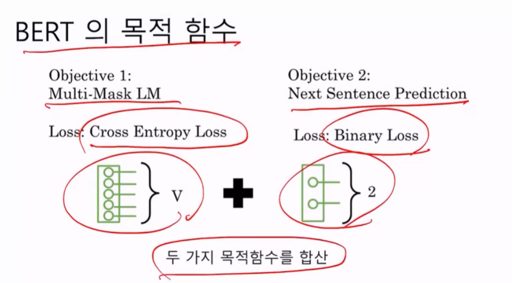

# BERT 구성과 훈련

Transformer는 6개의인코더와 6개의 디코더로 만들었다면 BERT는 12/24개의 인코더로 이루어져있다.

## How to train BERT?

훈련 방법이 재미있다고한다. unsupervised supervised learning이라는 표현인데 비지도지도학습이다.

프로그램 임의로 단어를 마스킹하는 건 사람손으로 레이블링하지 않아 비지도학습이지만, 레이블을 프로그램 안에서 작성해서 알아맞추는 알고리즘이다.

모든 input data는 CLS 토큰으로 시작한다.

2개의 문장이 입력이되면 Seperation 토큰이 삽입된다.

BERT는 2개를 동시에 학습한다.

Maksed Language Modeling, NExt SEntence Prediction

먼저 Masked Language Model은 어떻게 학습하냐면

아래 입력 토큰 중간에 마스킹을한다 (가린다). 가린것을 output에서 맞추도록 하는것이 MLM이다. 물론 input 차원과 output 차원은 동일하다.

output은 두 가지로나뉜다. 

* CLS 부분 
  * 이진 분류문제
* 문장토큰 부분
  * 문장 알아맞추기 word embedding을 만드는 과정

다음 Next Sentence prediction은 뭐냐면?

첫 번째 문장과 두 번째 문장이 이어지나?? 그것을 맞추는 것이다.

두 문장이 이어지는 것을 어떻게 맞추나?? output의 처음에있는 C (CLS)에서 맞춘다. 답이 isNext라고 예측하면 이어지는 문장이며, not Next는 이어지지 않는 문자이다.

## Masked Language modeling

Input에서 random 하게 몇 개의 token을 masking

전체 학습데이터 token의 15%를 마스킹한다.

이중 80%은 [MASK] 토큰으로 replace

10%는 이상한단어로 random word로 replace로 바꿈 (문제를 어렵게만듬)

10%는 바꾸지 않고 놔둔다. 하지만 바뀌었다고 태깅만 해준다. (tagging 만 바뀐것으로 표시)

문제를 어렵게 만들었다.

## Self-supervised Laerning Task

input에 Mask로 가려놓고, friend를 타겟으로 딱 만듬. BERT모델이 예측함. MASK한 자리에 빈자리에 friend가 들어가지 못하면 LOSS가 발생하고 backprop을 통해서알아맞추게 될것이다.

구조화해서 그려보면 아래와 같다. 인풋에 MASK로 가리고 임베딩층을 통해 ENcoder에 주입된다. Softmax로 분류된다. GELU는 ReLU의 변형이며 NLP에 주로 사용됨.

mask 안된것들은 무시. 당연히 맞출테니깐.. mask 부분만 예측해서 Loss를 계산할것임.

## Next Sentence Prediction

Sentence Pair를 사용한다.

주요 목적은 output의 C([CLS])를 train 시키는것.  아까 GLUE TASK를 보면 2/3가 이진분류문제였다. 그 Cls 토큰을 훈련시키는 것이다. BERT를 이진분류 문제로도 사용할 수 있도록.

두가지 Loss

Masked와 Next Sentence의 Loss를 합친 function을 최소화해야한다.

## BERT의 목적함수

