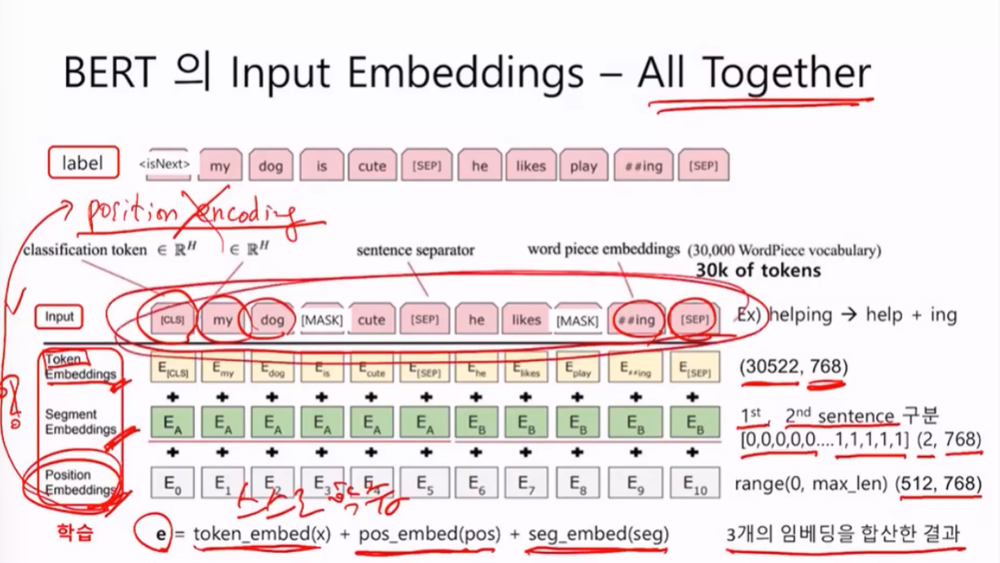
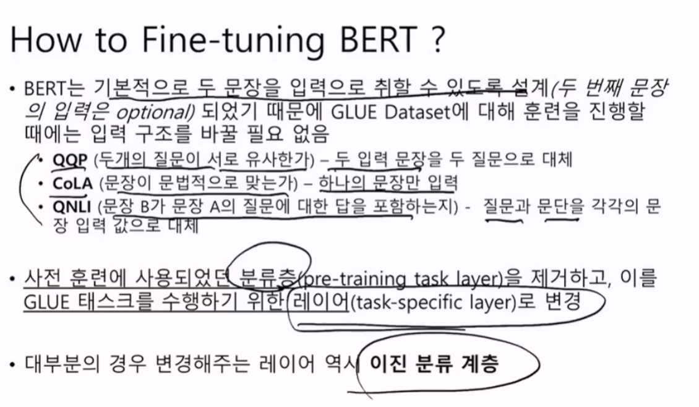
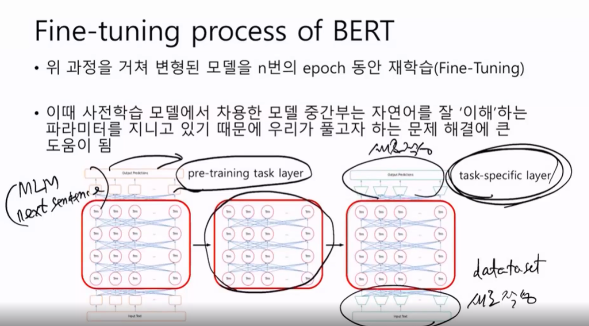
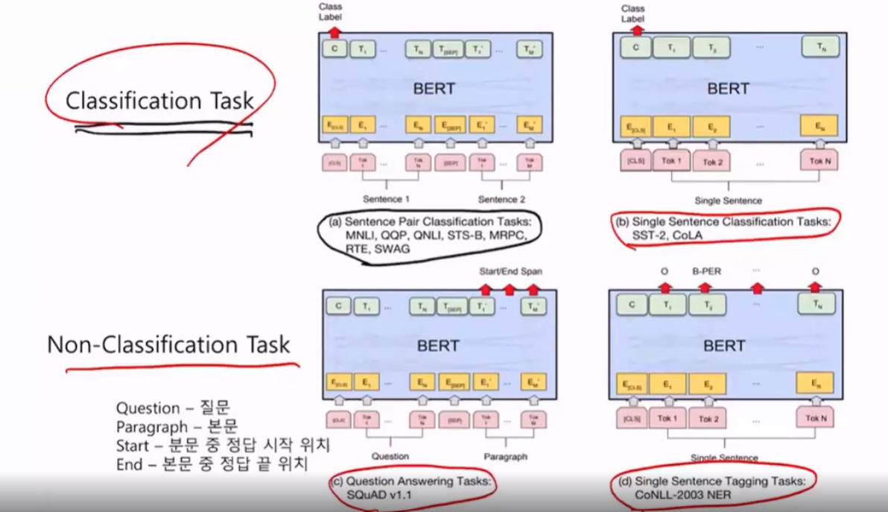

단어의 자체는 항상 임베딩과정을 거친다.

### 토큰자체의 임베딩 Token Embeddings

토큰이 형태소를 의미함. 단어의 임베딩 해서 벡터. BERT영어버전의 경우 3만개의 단어, 768개의 디멘전. 이것이 임베딩 매트릭스의 shape

### Segment Embeddings

첫 번째 문장이냐? 두 번째 문장이냐를 구분하게끔.  첫번째문장은 0000 두번째문장은 1111. shape는 (2, 768)

문장 구분이 됨.

### Position Embeddings

Transformer에서는 **Position Encoding**이라해서  단어의 위치를 파악할 때. Sin 함수와 Cos 함수를 이용해서 위치정보를 주었다. 하지만 BERT에서는 이걸 쓰지 않는다.

Position Embedding이라해서 range(0, max_len) (512, 768) 512개의 단어를 넘어가면 안되도록 제한 했다. 위치정보 자체를 스스로학습한다. 초기값으로 랜덤값을 준다. (이 단어가 몇 번째 포지션이어야 된다)

이 토큰들의 최종값은 사진의 식과 같다.  합산한다.

갑자기 postion 임베딩을 해서 

## All Together

이걸 알아야하는 이유는 Fine - Tuning을 위해서다.

우리가 Fine Tuning할 때 우리 데이터를 BERT를 넘겨야하는데. BERT에 입력데이터를 임베딩하는 것은 우리의 몫이다. BERT가 요구하는 입력은 사진의 오른쪽부분이다.

## How to Fine-tuning BERT?

BERT는 기본적으로 두 문장을 입력으로 취할 수 있도록 설계되어있다.

우리의 데이터 셋에맞춰서 새로작성해야하는 부분을 알아야한다.

분류문제(이진 CLS), 비분류문제(QNA)

구글에서 사전 훈련된 모델을 Tensorflow Hub라는 곳에 올려두었다. 공개된 전이학습모델이 많다.

모델구하기 쉽다..