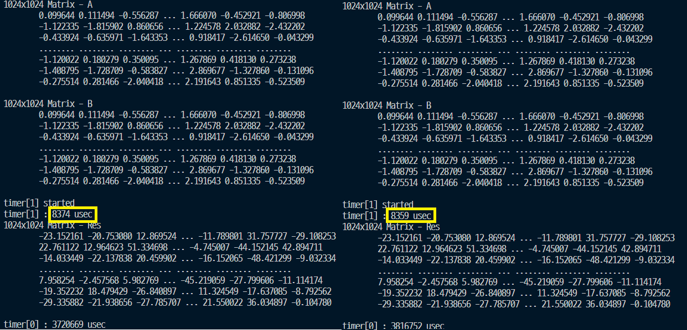
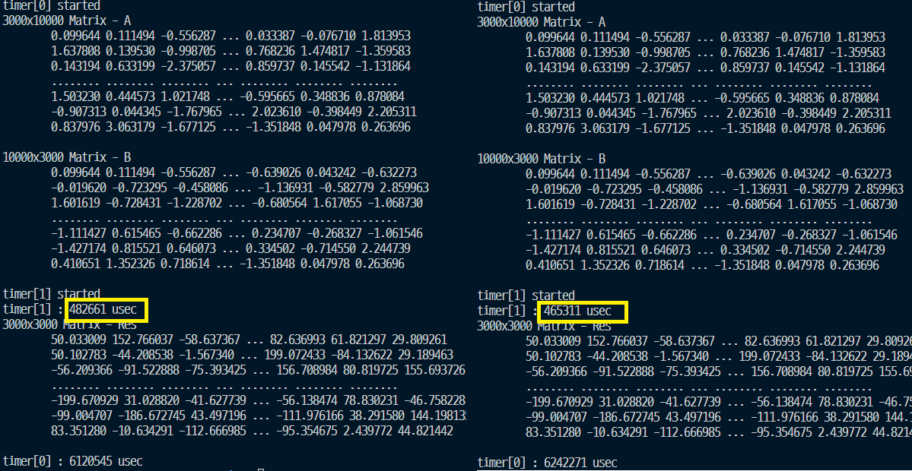
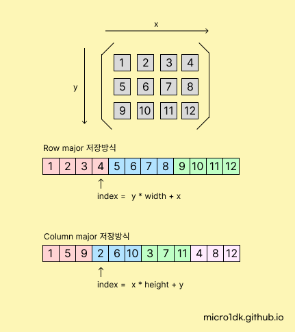

# Matrix 설계

CUDA 프로그래밍에서 메모리는 CPU와 GPU가 공유할 수 있는 Host 메모리와 GPU에서만 접근 가능한 Device 메모리로 구분된다.

CUDA에서는 메모리를 할당하는 방법에는 주로 2가지가 있다.

1. pitch를 사용하지 않는 기본적인 방법
   * 메모리가 연속된 1차원 배열로 구성된다. 
   * `cudaMalloc`을 통해 1D 메모리를 할당한다.
2. pitch를 사용하는 방법
   * 2D 배열의 연산을 할 때 효과적이다.
   * `cudaMallocPitch`을 통해 2D 메모리를 할당한다.

## 메모리 할당방식 비교

아래는 크기 (2000 , 1000)의 행렬을 메모리에 저장하는 방식을 그림으로 나타내었다.

pitch방식은 boundary 에 맞춰 메모리를 정렬한다.  pitch는 Column의 크기에따라 설정된다. pitch 값은 각 행의 바이트수를 저장한다. 각 행의 바이트 수는 일반적으로 4또는 8의 배수로 맞추어진다. 사용자의 하드웨어에 따라 다르며 본인의 사양에서는 512바이트의 단위로 맞추어진다.

pitch를 사용하면 메모리의 낭비가 발생한다. 아래그림처럼

그래도 pitch를 사용하는 이유는

1. 메모리 정렬을 맞추면, 캐시 라인과 메모리 블록을 최대한 활용할 수 있다. 캐시 라인은 CPU와 GPU가 메모리를 읽거나 쓸 때 일어나는 데이터 전송의 기본 단위이며, 캐시 라인에 맞춰서 데이터를 정렬하면, CPU와 GPU가 메모리를 더 빠르게 읽고 쓸 수 있다. 이는 메모리 복사 및 전송 시간을 절약하고, 연산 속도를 높일 수 있다.
2.  메모리 정렬을 맞추면, 메모리의 경계를 넘어가는 데이터 접근이 발생하지 않도록 보장할 수 있다. 또한, 메모리 접근 패턴이 최적화되어 데이터 처리 속도가 높아진다.

그렇다고 무조건 pitch를 사용하는 것은 좋은 방법이 아니다. 예를들어 크기 (1000, 2)은 아래와 같이 메모리를 정렬하기때문에 메모리낭비가 크다. 

또한 Pitch를 잡는과정에서 오버헤드가 발생하며, 코드 복잡성까지 증가한다. 

## 실행속도 비교

A(1024, 1024) B(1024, 1024) Dot Product 연산 결과   좌) cudaMalloc, 우) cudaMallocPitch

이론은 pitch를 사용하는 것이 빠른데 본인 사양에서는 큰 차이가 없다. 그렇다면 더 큰 행렬에서는 어떨까?

A(3000, 10000) B(10000, 3000) Dot Product 연산 결과   좌) cudaMalloc, 우) cudaMallocPitch

크기가 큰 행렬에서는 pitch할당방식이 3%정도 빨랐다.

## 선택 - cudaMalloc

결과적으로 Pitch를 사용하기에 적합한지 여부는 데이터의 크기, 하드웨어의 성능에 따라 고려하여 판단해야한다.

위의 두번째 예제로 3000 * 10000 = 3천만개의 데이터로 테스트해서 약간의 속도향상을 경험했다. 앞으로 해볼 프로젝트로 저 만한 크기의 행렬을 다룰 것 같지는 않고, 코드 복잡성이 증가하다보니 pitch할당방식을 사용하지 않을것이다.

## Row & Column major

2차원 데이터를 CPU 메모리에 저장하는 방식은 두 가지 방식이 있다.

### Row major 행 우선

행을 우선으로 저장하고, 행 내에서는 열을 순차적으로 저장한다.

예를 들어, 2차원 배열 A의 요소들은 메모리에 `A[0][0], A[0][1], A[0][2], ..., A[1][0], A[1][1], A[1][2], ...` 순서로 저장된다.

기본적으로 C / Python 등에서는 행우선방식을 채택한다.

### Col major 열 우선

열을 우선으로 저장하고, 열 내에서는 행을 순차적으로 저장한다. 예를 들어, 2차원 배열 A의 요소들은 메모리에 `A[0][0], A[1][0], A[2][0], ..., A[0][1], A[1][1], A[2][1], ... `순서로 저장된다.

## 선택 - column-major

두 방법의 차이는 구현법만 달라질 뿐 성능에서는 차이가 없다. 엔비디아에서 제공하는 CuBLAS, cuDNN라이브러리는 기본적으로 col-major방식을 채택했다. 나중에 라이브러리를 사용할 수 있으니 호환성을 위해 **Col-major** 저장방식을 사용하겠다.