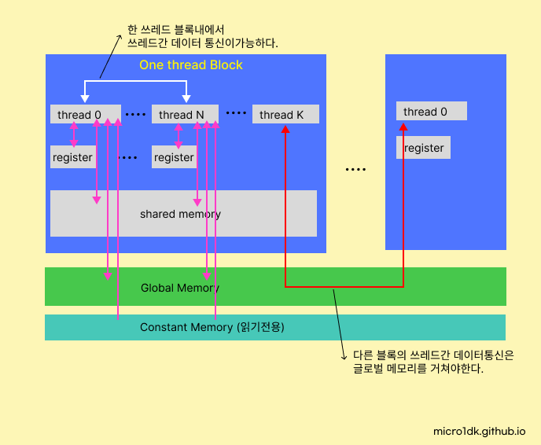
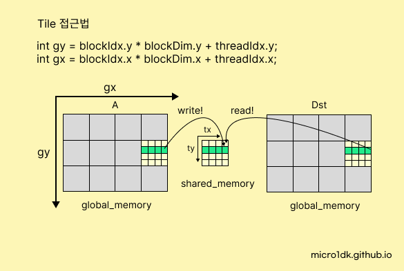

# Memory

### 메모리의 구조



RTX 2050의 경우 32개의 SM이 thread block을 컨트롤한다.


### 메모리 사양확인

```
cuda-12/extras/demo_suite$ ./deviceQuery
```

CUDA 설치경로에서, 터미널에서 deviceQuery 파일을 실행한다. 

```
Total amount of global memory:                 4096 MBytes (4294508544 bytes)
Total amount of constant memory:               65536 bytes
Total amount of shared memory per block:       49152 bytes
```


# Global Memory

GPU의 메인메모리다. HOST 메모리에서 `cudaMalloc`을 통해 메모리를 할당하면 글로벌 메모리에 저장된다. 이 메모리는 모든 스레드에서 접근가능하며, 대용량 데이터를 저장할 수 있다. 


### DRAM & Memory Coalescing

GPU에서 글로벌 메모리는 기본적으로 GPU 카드의 **DRAM(Dynamic Random Access Memory)**에 위치한다. 

Memory Coalescing은 GPU의 스레드들이 DRAM에 연속적으로 접근할 때 중요한 역할을 한다. 불연속적인 위치에 접근하는 경우 효율이 떨어지게된다. CUDA 설계시 고려해야할 중요한 요소다.


# Shared Memory

공유메모리는 GPU의 스레드 블록 내에서 데이터를 공유하는데 사용되는 메모리이다. 같은 블록내에서 캐시를 이용하는 것과 같은 개념이기에 글로벌 메모리에 접근하는 것보다 공유메모리에 접근하는 것이 더 빠르다.

그러나 공유메모리를 사용한다고 해서 무조건 실행속도가 빨라지지는 않는다.  그 이유는 차차 설명.


### All on-chip memory (‘shared’ memory, registers, and caches) most likely is SRAM

공유메모리는 각 GPU의 스트리밍 멀티프로세서(SM, Streaming Multiprocessor)에 내장되어 있는 작고 빠른 메모리다. 레지스터처럼 매우 빠른 접근속도를 제공하지만, DRAM처럼 큰 용량은 가지지 않는다. 따라서 공유메모리에는 작은 데이터셋에 대한 빈번한 접근이 좋다.


## Tiled 접근법



Cuda에서 Tiled 접근법이란 Tile 크기의 공유메모리를 활용하여 데이터의 읽기와 쓰기를 수행하는 방법이다. 다음과 같은 단계로 동작한다. 타일은 정사각형의 크기를 사용한다. 

공유 메모리를 선언하는 방법은 아래.

```c
#define TILE_WIDTH 32
__shared__ float shared_mat[TILE_WIDTH][TILE_WIDTH];
```

물론 1차원 배열로 잡아도 된다. 주로 32 * 32 = 1024의 크기를 사용한다.

내 CUDA 사양에서 `Maximum number of threads per block: 1024`이기 때문이다.

그리고 CUDA 사양에서 `Total amount of shared memory per block: 49152 bytes`인데 float 타입의 크기가 4바이트인경우, float 데이터를 49152/4 = 12288개 저장할 수 있다. float인 경우에는 1024개를 저장하고도 남는다. 만약 float이 아닌 다른 타입인 경우는 메모리용량을 고려해야한다.


다음은 두 행렬의 덧셈 연산을 공유메모리를 활용한 그림이다.


아래는 CUDA 코드

```c
__global__ void kernel_MatAddMat(
    float* Dst, const float* A, const float* B,
    int nrow, int ncol
) {
    __shared__ float s_mat[TILE_WIDTH][TILE_WIDTH];
    int gy = blockIdx.y * blockDim.y + threadIdx.y;
    int gx = blockIdx.x * blockDim.x + threadIdx.x;

    if (gy < nrow && gx < ncol) {
        int idx = gy * ncol + gx;
        // write
         s_mat[threadIdx.y][threadIdx.x] = A[idx] + B[idx];
        
        // wait
        __syncthreads();
        
        // read
        Dst[idx] = s_mat[threadIdx.y][threadIdx.x];
    }
}
```

공유 메모리 사용한 결과는 어떻냐?, 사용하지 않은 것보다 느리다. 

그 이유는 ` __syncthreads();`에 있다. 이 함수는 스레드 블록내의 모든 스레드가 동기화되도록 기다리는 역할을 한다. 블록의 모든 스레드가 공유메모리에 쓰기를 완료하기까지 대기한다. 

공유메모리에 데이터를 쓰고 여러번 읽을 때 효과를 속도개선을 경험할 수 있다. Element wise 연산의 경우 공유메모리에 데이터를 저장한 뒤 접근을 한 번만 한다. (Dot 연산의 경우 공유메모리에 접근을 여러번 한다)

따라서 Element wise 연산에서 공유메모리를 사용하는 것보다는 사용하지 않는것이 더 빠르다

