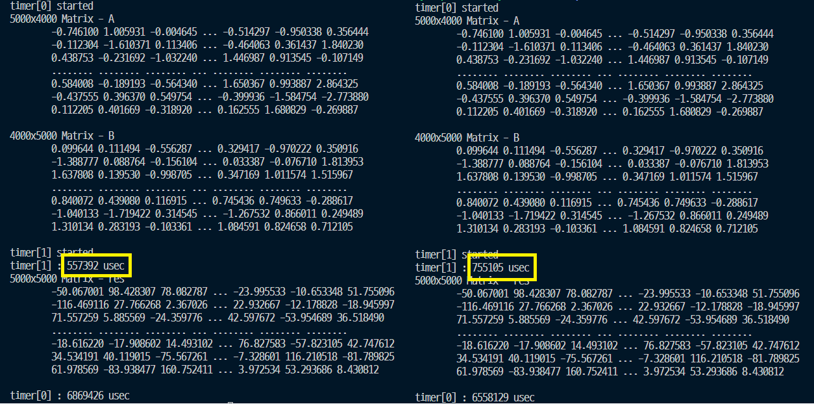

# Memory Coalescing

CUDA 병렬프로그래밍에서 접하는 개념이다. GPU 글로벌 메모리에서 연속적으로 배치된 메모리를 액세스하는 것으로 메모리 코알레싱을 달성할 수 있다.

(5000, 4000), (4000, 5000)의 두 행렬의 Dot연산.

좌) 메모리 코알레싱을 달성한 결과

우) 메모리 코알레싱 달성 실패

메모리 코알레싱을 달성하여 40%가 빨라진것을 확인했다. 

### 코드비교

문제는 빨간네모박스 부분에서 발생한다.

gx와 gy는 2차원 그리드에서 스레드의 index를 나타낸다. 2차원 그리드는 x와 y의 두 차원으로 구성되고 일반적으로 x를 먼저처리하고 y를 처리한다. (gy, gx) = (0, 0) (0, 1), (0, 2) ...

그렇기 때문에 gx를 먼저처리하지만, gx * K는 일렬로 배치된 메모리에 접근하지 않는다. (gx * K에서 K의 배수만큼 이동함. 첫 번째 사진의 2번째 상황)

## Dram bursting

메모리 코알레싱을 달성하기 위해서는 먼저 DRAM Bursting을 이해해야 한다. 

DRAM Bursting은 한 번의 요청으로 DRAM 컨트롤러가 일련으로된 데이터집합을 가져오도록 하는 것이다.

가져온 집합 내에서, 현재 쓰레드가 데이터를 읽고, 다음 쓰레드가 그 옆의 데이터를 읽고, 그것이 반복되면 코알레싱을 달성하는 것이다.

