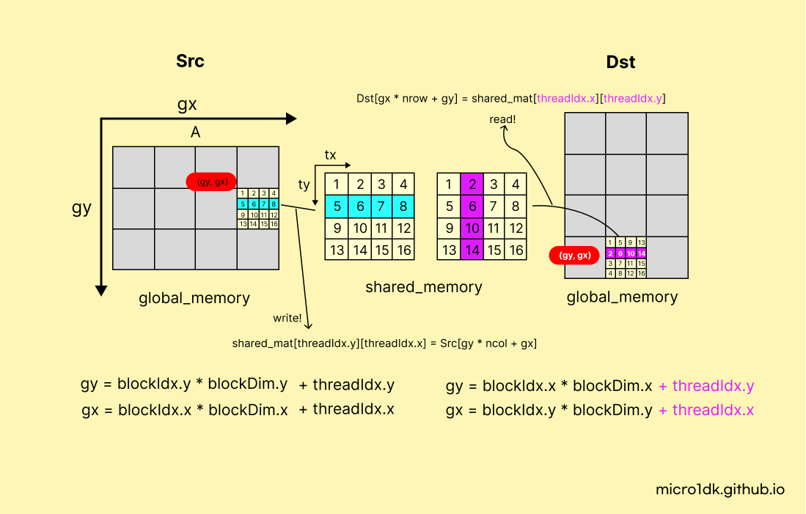

# Traspose




```c
#define TILE_WIDTH 32

__global__ void kernel_Transpose(float* Dst, const float* Src, int nrow, int ncol) {
    __shared__ float mat[TILE_WIDTH][TILE_WIDTH + 1];
    int gy = blockIdx.y * blockDim.y + threadIdx.y;
    int gx = blockIdx.x * blockDim.x + threadIdx.x;

    if (gy < nrow && gx < ncol) {
        mat[threadIdx.y][threadIdx.x] = Src[gy * ncol + gx]; // column-major
    }
    __syncthreads();
    gy = blockIdx.x * blockDim.x + threadIdx.y;
	gx = blockIdx.y * blockDim.y + threadIdx.x;
    if (gy < ncol && gx < nrow) {
		Dst[gy * nrow + gx] = mat[threadIdx.x][threadIdx.y];
	}
}

void exec_kernel_Transpose(float* Dst, const float* Src, int nrow, int ncol, const int BLOCK_SIZE) {
    dim3 dimBlock(BLOCK_SIZE, BLOCK_SIZE, 1);
    dim3 dimGrid(
        (ncol + dimBlock.x - 1) / dimBlock.x,
        (nrow + dimBlock.y - 1) / dimBlock.y,
        1
    );
    kernel_Transpose<<<dimGrid, dimBlock>>>(Dst, Src, nrow, ncol);
    cudaDeviceSynchronize();
}

```


## Memory Bank

메모리뱅크는 자주 사용하는 데이터를 저장하고 검색하는 데 사용되는 컴퓨터 메모리 내의 논리적 저장소다. 메모리 뱅크는 병렬처리를 가능하게 하기 위해 사용되며, 동시에 여러 뱅크에서 읽기와 쓰기 연산을 수행할 수 있다.

다양한 스레드가 동시에 다른 메모리 뱅크에 접근하여 메모리 대역폭을 효과적으로 활용할 수 있다.

GPU에서는 동시에 여러개의 데이터를 처리해야하기 때문에,  shared memory를 각 warp마다 일정 갯수 memory bank로 나누어 두었다.

### Memory Bank Conflict

메모리 뱅크 충돌이란 동일한 메모리 뱅크에 여러 스레드가 동시에 접근하려할 때 발생한다.


