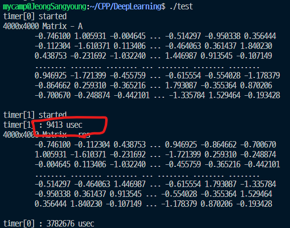
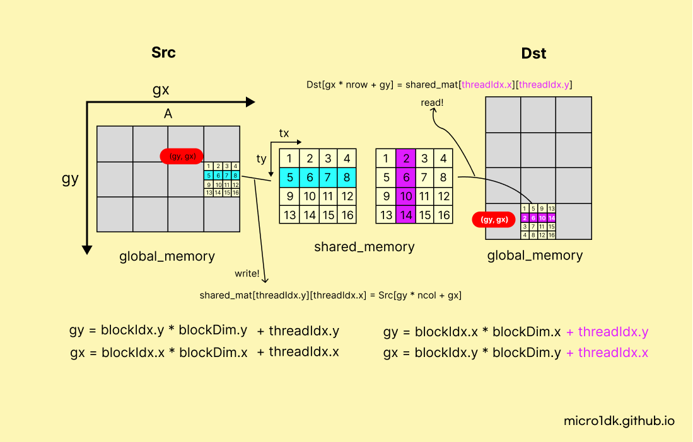
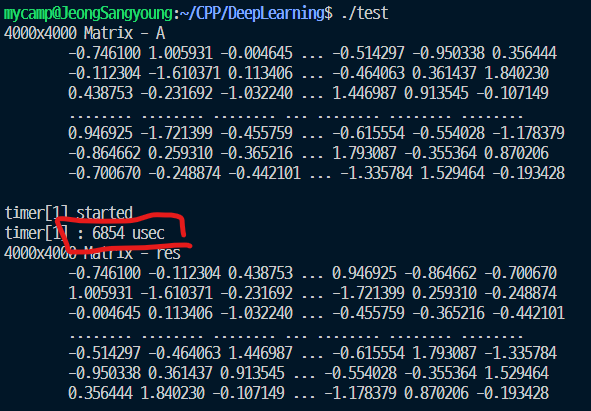

# Traspose

Transpose 연산은 shared memory를 활용하는것이 낫다.

* element-wise 연산에서는 shared 메모리에 하나의 데이터만 한 번 읽는다. (shared 메모리 효과를 못 본다.)
* Transpose 연산에서는 shared 메모리에서 인덱싱을 하여 한 줄을 읽는다. (shared 메모리 효과를 본다.)


먼저 일반적으로 생각할 수 있는 방법은 아래그림처럼


그림은 **5 6 7 8**과 매치되는 스레드 인덱스의 값이 공유메모리와 결과 메모리에 이동되는 그림이다.

5, 6, 7, 8은 차례로 결과 메모리에 **세로방향**으로 쓰기가된다.


```c++
#define TILE_WIDTH 32

__global__ void kernel_Transpose(float* Dst, const float* Src, int nrow, int ncol) {
    __shared__ float mat[TILE_WIDTH][TILE_WIDTH + 1];
    int gy = blockIdx.y * blockDim.y + threadIdx.y;
    int gx = blockIdx.x * blockDim.x + threadIdx.x;

    if (gy < nrow && gx < ncol) {
        mat[threadIdx.y][threadIdx.x] = Src[gy * ncol + gx]; // column-major
    }
    __syncthreads();
	// swap gx, gy
    if (gy < ncol && gx < nrow) {
		Dst[gx * nrow + gy] = mat[threadIdx.y][threadIdx.x];
	}
}

void exec_kernel_Transpose(float* Dst, const float* Src, int nrow, int ncol, const int BLOCK_SIZE) {
    dim3 dimBlock(BLOCK_SIZE, BLOCK_SIZE, 1);
    dim3 dimGrid(
        (ncol + dimBlock.x - 1) / dimBlock.x,
        (nrow + dimBlock.y - 1) / dimBlock.y,
        1
    );
    kernel_Transpose<<<dimGrid, dimBlock>>>(Dst, Src, nrow, ncol);
    cudaDeviceSynchronize();
}
```


다음은 4000 x 4000 행렬을 Transpose 연산하여 걸린 시간이다.



소요시간 : **9413 usec**


## Memory Coalescing

shared의 메모리를 읽어 글로벌 메모리에 쓰는 과정에서 문제가 발생한다.

```c++
Dst[gx * nrow + gy] = shared_mat[threadIdx.y][threaIdx.x]
```

`gx * nrow + gy` 여기에서 메모리 코알레싱을 달성하지 못한다. 글로벌 메모리에 순차적으로 접근해야하는데 nrow 간격으로 접근하기 때문이다. 이것을 해결하면 좀 더 가속화될 수 있다.


### 해결

블록의 인덱스만 swap하고 thread의 인덱스를 x방향으로 순차적으로 접근할 수 있게 (gy, gx)를 수정한다. 그림을 보면 쉽게 이해된다.




그림에서 5 6 7 8과 매치되는 스레드 인덱스의 값이 공유메모리와 결과 메모리에 이동되는 그림이다.

5, 6, 7, 8 인덱스의 위치를 전치시켜 매치되는 **2, 6, 10, 14** 값을 결과 메모리에 가로로 저장한다. (메모리에 순차적으로 접근함)


```c
#define TILE_WIDTH 32

__global__ void kernel_Transpose(float* Dst, const float* Src, int nrow, int ncol) {
    __shared__ float mat[TILE_WIDTH][TILE_WIDTH + 1];
    int gy = blockIdx.y * blockDim.y + threadIdx.y;
    int gx = blockIdx.x * blockDim.x + threadIdx.x;

    if (gy < nrow && gx < ncol) {
        mat[threadIdx.y][threadIdx.x] = Src[gy * ncol + gx]; // column-major
    }
    __syncthreads();
    gy = blockIdx.x * blockDim.x + threadIdx.y;
	gx = blockIdx.y * blockDim.y + threadIdx.x;
    if (gy < ncol && gx < nrow) {
		Dst[gy * nrow + gx] = mat[threadIdx.x][threadIdx.y];
	}
}

void exec_kernel_Transpose(float* Dst, const float* Src, int nrow, int ncol, const int BLOCK_SIZE) {
    dim3 dimBlock(BLOCK_SIZE, BLOCK_SIZE, 1);
    dim3 dimGrid(
        (ncol + dimBlock.x - 1) / dimBlock.x,
        (nrow + dimBlock.y - 1) / dimBlock.y,
        1
    );
    kernel_Transpose<<<dimGrid, dimBlock>>>(Dst, Src, nrow, ncol);
    cudaDeviceSynchronize();
}

```


다음은 4000 x 4000 행렬을 Transpose 연산하여 측정한 시간이다. 메모리 코알레싱을 달성하여 30~40% 속도향상을 했다.



소요시간 : **6854usec**


메모리 뱅크라는 개념이 있다. 이것을 고려하면 더 가속화 할 수 있다.

다음에 설명.

