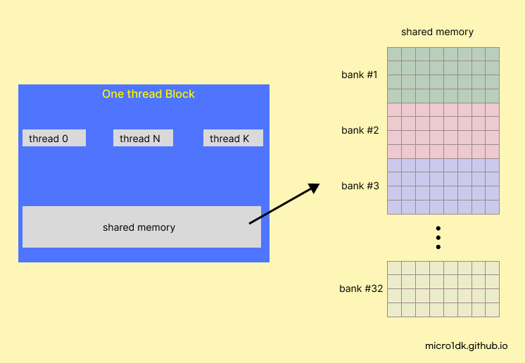
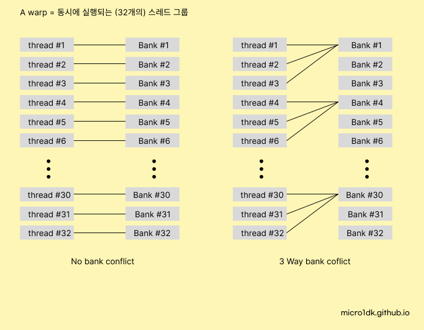
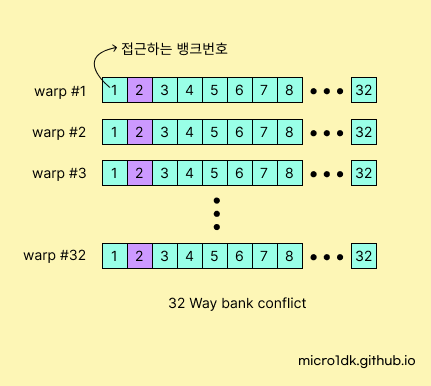
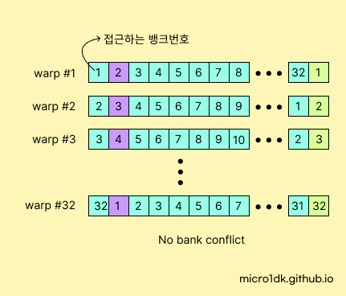

# Memory Bank

Shared Memory는 Warp 단위만큼 메모리 뱅크(memory bank)로 나뉘어져있다. 동시에 여러 뱅크에서 읽기와 쓰기 연산을 수행할 수 있다. 각 뱅크에는 32비트 (4바이트) 메모리를 제공한다. float type은 bank를 하나를 사용하며 double type은 bank를 2개 사용하는 셈이다.



Warp는 동시에 실행하는 스레드의 그룹을 나타낸다. 하나의 warp는 32개의 스레드로 구성된다. 정확히 알고싶으면 내 CUDA 사양을 확인하면 정보를 확인할 수 있다.

```
Warp size: 32
```


## Memory Bank Conflict

메모리 뱅크 충돌이란 동일한 메모리 뱅크에 여러 스레드가 동시에 접근하려할 때 발생한다.

아래는 충돌이 발생하는 경우와 발생하지 않는 경우를 그림으로 나타내었다.



하나의 뱅크에 여러개의 스레드가 접근하려 한다면  메모리 뱅크 충돌이라는 표현을 사용한다.


이전단계에서 커널에서 shared memory 사용부분을 보면

```c++
#define TILE_WIDTH 32
__global__ void kernel_Transpose(float* Dst, const float* Src, int nrow, int ncol) {
    __shared__ float mat[TILE_WIDTH][TILE_WIDTH];
    // ... 생략
 }
```


이는 아래의 그림처럼 동작한다.



* 하나의 Warp에서 각 스레드는 32개의 뱅크에 모두 연결되어있다.
* 각 Warp의 스레드가 전부 같은 뱅크번호에 접근하려한다.

이렇게 같은 뱅크에 접근하려고하기 때문에 Bank Conflict가 발생된다.

이를 해결하기 위해 각 Warp의 스레드가 서로 다른 뱅크번호에 접근하도록 만들면 된다. 약간의 Trick을 사용한다.




* 하나의 Warp에서 각 스레드는 32개의 뱅크에 모두 연결되어있다.
* 각 Warp의 스레드가 서로 다른 뱅크번호에 접근하려한다.

이렇게 


다음에