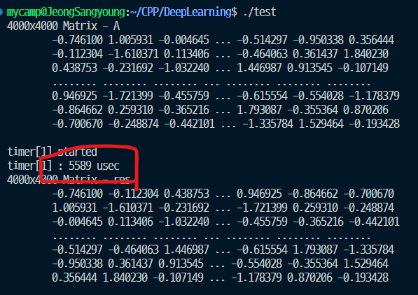

# Memory Bank

Shared Memory는 Warp 단위만큼 메모리 뱅크(memory bank)로 나뉘어져있다. 동시에 여러 뱅크에서 읽기와 쓰기 연산을 수행할 수 있다. 각 뱅크에는 32비트 (4바이트) 메모리를 제공한다. float type은 bank를 하나를 사용하며 double type은 bank를 2개 사용하는 셈이다.


Warp는 동시에 실행하는 스레드의 그룹을 나타낸다. 하나의 warp는 32개의 스레드로 구성된다. 정확히 알고싶으면 내 CUDA 사양을 확인하면 정보를 확인할 수 있다.

```
Warp size: 32
```


## Memory Bank Conflict

메모리 뱅크 충돌이란 동일한 메모리 뱅크에 여러 스레드가 동시에 접근하려할 때 발생한다.

아래는 충돌이 발생하는 경우와 발생하지 않는 경우를 그림으로 나타내었다.


하나의 뱅크에 여러개의 스레드가 접근하려 한다면  메모리 뱅크 충돌이라는 표현을 사용한다.


이전단계에서 커널에서 shared memory 사용부분을 보면

```c++
#define TILE_WIDTH 32
__global__ void kernel_Transpose(float* Dst, const float* Src, int nrow, int ncol) {
    __shared__ float mat[TILE_WIDTH][TILE_WIDTH];
    // ... 생략
 }
```


이는 아래의 그림처럼 동작한다.


* 하나의 Warp에서 각 스레드는 32개의 뱅크에 모두 연결되어있다.
* 각 Warp의 스레드가 전부 같은 뱅크번호에 접근하려한다.

이렇게 같은 뱅크에 접근하려고하기 때문에 Bank Conflict가 발생된다.


### Solution

이를 해결하기 위해 각 Warp의 스레드가 서로 다른 뱅크번호에 접근하도록 만들면 된다. 

약간의 Trick을 사용한다. shared memory의 열을 한 칸 더 추가하면된다.

```c++
__shared__ float mat[TILE_WIDTH][TILE_WIDTH + 1];
```

이렇게만 하면 아래 그림처럼 동작한다.


설명을 위해 각 warp의 작업이 1번부터 32번까지 순차적으로 진행된다고 가정한다. (실제는 랜덤하다)

* 하나의 Warp에서 각 스레드는 32개의 뱅크에 모두 연결되어있다.
* 33번째 열은 실제로 데이터가 저장되지 않는다. 그냥 뱅크접근 용도로만 사용해서 뱅크접근 순서를 한 칸씩 밀어낸다.
* Warp#1 에 연결된 `Shared_mat[0][32]` (33번째 열)는 1번 뱅크에 접근하려한다. 그렇게 Warp#2의 첫 번째 스레드는 2번 뱅크에 연결되었다.
* 결과적으로 각 Warp의 스레드가 서로 다른 뱅크번호에 접근하려한다.


### Code

```c++
#define TILE_WIDTH 32

__global__ void kernel_Transpose(float* Dst, const float* Src, int nrow, int ncol) {
    __shared__ float mat[TILE_WIDTH][TILE_WIDTH + 1];
    int gy = blockIdx.y * blockDim.y + threadIdx.y;
    int gx = blockIdx.x * blockDim.x + threadIdx.x;

    if (gy < nrow && gx < ncol) {
        mat[threadIdx.y][threadIdx.x] = Src[gy * ncol + gx]; // column-major
    }
    __syncthreads();
    gy = blockIdx.x * blockDim.x + threadIdx.y;
	gx = blockIdx.y * blockDim.y + threadIdx.x;
    if (gy < ncol && gx < nrow) {
		Dst[gy * nrow + gx] = mat[threadIdx.x][threadIdx.y];
	}
}

void exec_kernel_Transpose(float* Dst, const float* Src, int nrow, int ncol, const int BLOCK_SIZE) {
    dim3 dimBlock(BLOCK_SIZE, BLOCK_SIZE, 1);
    dim3 dimGrid(
        (ncol + dimBlock.x - 1) / dimBlock.x,
        (nrow + dimBlock.y - 1) / dimBlock.y,
        1
    );
    kernel_Transpose<<<dimGrid, dimBlock>>>(Dst, Src, nrow, ncol);
    cudaDeviceSynchronize();
}

```

* `__shared__ float mat[TILE_WIDTH][TILE_WIDTH + 1];` 이 행만 바뀌었다.


다음으로 4000 x 4000 행렬의 Transpose 연산의 시간측정결과는



전 단계에서 5~15% 속도향상을 볼 수 있다.

