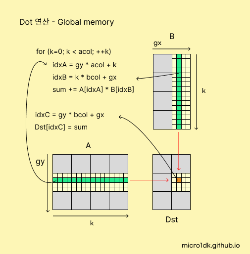
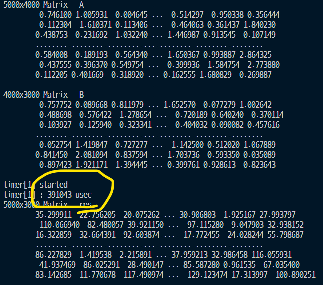
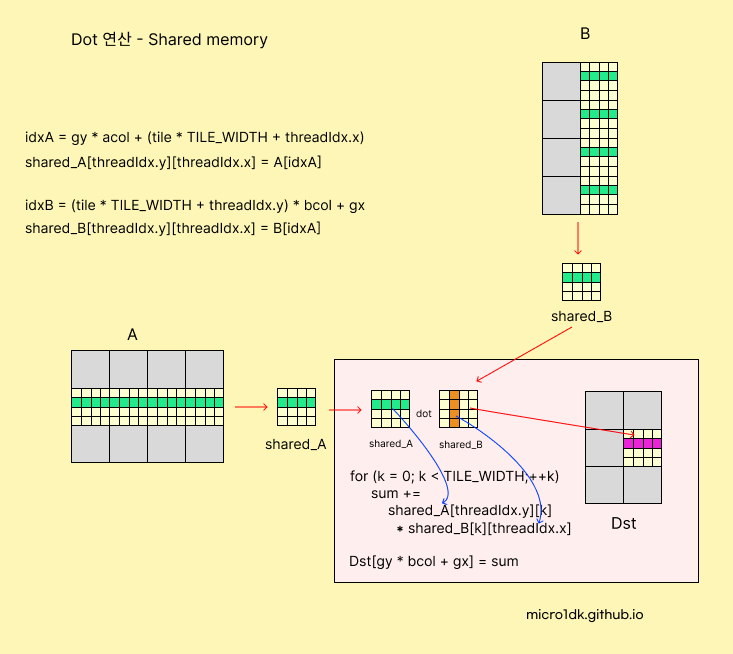
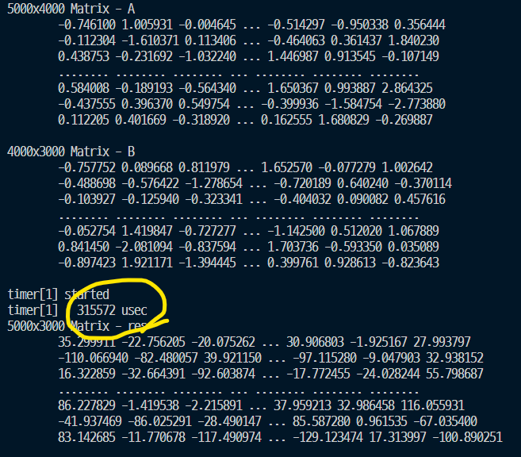

# Dot 연산

Memory Coalescing과 Shared memory를 활용하여 내적연산을 구현해본다.

Dot Product의 결과의 크기는 (앞 행렬의 행, 뒤 행렬의 열) 의 크기를 갖는다.


기본동작을 설명하자면 Matrix의 가로 한 줄, 세로 한 줄을 읽는다. 그리고 결과 메모리에 각 요소의 곱의 합을 저장한다.



```c++
__global__ void kernel_matDot2(
        float* Dst, const float* A, const float* B,
        int arow, int acol, int bcol
) {
    int gy = blockIdx.y * blockDim.y + threadIdx.y;
	int gx = blockIdx.x * blockDim.x + threadIdx.x;
    if (gy < arow && gx < bcol) { 
        float sum = 0.0f;
        for (int k = 0; k < acol; ++k) {
            int idxA = gy * acol + k;
            int idxB = k * bcol + gx;
            sum += A[idxA] * B[idxB];
        }
        int idxC = gy * bcol + gx;
        Dst[idxC] = sum;
    }
}
```


다음은 A(5000, 4000) 행렬과 B(4000, 3000) 행렬의 DOT연산 결과를 측정한 결과이다.




Shared 메모리와 Memory Coalescing을 고려한다면 훨씬 빠른 연산이 가능하다.




Matrix B의 데이터를 TILE 단위로, 가로로 순차적으로 접근하여 Memory Coalescing을 달성한다.

공유 메모리에 데이터의 저장이 완료되었다면, 연산을 진행한다. 

참고로 공유메모리를 세로로 접근하는 것은 Memory Coalescing과 관련이 없다. Memory Coalescing은 DRAM에서 적용되는 개념이다.

```c++
__global__ void kernel_Dot(
        float* Dst, const float* A, const float* B,
        int arow, int acol, int bcol
) {
    __shared__ float s_A[TILE_WIDTH][TILE_WIDTH];
    __shared__ float s_B[TILE_WIDTH][TILE_WIDTH];
    int ntiles = (acol + TILE_WIDTH - 1) / TILE_WIDTH;
    int remaining = acol; 
    int gy = blockIdx.y * blockDim.y + threadIdx.y;
	int gx = blockIdx.x * blockDim.x + threadIdx.x;
    float sum = 0.0f;
    for (int tile = 0; tile < ntiles; ++tile) {
        int nelem = min( remaining, TILE_WIDTH );
        remaining -= TILE_WIDTH;

        if (gy < arow && threadIdx.x < nelem) {
            int idxA = gy * acol + (tile * TILE_WIDTH + threadIdx.x);
            s_A[threadIdx.y][threadIdx.x] = A[idxA];
        }

        if (gx < bcol && threadIdx.y < nelem) {
            int idxB = (tile * TILE_WIDTH + threadIdx.y) * bcol + gx;
            s_B[threadIdx.y][threadIdx.x] = B[idxB];
        }
        __syncthreads();
        
        // Dot 연산과정 (분홍 네모칸)
        for (int k = 0; k < nelem; ++k) {
            sum += s_A[threadIdx.y][k] * s_B[k][threadIdx.x];
        }
        __syncthreads();
    }
    if (gy < arow && gx < bcol) {
	    Dst[gy * bcol + gx] = sum;
    }
}
```

반드시 공유메모리에 데이터를 저장한 뒤, 연산을 해야한다. 따라서 데이터 저장을 완료할 때 까지 대기하는 함수인 `__syncthreads()`를 한 번, DOT 연산과정이 완료될 때 까지  `__syncthreads()` 한 번 해서, 총 2번 사용된다.


다음은 A(5000, 4000) 행렬과 B(4000, 3000) 행렬의 DOT연산 결과를 측정한 결과이다.



shared 메모리를 사용했을 때 측정시간이 약 20~30% 빨라졌다.