# Optimizer

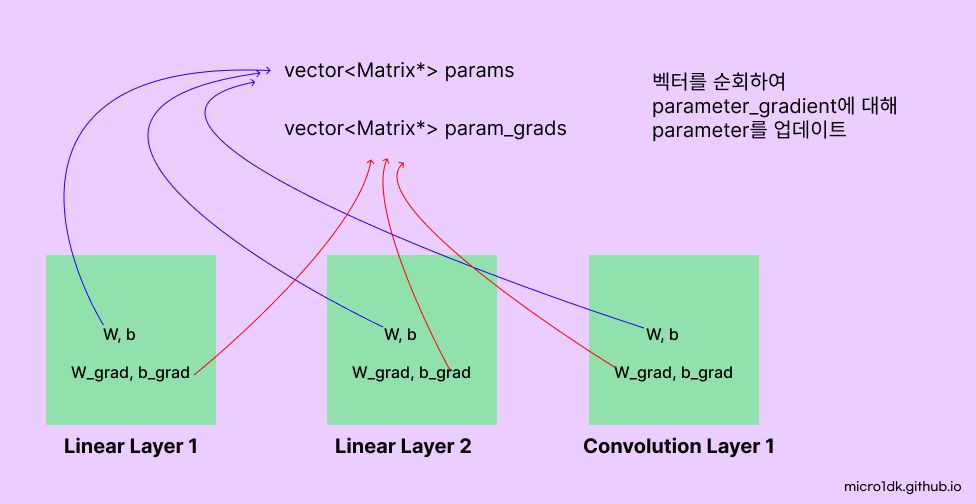

모델의 학습과정을 조절하는 알고리즘을 의미한다. 학습의 목표는 모델의 예측오차를 최소화하는 것인데, Optimizer는 오차 값이 최소가 되는 모델 파라미터를 찾는 방법이다. 

## 경사하강법

경사 하강법은 모델의 오차 함수를 최소화하기 위한 매개변수를 반복적으로 조정한다. 경사하강법에는 크게 3가지 유형으로 나뉜다.

* **배치 경사 하강법** (BGD)
  * **전체 학습데이터**를 사용한다.
  * 전체 데이터에 대한 모델의 오차의 평균을 구한 다음, 미분을 통해 기울기를 산출하고 최적화를한다.
  * 전체 데이터를 통해 학습하기에 업데이트 수가 적다. 1 Epoch 당 1회의 업데이트
  * 전체 데이터를 한 번에 처리하기 때문에 **메모리 비용이 크다**.
  * 항상 같은 데이터를 사용하기에 손실의 안정적인 수렴을 보여준다.
* **확률적 경사하강법** (SGD)
  * **하나의 샘플 데이터**를 사용한다. (랜덤선택)
  * 한 데이터에 대한 오차와 기울기를 산출한다.
  * 한 데이터만 이용하므로 GPU 병렬처리를 효과적이지 않다.
  * 지역최솟값에 수렴하기 쉽다.
* **미니배치 경사하강법**

### 미니배치 경사하강법

배치경사하강법과 확률적경사 하강법 두 방법 모두 장단점이있다. 

실제로는 두 방법의 절충안인 **미니 배치 경사 하강법**을 사용한다.

* 적은 수의 샘플 (예 32, 64, 128, 256 등)을 사용하여 오차의 평균을 구하고 기울기를 계산한다.
* GPU 병렬처리의 효과를 볼 수 있다.
* 빠르면서도 안정적이다.

## 알고리즘 & Anisotropy

SGD에서 파생되어서 대표적으로 아래 알고리즘이 사용된다.

* Momentum
* Adagrad
* RMSprop
* Adam

비등방성(Anisotropy)이란 방향에 따라서 물리적 성질이 바뀌는 것을 의미한다. 각 위치에서의 기울기가 가리키는 지점이 하나가 아닌 여러개다. 비등방성 함수를 통해 서로 다른 매개변수 축을 따라 기울기의 최적화 문제를 시뮬레이션 해보자.

시작 좌표 (-7, 4) 에서 출발하여 (0, 0)에 도달하는 과정을 그래프로 나타낼 것이다.

최적화 알고리즘이 특정 방향으로 빠르게 진행하고, 다른 방향으로는 느리게 진행하는 경향이 보일것이다. 

## SGD

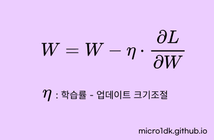

확률적 경사 하강법(Stochastic Gradient Descent)은 가장 기본적인 최적화 방법이다. 

SGD의 특징은

* 구현이 간단하고 계산비용이 적다.

### Anisotropy에서 최솟값을 찾아가는 과정

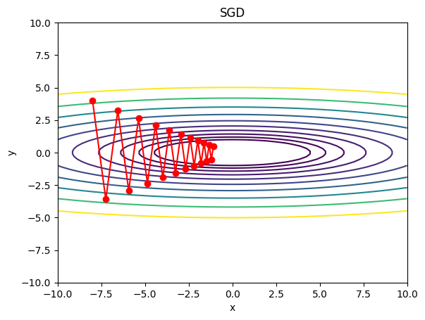

최적화 과정에서 많이 진동한다. 진동이 심하면 최솟값을 찾아가는 과정은 Z모양이 되고 **수렴속도가 늦다.** 따라서 비등방성 함수에서는 탐색경로가 상당히 비효율적이다.

## SGD Momentum

SGD Momentum은 전통적인 SGD에서 모멘텀 요소를 추가하였다. 

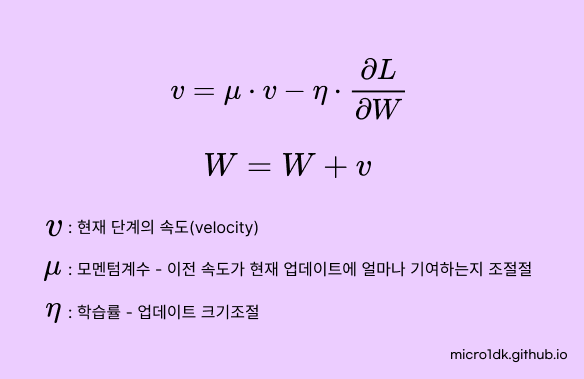

이전 기울기 방향을 유지하면서 최솟값을 찾아나간다. 물리학에서 관성개념과 유사하게, 움직임의 관성을 이용한다.

모멘텀 효과로인해 지역최솟값에서 쉽게 벗어날 수 있다. SGD가 가지고 있는 문제를 완화시켜준다. (그렇다고 해서 무조건 Global optimum을 찾는 것은 아님)

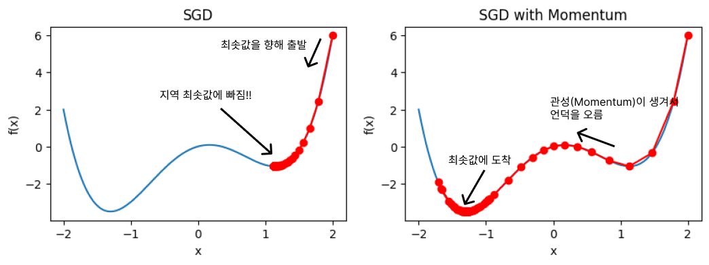

### Anisotropy

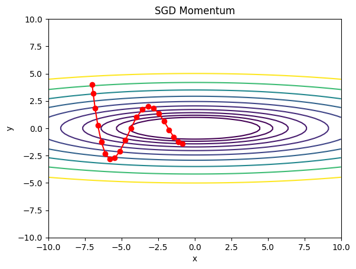

SGD에 비해 수렴속도가 빨라졌다. 여전히 안정적이지는 않다.

### Adagrad

학습률 (Learning rate)를 맞춤형으로 조절한다. 큰 기울기를 가지는 파라미터는 학습률을 줄이고, 작은 기울기를 가지는 파라미터에 대해서는 학습률을 늘린다.

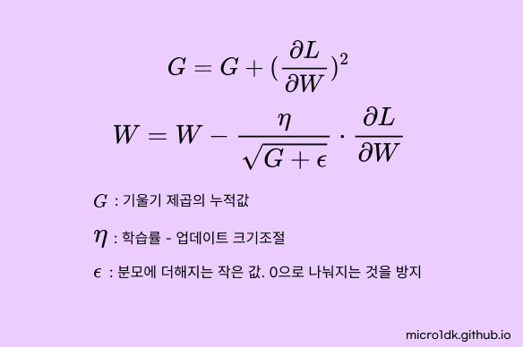

기울기의 누적 제곱 합을 사용하여 학습률을 조정하게 된다. 그 결과 맞춤형 조절방식이 되었다.

하지만 학습이 진행될 수록 학습률이 **지속적으로 감소한다.** 따라서 학습횟수가 많은 경우에는 학습률이 상당히 작아져 학습이 이루어지지 않는다는 단점이 존재한다. 이를 해결하기 위해 RMSprop의 알고리즘이 제안되었다.

### Anisotropy

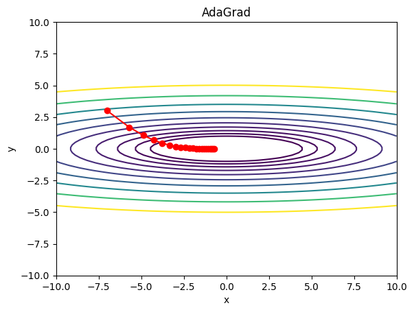

적응형으로 학습률을 조정하다 보니 손실공간에서 최솟값에 빠르게 도달하는것을 확인할 수 있다. 

또한 누적 기울기 제곱 합을 사용하기 때문에, 기울기가 커질 수록 학습률이 빠르게 감소하므로, 비등방성 손실함수 공간에서 빠르게 낮은 지역으로 이동할 수 있다.

## RMSprop

Adagrad의 단점을 개선하기 위해 제안된 알고리즘이다. Adagrad의 경우 모든 과거의 기울기를 동등하게 고려하는데 반해, RMSprop은 최근에 반영된 기울기만을 더 많이 고려한다. 쉽게말해 과거의 기울기는 서서히 잊고 최근의 기울기는 많이 반영하겠다는말이다.

가중치를 업데이트하는 수식의 형태는 Adagrad와 동일하다.

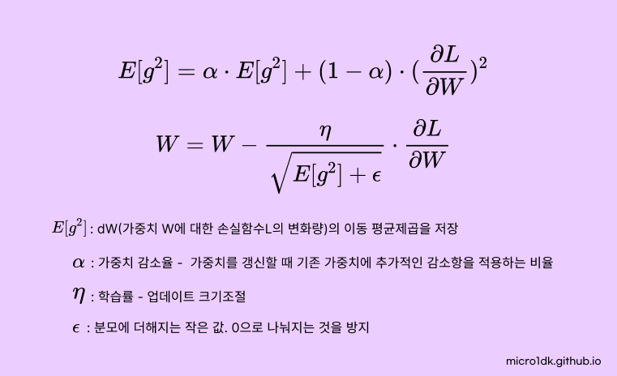

### Anisotropy

Adagrad와 형태가 동일하다.

## Adam

앞의 RMSprop과 Momentum을 결합하여 만들어졌다. 적응형 학습률 조정과 모멘텀을 이용하여 경사 하강법의 방향과 크기를 모두 맞춤형으로 조정한다. 이 때문에 Adam이 널리사용된다고한다.

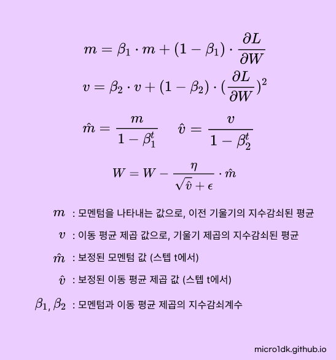

Adam이 만능은 아니다. 컴퓨터 비전에서는 오히려 SGD보다도 떨어진다는 연구도 있었다. Adam의 파생형으로 RAdam, AdamW 등 여러가지 등장한다.

### Anisotropy

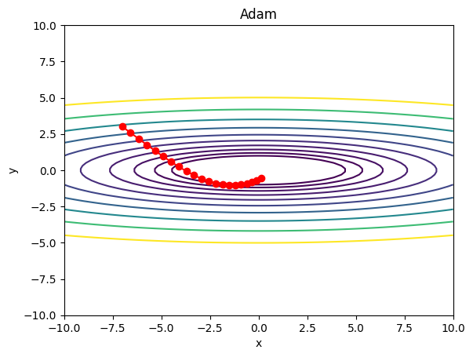

Momentum이 생겼기 때문에 RMSprop과 비교하면 곡률이 있음.

RMSprop과 Momentum을 동시에 적용했기 때문에

* 기울기가 큰 방향으로 학습률을 조정하고 이를 통해 가중치 업데이트의 변동을 줄인다.
* Momentum 기법을 이용하여 이전 기울기 방향을 유지하며, 올바른 방향으로 가중치를 업뎃한다.

## 결과

알고리즘 선택에는 정답이 없다. 해당 모델에 여러 알고리즘을 적용해보고 하이퍼파라미터도 조정해보는 등 노력이 필요하다.