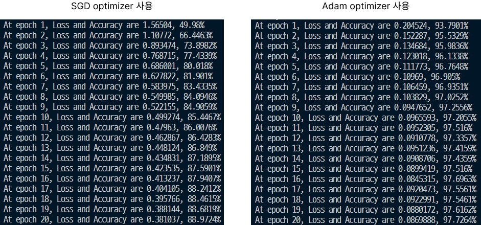

## Mnist

(28, 28) 크기의 이미지가 주어지고 0~9까지의 숫자를 맞춰야한다. 

Mnist 데이터 전처리과정을 거친다. Mnist 클래스에 대한 코드는 [여기]()

```c++
Mnist mnist, mnist_test;
vector<vector<float>> X_train, X_test;
vector<float> y_train, y_test;
X_train = mnist.readTrainingFile("./Utils/dataset/mnist/train-images.idx3-ubyte");
y_train = mnist.readLabelFile("./Utils/dataset/mnist/train-labels.idx1-ubyte");
X_test = mnist_test.readTrainingFile("./Utils/dataset/mnist/t10k-images.idx3-ubyte");
y_test = mnist_test.readLabelFile("./Utils/dataset/mnist/t10k-labels.idx1-ubyte");
```


신경망에 입력하기 전에 정규화를한다. 입력데이터셋의 평균을 0으로 표준편차를 1으로 맞춘다. 이렇게 하면 학습속도를 개선할 수 있다는 연구가 있다. (나중에 **배치 정규화**를 구현할 건데, 배치별로 데이터의 편차를 보정한다 .이 기법은 최근에 폭 넓게 활용되는 개념이다. 잔차네트워크, Transformer 등등)

```c++
Dataset dataset;
dataset.Standardize(X_train);
dataset.Standardize(X_test);
```


모델을 설계한다. 분류문제이므로 **Categorical Cross Entropy**를 사용한다.

```c++
model.AddLayer(new Linear(i_size, 178, WeightInit::GLOROT));
model.AddLayer(new Tanh());
model.AddLayer(new Dropout(0.2));

model.AddLayer(new Linear(178, 46, WeightInit::GLOROT));
model.AddLayer(new Tanh());
model.AddLayer(new Dropout(0.2));

model.AddLayer(new Linear(46, 10, WeightInit::GLOROT));

model.AddLoss(new CategoricalCrossEntropy()); // softmax 포함됨

SGD optimizer(&model, 0.001);
// Adam optimizer(&model, 0.001);
```


학습진행

```c++
int epochs = 100;
for (int epoch = 0; epoch < epochs; epoch++) {
    for (int ii = 0; ii < total_train; ii++) {
        Matrix input(i_size, batch_size);
        Matrix label(o_size, batch_size);

        input.CopyHostToDevice(batches.at(ii)->Get_X_Batch());
        label.CopyHostToDevice(batches.at(ii)->Get_y_Batch());

        model.TrainBatch(input, label);
        optimizer._Step();
        model.ZeroGrads();
    }
}
```


Optimizer로 **SGD**와 **Adam** 두 가지로 나누어서 테스트 해보았다.

20에폭까지 진행했으며 **1에폭마다 테스트 데이터셋에 대한 오차와 정확도**를 측정하였다.



Adam을 사용했을 때 1epoch에서부터 정확도가 90%를 넘겼다.


