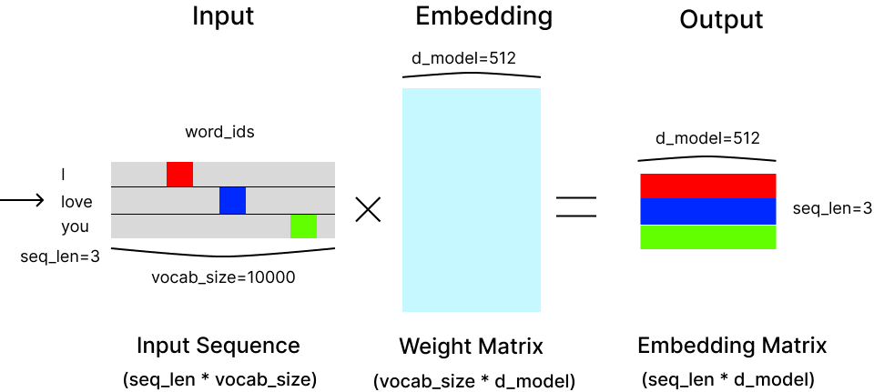
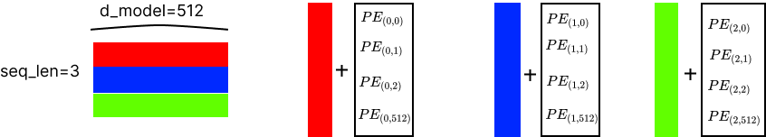
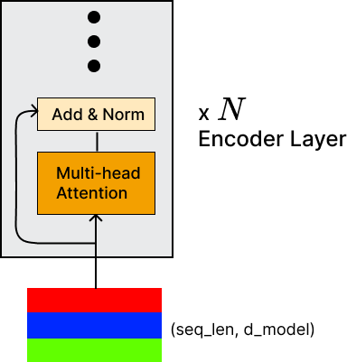
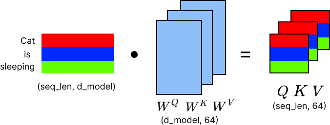
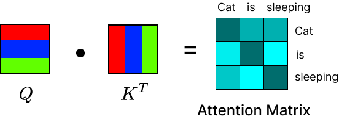
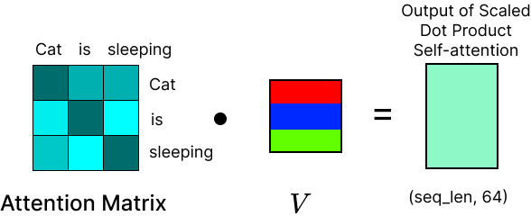
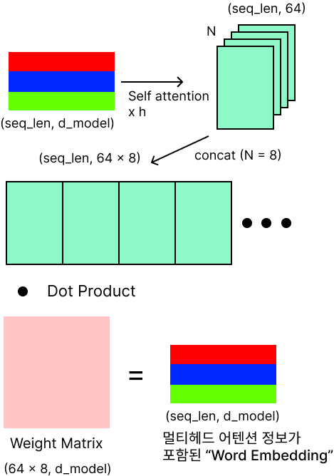

## Word Embedding

단어 임베딩의 목적은 입력 시퀀스를 기계가 읽을 수 있는 표현으로 변환하는 것이다. 가장 단순한 방법은 원-핫 인코딩이다. 이 접근 방식은 효과적이지 않다. 차원의 저주로 모델의 성능에 부정적인 영향을 미친다.

트랜스포머에서 단어 임베딩은 대규모 말뭉치에서 학습된 추가 변환을 희소한 원-핫 인코딩 벡터에 적용하여, 맥락 정보를 고려하면서 밀집되고 상대적으로 저차원의 단어 표현을 생성한다.

트랜스포머는 모델에 부착된 단어 임베딩을 사용하며, 처음부터 훈련이 된다. 사전 초기화된 파라미터 없이 단어 임베딩을 사용하면, 모델이 입력데이터의 맥락과 전체 모델 구조에 맞춰 임베딩 표현을 학습할 수 있다.

가중치 행렬의 형태는 (고유 어휘 수, 임베딩 차원)으로 나타낸다. 임베딩 차원을 d_model로 나타내겠다. 이 값은 논문 저자들이 512로 설정하였다.

임베딩은 입력된 원-핫 인코딩 벡터를 (시퀀스 길이, d_model) 형태로 더 낮은 차원 공간으로 매핑시키는 Lookup Table로 볼 수 있다. 임베딩은 단어 간의 의존성을 포착하고 맥락 정보를 제공한다. 이를 설명하는 예시는 "왕"의 임베딩 벡터에서, "남자"의 벡터를 빼면, "여왕"의 임베딩 벡터와 유사한 벡터를 얻는 것이다.



```python
class Embeddings(nn.Module):
    """
    단어의 인덱스틀 임베딩 벡터로 변환한다.
    임베딩 벡터의 값을 조정하여 반환한다.
    ex) 
        * 단어사전크기 vocab = 10000
        * 임베딩 벡터차원 d_model = 512
        의 경우, 10000개의 단어를 512차원의 임베딩 벡터로 변환한다.
    """
    def __init__(self, d_model, vocab):
        super(Embeddings, self).__init__()
        self.lut = nn.Embedding(vocab, d_model) # Lookup table
        self.d_model = d_model
        
    def forward(self, x):
        embed = self.lut(x) * math.sqrt(self.d_model) # Scaling
        return embed
```

입력의 제곱근에 의한 곱셈이 있는 이유? 임베딩은 위치 인코딩(Positional Encoding) 에 더해지기 전에 sqrt(d)로 곱해진다.

단어 임베딩의 가중치는 평균이 0이고 분산이 1로 초기화된다는 점을 유념해야한다. 저자들이 다양한 수치로 임베딩을 재조정해 보았고 (실제로 어텐션에서 그렇게 했듯이), 이 특정한 재조정이 효과가 있었던 이유는 초기에는 임베딩을 위치 인코딩보다 훨씬 더 크게 만들었기 때문이라고 생각한다. 위치 인코딩은 필요하지만, 아마도 단어 자체만큼 "크게" 작용하지 않아야 한다고 본다.


## Positional Encoding

트랜스포머 아키텍처는 순환 기반 네트워크의 사용을 버리고, 대신 입력 시퀀스를 처리하기 위해 자기 주의 메커니즘에 의존한다. 이는 입력을 한번에 처리하여 빠른 처리를 가능하게 하지만, 입력 단어들의 상대적인 위치에 대한 정보를 잃게된다.

예를 들어, "나는 영수를 때렸다"와 "영수가 나를 때렸다"라는 문장은 "영수"의 위치에 따라 다른 의미를 전달한다. 그럼에도 "영수"에 대한 단어 임베딩은 동일하다. 트랜스포머에서는 이 "영수"를 구별하기 위해 추가 정보가 필요하다.



```python
class PositionalEncoding(nn.Module):
    def __init__(self, d_model, dropout, max_len=256):
        super(PositionalEncoding, self).__init__()
        self.dropout = nn.Dropout(p=dropout)
        
        pe = torch.zeros(max_len, d_model) # 위치 임베딩 저장하기 위한 텐서
        position = torch.arange(0, max_len).unsqueeze(1).float() # [[0.], [1.], ...]
        
        # 스케일링 인자 생성
        div_term = torch.exp(torch.arange(0, d_model, 2).float() *
                             -(math.log(10000.0) / d_model))
        
        pe[:, 0::2] = torch.sin(position * div_term) # 모든행과 짝수열
        pe[:, 1::2] = torch.cos(position * div_term) # 모든행과 홀수열
        
        # (max_len, d_model) ==> (1, max_len, d_model) 크기가 됨
        pe = pe.unsqueeze(0)
        
        # 텐서를 모델의 버퍼에 등록한다. 등록된 텐서는 학습되지 않는다.
        self.register_buffer('pe', pe)
        
    def forward(self, x):
        # x의 크기가 (batch_size, seq_len, d_model) 이면, self.pe[:, :seq_len]은
        # 크기가 (1, seq_len, d_model)인 텐서를 반환
        x = x + Variable(self.pe[:, :x.size(1)],
                            requires_grad=False # 역전파 중 이 값은 업뎃되지 않음
                        )
        return self.dropout(x)
```

위치 인코딩 구성이후, (seq_len, d_model) 형태의 출력은 self-attention 블록과 피드포워드 신경망으로 구성된 첫 번째 인코더 츠으로 전달된다. 디코더의 입력 시퀀스에도 동일한 전처리방식(단어 임베딩, 위치 인코딩)이 사용된다.


## MultiHead Attention

트랜스포머는 self attention을 병렬로 h번 학습시키는 멀티헤드 어텐션 구조로 이루어져있다. self attention에 대한 이해가 먼저 필요하다.

앞서 진행한 인코딩의 출력이 (seq_len, d_model) 형태라는 것을 기억해야한다. 




### Self Attention의 이해

Self-attention의 이해가 필요하다. 기본 아이디어는 모델이 맥락에 따른 관련성에 따라 특정 단어에 더 집중할 수 있다는 것이다. 다시 말해, 모델은 각 입력 단어에 "Attention"의 정도를 할당하여, 더 중요한 단어에 더 많은 Attention을 부여한다.

아래는 예시

```
오늘 아침 회사에 가는 길에 차가 고장났습니다. 정비소에 차를 맡기고 버스를 타고 출근했어요. 점심시간에 동료와 새로 오픈한 이탈리안 레스토랑에서 파스타를 먹었습니다. 퇴근 후에는 체육관에 가서 1시간 동안 운동을 했습니다. 오늘 하루 중 가장 스트레스를 받은 사건은 무엇일까요?
```

* Attention 모델이 아닌경우

  차가 고장난 것, 버스를 탄 것, 점심 식사, 운동 등 모든 사건에 균등한 가중치를 줄 것이다. 이로 인해 "가장 스트레스를 받은 사건"을 정확히 파악하기 어려울 수 있다.

* Attention 모델인 경우

  * 차가 고장났습니다"는 일상적이지 않은 부정적인 사건이므로 높은 Attention을 받는다.
  * "버스를 타고 출근했어요"는 차 고장의 결과로, 중간 정도의 Attention을 받을 수 있다. 평소와는 다른 출근 방식이므로 약간의 스트레스 요인이 될 수 있다.
  * "파스타를 먹었습니다"는 긍정적인 경험으로 보이므로, 스트레스와 관련해서는 낮은 Attention을 받을 것이다.
  * "운동을 했습니다"는 스트레스 해소에 도움이 되는 활동이므로 낮은 Attention을 받는다.


### Self Attention 계산방법

```python
def attention(query: torch.Tensor,
              key: torch.Tensor,
              value: torch.Tensor,
              mask: Optional[torch.Tensor] = None,
              dropout: Optional[torch.Tensor] = None,
              align: Optional[torch.Tensor] = None
            ) -> Tuple[torch.Tensor, torch.Tensor]:
    """
    query, key, value는 (n_batches, n_heads, seq_len, d_k)의 형태를 가진다.
    Multihead attention 계산을 위해 n_heads를 적용한다.
    """
    pass
```

입력행렬은 세 개의 별도 가중치 행렬을 통해 Query, Key Value를 나타내는 세 개의 작은 행렬로 선형투영된다. 이 행렬들은 (seq_len, 64) 형태를 가진다. 64는 논문저자들이 선택한 임의의 값이다.이 가중치 행렬들은 전체 모델과 함께 역전파를 통해 학습뇐다. 64라는 값은 어텐션 계산에 영향을 미치지 않는다.


위 식을 아래 그림을 통해 설명한다.



```python
query, key, value = \
            [linear(x).view(nbatches, -1, self.h, self.d_k).transpose(1, 2)
             for linear, x in zip(self.linears, (query, key, value))]
```

입력 시퀀스의 모든단어(자신포함)의 Key 벡터는 각 단어의 쿼리와 비교되어 가장 잘 일치하는 것을 결정한다. 그 결과로, Attention Matrix를 생성한다. 이는 입력시퀀스의 단어 임베딩 표현을 재생성하지만, attention 정보가 포함된 것이다.



```python
d_k = query.size(-1)
scores = torch.matmul(query, key.transpose(-2, -1)) / math.sqrt(d_k)
```


Query와 Key 행렬은 서로 내적되어 위에서 보여지는 "Attention Matrix"을 생성한다. 2차원 공간에서 두 벡터간의 내적은 벡터들 사이의 코사인 유사도를 측정하는 것으로 볼 수 있다. 이는 크기의 곱에 의해 스케일링된다. Attention Matrix는 (seq_len, seq_len)의 형태를 가진다.



```python
p_attn = F.softmax(scores, dim=-1) # attention map
x = torch.matmul(p_attn, value)
```

Attention Matrix의 각 값은 Key, Query, Value 행렬으이 크기의 제곱근으로 나눠진다. 이 과정은 학습 중 그래디언트를 안정화시킨다. 다음 Attention Matrix는 소프트맥스 함수를 통과하여, 0과 1사이로 정규화한다.


### Multihead Attention



트랜스포머는 self attention을 병렬로 h번 학습시키는 멀티헤드 어텐션 구조로 이루어져있다. 다음은 병렬로 학습하는 이유를 설명한다. 다음 예시 문장을 통해 설명한다.

```
The cat chased the mouse across the old wooden floor.
```

이 문장에서 멀티헤드 어텐션이 어떻게 작동하는가? 중요한것은 여러 부분에 대해 동시에 어텐션을 적용할 수 있기 때문에, 토큰 간의 다양한 유형의 종속성을 포착할 수 있다. 동시에 다양한 정보를 결합할 수 있다.

1. 주어-동사 관계
   * The cat과 chased의 관계에 집중한다. 이 Head는 누가 행동의 주체인지 파악한다.
2. 동사-목적어 관계
   * chased와 the mouse의 관계에 집중한다. 이 Head는 행동의 대상이 무엇인지 식별한다.
3. 공간관계
   * across와 the old wooden floor의 관계에 집중한다. 이 Head는 행동이 일어나는 장소와 방향을 파악한다.
4. 형용사-명사 관계
   * old wooden과 floor의 관계에 집중한다. 

이와 같이 Head는 다양한 관계에 집중하는 어텐션을 줄 수 있다. 이렇게 복잡한 관계를 다룰 수 있다.