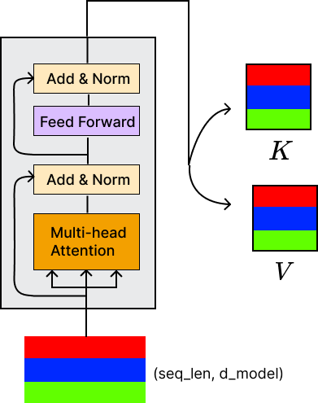
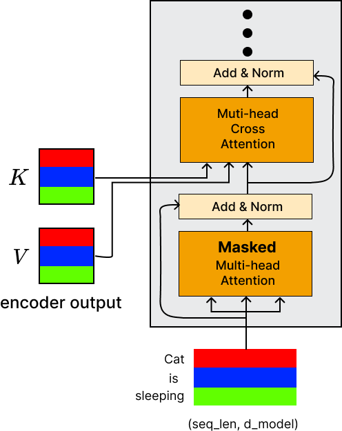

## Decoder

### Encoder output

마지막 인코더층의 출력은 선형투영을 거치며, 디코더에 입력될 Key와 Value 행렬을 생성한다.

### 디코더 학습 및 추론 방식 - Teacher Forcing

인코더와 동일한 방식으로 입력을 처리한다. 단어임베딩과 위치 인코딩을 통해 처리된다.

디코더는 먼저 "문장의 시작" 토큰을 입력으로 받으며 정보가 흐르게 된다. 그 다음 시퀀스에서 다음 출력을 생성하고, 이 출력은 이전 시간 단계의 입력과 연결되어 다음 입력으로 사용된다.

이 반복 과정은 디코더가 "문장의 끝" 토큰을 생성하거나 사용자가 지정한 한도에 도달할 때까지 계속된다. 이 접근 방식은 디코더가 순차적으로 하나씩 출력 요소를 생성하도록 한다.

그리고 디코더는 예측 단계마다 모든 디코더 층에서 인코더가 생성한 동일한 Key와 Value 행렬을 받는다.

디코더는 자율 회귀적으로 학습시키는 대신, 각 시간 단계에서 디코더의 입력은 시퀀스의 시작부터 이전 시간 단계까지의 예상 출력이다.