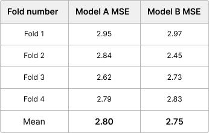

---

title: 교차검증
layout: default
parent: 머신러닝
nav_order: 1
---

# Local Validation

머신 러닝에서 **Local Validation**은 모델을 개발하고 튜닝하는 과정에서, 훈련 데이터 세트의 일부를 사용하여 모델의 성능을 평가하는 과정을 말한다. 이는 모델이 실제 운영 환경에서 얼마나 잘 작동할 것인지를 예측하기 위해 수행된다.


## 교차검증

주어진 데이터를 훈련 세트와 검증 세트로 분할하고, 이를 통해 모델을 훈련하고 평가한다. 다시 데이터를 분할부터 계속 반복한다.

데이터를 여러 서브셋으로 나누고 훈련하고 테스트하면서 새로운 데이터에 대한 모델의 성능을 추정한다. 새로운데이터에 대해 얼마나 잘 예측할 수 있는지 알 수 있다.

머신러닝은 데이터의 의존성이 높다. 따라서 훈련데이터에 과적합 되는 경우, 새로운 데이터에 대한 성능이 떨어진다. 교차 검증을 통해 완화할 수 있다.


교차검증 방법에는

* **k-Fold 교차 검증**

* **Stratified k-Fold 교차 검증**

* **Leave-One-Out (LOO) 교차 검증**

* **Nested 교차 검증**

* **시계열 교차 검증**

등 존재한다. 


## K fold


```python
from sklearn.model_selection import KFold, cross_val_score
from sklearn.ensemble import RandomForestClassifier
import numpy as np

iris = load_iris()
X, y = iris.data, iris.target

model = RandomForestClassifier(random_state=42)

kfold = KFold(n_splits=5)

scores = cross_val_score(model, X, y, cv=kfold)

print('Cross-validation scores:', scores)
print('Average score:', np.mean(scores))
```

```
Cross-validation scores: [1.         1.         0.86666667 0.93333333 0.76666667]
Average score: 0.9133333333333333
```


## Stratified K fold


**불균형분포**를 가진 데이터셋에서 유용하다. 예를들어 클래스 A샘플이 1000개, 클래스 B 샘플이 100개인 경우, 어떤 fold에서는 B샘플이 아예 없을 수 있다. 이는 해당 fold에서 클래스B에 대한 학습이 이루어지지 않는 문제를 야기한다.

따라서 **Stratified K fold**는 각 fold가 **원본 데이터셋의 클래스 분포를 유지** 하도록 데이터를 분할한다. 이 방식을 사용하여 각 fold에서 학습과 검증이 공정하게 이루어진다.

사용하는 예시로, 질병을 진단하는 의료데이터에서 질병이 있는 환자가 전체 중 소수인 경우, 신용카드 사기 탐지에서 사기 건이 전체 중에 소수인 경우.

```python
from sklearn.datasets import load_iris
from sklearn.model_selection import StratifiedKFold, cross_val_score
from sklearn.ensemble import RandomForestClassifier
import numpy as np

iris = load_iris()
X, y = iris.data, iris.target

model = RandomForestClassifier(random_state=42)

stratified_kfold = StratifiedKFold(n_splits=5)

scores = cross_val_score(model, X, y, cv=stratified_kfold)

print('Cross-validation scores:', scores)
print('Average score:', np.mean(scores))
```

```
Cross-validation scores: [0.96666667 0.96666667 0.93333333 0.96666667 1.        ]
Average score: 0.9666666666666668
```


## Leave-One-Out (LOO) 교차 검증

K fold 교차 검증의 특별한 경우로, 각 반복에서 하나의 데이터 샘플만 테스트 데이터로 사용한다. 이 방법은 계산 비용이 매우 높지만, 작은 데이터셋에서는 유용할 수 있다.

```python
from sklearn.model_selection import cross_val_score, LeaveOneOut
from sklearn.datasets import load_iris
from sklearn.ensemble import RandomForestClassifier
import numpy as np

iris = load_iris()
X, y = iris.data, iris.target

model = RandomForestClassifier(random_state=42)

scores = cross_val_score(model, X, y, cv=LeaveOneOut())

print('Average accuracy:', np.mean(scores))
```

```
Average accuracy: 0.9533333333333334
```

다른 교차검증에 비해 계산비용이 높아 실행속도가 매우 느리다.


## Nested 교차 검증

 "내부" 교차 검증을 사용하여 모델의 최적의 매개변수를 선택하고, "외부" 교차 검증을 사용하여 선택된 모델의 성능을 평가하는 방식으로 이루어진다. 모델 선택과 성능 평가를 동시에 신뢰성 있게 수행하기 위한 방법이다.

교차 검증을 '내부 교차 검증'과 '외부 교차 검증'으로 구분하는 것은 모델 선택과 하이퍼파라미터 튜닝 과정에서의 차이를 나타내는 데 사용된다.

내부 교차 검증은 모델 훈련과정 내에서 주로 하이퍼파라미터 튜닝이나 모델 선택을 위해 사용되며, 외부 교차 검증은 모델의 성능 평가를 위해 사용된다.

**GridSearchCV**를 이용하여 최적화된 하이퍼파라미터를 얻을 수 있다.

```python
from sklearn.datasets import load_iris
from sklearn.ensemble import RandomForestClassifier
from sklearn.model_selection import GridSearchCV, cross_val_score, KFold

iris = load_iris()
X = iris.data
y = iris.target

param_grid = {'max_depth': [3, 5, 7, 9], 'min_samples_split': [2, 5, 10]}

grid_search = GridSearchCV(RandomForestClassifier(), param_grid, cv=5)

kfold = KFold(n_splits=5)

nested_scores = cross_val_score(grid_search, X, y, cv=kfold)

print("Nested cross validation scores: ", nested_scores)
print("Mean score: ", nested_scores.mean())
```

```
Nested cross validation scores:  [1.         1.         0.83333333 0.93333333 0.8       ]
Mean score:  0.9133333333333333
```


## 시계열 교차 검증

시계열 데이터의 경우, 일반적인 k-fold 교차 검증 방식을 사용하면 미래 데이터를 사용하여 과거를 예측하는 문제가 발생할 수 있다. 이를 피하기 위해 시계열 교차 검증(Time Series Split)을 사용한다.


### Data Leakage

다음 시계열 데이터에서 K-fold 전략의 문제점이다.


시간 순서를 무시한다. 실제 환경에서는 미레 데이터에 접근할 수 없다.


다음은 가능한 접근 방식이다. **Time Series Cross-Validation** 전략이다.


항상 미래를 예측하면서 과거 데이터에 대해서만 훈련하는 방식으로 분할한다.


## Validation pipeline

```python
fold_metrics = []
for train_idx, test_idx in CV_STRATEGY.split(train):
    cv_train, cv_test = train.iloc[train_idx], train.iloc[test_idx]
    # 모델 훈련
    model.fit(cv_train)
    # 예측
    predictions = model.predict(cv_test)
    # 성능 지표 평가
    metric = evaluate(cv_test, predictions)
    fold_metrics.append(metric)
```


결과적으로 각 Fold에 대한 모델의 오차를 나타내는 목록이 있다. 예시로, 두 개의 다른 모델을 훈련하고 각 모델에 대한 Fold 목록을 나타낼 수 있다.



여기서 우리의 목표는 A와 B 중 더 나은 품질의 모델을 선택하는 것이다. 하지만 K개의 수를 동시에 비교하여 결론을 내리기는 어렵다. K-폴드 교차 검증에서 여러 개의 검증 점수를 단일 전체 검증 점수로 요약하는 방법은 평균을 취하는 것이다.

```python
mean_score = np.mean(fold_metrics)
```

Single Fold에서는 좋은 점수를 얻을 수 있지만 나머지 Fold에서는 성능이 좋지 않을 수 있다.

보다 신뢰할 수 있는 전체 유효성 검사 점수를 정의해보자면

```python
overall_score_minimizing = np.mean(fold_metrics) + np.std(fold_metrics)
overall_score_maximizing = np.mean(fold_metrics) - np.std(fold_metrics)
```

표준편차를 추가한다.

점수 편차를 고려하여 전체 점수를 계산하는 경우


실제로 모델 A가 더 나은것으로 나타났다.