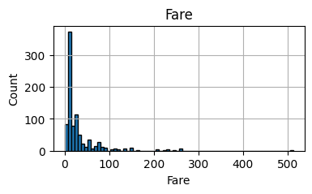
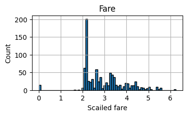

# Feature Scaling

Feature Scaling은 입력 데이터의 범위를 표준화하거나 정규화하는 방법이다. 알고리즘 성능을 높이거나 수렴 속도를 빠르게 하는데 도움이된다.

Feature Scaling에는 주로 3가지 방법이 있다.

* **Standardization (표준화)** : 데이터의 특성들이 평균이 0이고 분산이 1인 가우스 정규 분포를 가지도록 만드는 과정이다. 각 특성의 평균을 뺀 후 표준 편차로 나눠준다.
* **Min-Max Scaling (정규화)** : 데이터를 0과 1 사이의 범위로 재조정하는 방식이다. 각 요소의 값을 해당 열의 최소값을 뺀 후, (해당 열의 최대값 - 해당 열의 최소값)으로 나눠준다.
* **Robust Scaling** : 중앙값(median)과 IQR(interquartile range)을 사용하여 특성들이 같은 스케일을 가지도록 만드는 방식이다. 이 방식은 이상치에 영향을 받지 않는다는 특징이 있다.


## Standardizing Data

**데이터 표준화(Standardizing Data)** 는 Feature들 간의 스케일 차이를 보정하여 모델이 각 피쳐를 공평하게 고려하도록 돕는 역할을 한다. 서로 다른 단위나 스케일을 가지는 변수들을 비교하고 분석하기 쉽게 만든다.

특히, 거리기반 알고리즘(kNN)이나 기울기 기반의 알고리즘(SGD)과 같이 스케일에 민감한 모델을 사용할 때 데이터 표준화는 중요한 역할을 한다.

표준화는 데이터의 Feature 각각이 평균이 0이고 분산이 1인 가우시안 정규분포를 가진 값으로 변환하는 의미한다.


몇 가지의 데이터를 표준화를 고려해야하는 경우가 있다.

* **Linear distance** : kNN, Linear Regression, K-means clusturing과 같이 선형 거리측정하는 알고리즘에서 데이터 표준화를 고려할 수 있다. 일관된 스케일을 가진 데이터로 표준화하여 데이터 간의 거리를 계산하거나 유사성을 측정한다.
* **High variance** : 분산이 큰 변수는 큰 범위에 퍼져있기 때문에 다른 변수들과 비교하기 어려울 수 있다. 예를들어, 어떤 한 변수의 값 범위는 0~1000이고, 다른 한 변수의 값 범위는 0~10일 때, 분산이 큰 변수의 영향이 더 크게 작용한다. 이때 동일한 스케일로 조정하여 정확하게 비교할 수 있다.
* **different scales** : 변수마다 다른 스케일을 가질 때 표준화를 해보자. 스케일이 큰 변수는 모델의 가중치에  큰 영향을 주게된다. 반대로 스케일이 작은 피쳐는 모델의 가중치에 미미한 영향을 준다. 이로인해 예측 결과와 변수간의 관계가 왜곡된다.  

```python

```


### Log normalization

표준화를해서 표준정규분포를 따르도록 만들 수 있지만, log값을 취해서도 정규화를 할 수 있다.

Log normalization은 데이터를 로그 스케일로 변환하는 방법이다. 이 방법은 데이터의 분포가 왜곡되어 있거나 오른쪽 치우친 분포 (Right skewed distribution)를 가질 경우 유용하다.

로그 변환은 양수 값이 있는 데이터에만 적용된다. 큰 값을 작은 값으로 변환한다.

**Titanic: Machine Learning from Disaster** 데이터 셋에서 Fare(운임요금) 변수의 경우 양수의 값으로 이루어져있고 변수의 분포를 살펴보면 한 쪽으로 치우친 분포를 가지고 있다. 이 변수에 대해 로그변환을 해준다.


Fare 피쳐의 히스토그램을 파악하고 로그변환을 해보자

```python
import numpy as np
import pandas as pd

df = pd.read_csv('train.csv') # 타이타닉 훈련데이터
```

```python
import matplotlib.pyplot as plt

df['Fare'].hist(bins=70, figsize=(4,2))
```



Right skewed 분포를 가지고 있다. 로그 변환을 진행한다.

```python
df['Fare'] = np.log1p(df['Fare'])
df['Fare'].hist(bins=70, figsize=(4,2))
```




### Feature Scailing

