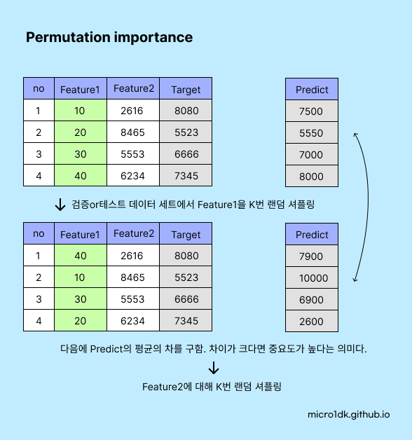

## Feature Engineering

실제데이터는 깔끔하지 않을 수 있으며, 정규화와 같은 전처리 단계 외에도 기존의 Feature에서 정보를 추출하고 확장해야한다. Feature Engineering에는 다양한 방법들이 있다.

* **Feature Creation** : 현재년도에서 나이라는 새로운 특성을 만들 수 있음
* **Feature Transformation** :  Scaling 또는 원-핫 인코딩 등
* **Feature Selection** : 유용한 특성을 선택, 덜 중요한 특성은 제거


# Feature Selection

## Correlated features

* Statistically correlated: features move together directionally
* Linear models assume feature independence
* Pearson's correlation coefficient


Scikit-Learn 라이브러리는 다양한 특성 선택 방법을 제공한다.

* **Variance Threshold** : 분산이 특정 임계값보다 낮은 특성을 제거한다. 기본적으로, 변동이 없는 특성을 제거 한다.
* **SelectKBest** : 모든 특성 중에서 목표 변수와의 관계가 가장 높은 상위 K개의 특성을 선택한다.
* **Recursive Feature Elimination (RFE)** 
* **SelectFromModel**


## Recursive Feature Elimination (RFE)

모델의 최초 학습 후, 가장 중요도가 낮은 특성부터 순차적으로 제거해 가면서 반복적으로 학습/평가를 수행하여 최적의 특성을 추출한다. 

하지만 수행시간이 오래 걸리고, 낮은 속성들을 제거해 나가는 메커니즘이 정확

RFE는 종종 SVM, 로지스틱 회귀, 랜덤 포레스트 등의 모델에 사용된다.

```python
from sklearn.feature_selection import RFE
from sklearn.svm import SVR

estimator = SVR(kernel="linear")
selector = RFE(estimator, n_features_to_select=5, step=1)
selector = selector.fit(X, y)
```


## SelectFromModel

모델 최초 학습 후,  특성 중요도에 따라 특정 임계값보다 큰 특성만 선택한다. 임계값에는 중앙값/평균 등 사용될 수 있다. SelectFromModel은 모델이 한 번만 학습되므로 RFE보다 계산 비용이 낮다.


```python
from sklearn.feature_selection import SelectFromModel
from sklearn.ensemble import RandomForestClassifier

clf = RandomForestClassifier()
selector = SelectFromModel(clf, threshold=0.2)
selector = selector.fit(X, y)
```


## Permutation importance

모델들의 피쳐를 하나씩 변조해나간다. 특정 값으로 변조를 할 수 있고, 피쳐의 Column에 대해서 무작위 셔플링도 할 수 있다. 이렇게 원래의 관계를 깨트리고 모델의 예측을 다시 수행한다.

특정 값을 변조/셔플링 후의 성능을 기본 성능에서 뺀다. 만약 **성능저하가 크다면 해당 특성은 중요하다**는 것을 의미한다. 성능에 큰 차이가 없다면 해당 특성은 덜 중요하다는 뜻.

학습 데이터를 제거하거나 변조하면 다시 학습을 수행해야 하므로 수행시간이 오래걸린다.  따라서 Train 데이터에 하는 것이아니라 Test 또는 Validation 세트에 대해서 수행한다.




```python
from sklearn.datasets import load_diabetes
from sklearn.model_selection import train_test_split
from sklearn.inspection import permutation_importance
from sklearn.linear_model import Ridge
from sklearn.metrics import r2_score
import numpy as np

diabetes = load_diabetes()
X_train, X_test, y_train, y_test = train_test_split(diabetes.data, diabetes.target, random_state=0)

model = Ridge(alpha=1e-2).fit(X_train, y_train)
y_pred = model.predict(X_test)
print('r2 score:', r2_score(y_test, y_pred))
print()

r = permutation_importance(model, X_test, y_test, n_repeats=30, random_state=0)

for i in r.importances_mean.argsort()[::-1]:
    if r.importances_mean[i] - 2 * r.importances_std[i] > 0:
         print(diabetes.feature_names[i],"   ", np.round(r.importances_mean[i], 4), " +/- ", np.round(r.importances_std[i], 5))

print()
print(r.importances_mean)
```

```
2 score: 0.3566675322939421

s5     0.2042  +/-  0.04964
bmi     0.1758  +/-  0.0484
bp     0.0884  +/-  0.03284
sex     0.0559  +/-  0.02319

[-0.00199237  0.05587285  0.17579633  0.08836144  0.04219777  0.00203309
  0.00203936  0.00318738  0.20422681  0.00278711]
```


## Permutation Importance vs Random Forest Feature Importance

https://scikit-learn.org/stable/auto_examples/inspection/plot_permutation_importance.html#sphx-glr-auto-examples-inspection-plot-permutation-importance-py

Permutation importance는 모든 상황에서 완벽한 특성 선택 방법이 아니다. 특성들 사이의 상호작용을 고려하지 않고, 높은 상관성을 가진 특성들이 있다면 이를 제대로 반영하지 못할 수 있다. 따라서 특성 선택 과정은 데이터와 문제의 복잡성, 그리고 사용하는 모델의 특성에 따라 여러 방법을 시도해 보고 최적의 결과를 얻어내는 과정이 필요하다.