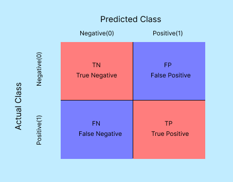
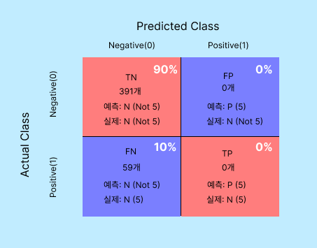
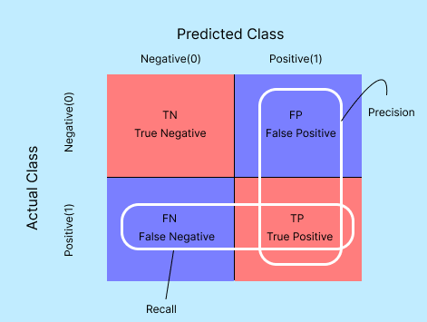
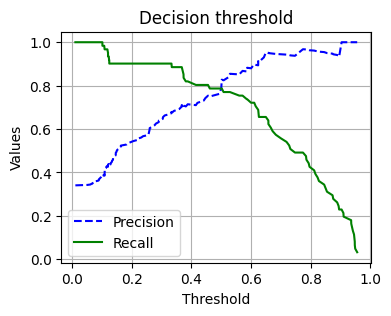

# 모델 평가

모델의 성능을 평가하기 위해 다양한 지표가 사용된다. 어떤 지표를 선택할지는 문제와 목적에 따라 달라진다. 보통 사용되는 몇 가지 지표는

* **정확도(Accuracy)** : 전체 예측 중에서 올바르게 예측한 비율. 데이터의 클래스 불균형(imbalanced)이 있을 경우에는 잘못된 정보를 줄 수있다. 
* **오차 행렬(Confusion Matrix)** : 클래스의 예측결과를 **2x2 행렬**로 나타낸다. 이 행렬은 진짜 양성(true positive), 거짓 양성(false positive), 진짜 음성(true negative), 거짓 음성(false negative)의 네 가지 경우를 나타낸다.
* **정밀도(Precision)**: 양성으로 예측된 경우 중에서 실제로 양성인 비율. 이는 **거짓 양성의 수를 최소화**하는 데 중점을 두었다.
* **재현율(Recall)** : 실제 양성 중 양성으로 예측된 비율. **거짓 음성의 수를 최소화** 하는데 중점을 두었다.
* **F1 점수(F1 Score)**: 정밀도와 재현율의 조화 평균을 계산한 값이다. 데이터가 불균형할 경우 F1 점수는 성능 평가에 유용하다.
* **ROC 곡선(Receiver Operating Characteristic Curve) 및 AUC(Area Under the Curve)** : 거짓 양성률에 대한 진짜 양성률을 Floating한 것.


## Accuracy

데이터 불균형(imbalanced)한 경우에는 사용하지 않는다. 예를들어 암 진단을 예측하는 모델을 개발한다고 했을 때, 데이터는

* 암 환자 데이터 - 100명 (양성)
* 비암 환자 데이터 - 900명 (음성)

이 데이터셋은 암 환자와 비암환자 사이에 데이터 불균형이 존재한다. 양성이 음성 수에비해 매우 적다. 이런 경우에는 모델이 항상 음성 클래스로 예측하는 경향을 가질 수 있다.  

정확도를 Mnist 데이터셋과 같은 다중 클래스 데이터셋을 **이진 분류**로 변환하여 평가할 때에도 문제가 발생한다. Mnist 데이터셋은 0부터 9까지의 10개의 클래스로 구성되어있다. 

* 숫자 0과 5를 분류하는 경우, 숫자 0의 샘플 수가 많고, 숫자 5의 샘플 수가 적을 수 있다. 따라서 모델은 0을 예측하는 경향이 더 커진다.
* 각각의 숫자를 분류하는 문제에서는 각각 클래스가 동등한 중요도를 가지고 있다. 그러나 정확도는 클래스의 중요도를 구분하지 않고 평가한다.


## Confusion Matrix

오차행렬은 **이진 분류 문제**에서 주로 사용되는 평가지표다.



* **TN**: 모델이 음성 클래스로 정확하게 음성으로 예측한 경우 (실제 값과 예측값이 모두 False)
* **FN**: 모델이 양성 클래스를 잘못해서 음성으로 예측한 경우 (실제 값은 True, 예측값이 False)
* **TP**: 모델이 양성 클래스를 정확하게 양성으로 예측한 경우 (실제 값과 예측값이 모두 True)
* **FP**: 모델이 음성 클래스를 잘못해서 양성으로 예측한 경우 (실제 값은 False, 예측값이 True)


### 오차 행렬을 통한 Accuracy 지표 문제점 인지

Mnist 데이터에서 '5와 5가 아님'에 대한 이진분류의 오차행렬을 구해보았다.

```python
from sklearn.datasets import load_digits
from sklearn.model_selection import train_test_split
from sklearn.linear_model import SGDClassifier
from sklearn.base import BaseEstimator
from sklearn.metrics import confusion_matrix, accuracy_score

mnist = load_digits()
X, y = mnist["data"], mnist["target"]
y = (y == 5).astype(int)

X_train, X_test, y_train, y_test = train_test_split(X, y, random_state=42)

# '0'으로만 예측하는 dummy 분류기 생성
dummy_clf = DummyClassifier(strategy='constant', constant=0)

dummy_clf.fit(X_train, y_train)

y_pred = dummy_clf.predict(X_test)

conf_mx = confusion_matrix(y_test, y_pred)
conf_mx
```

```
[[391   0]
 [ 59   0]]
```

TP와 FP가 0이다. Positive로 예측한 것 중 성공한건이 없다.

오차행렬을 그림으로 나타내면



FP와 TP가 0이 나왔다. 문제가 있음을 인지했다. 이렇게 이진분류에서 정확도를 구하는데 문제가 있음을 알 수 있다.


### 정확도 계산

```python
accuracy_score(y_test , y_pred)
```

```
0.8688888888888889
```


대략 87%가 나왔다. 5가 아닌확률이 87%이다.


## Precision & Recall




* 정밀도(Precision)는
  * (분모) 예측을 Positive로 한 대상 중에
  * (분자) 예측과 실제값이 Positive 한 데이터
* 재현율(Recall)은
  * (분모) 실제값이 Positive인 대상 중에
  * (분자) 예측값과 실제값이 Positive 한 데이터

암 진단 데이터에서 정밀도와 재현율은 매우 중요한 지표가 된다.


### 정밀도

정밀도가 높다는 것은 암진단 받은 사람중에서 실제로 암인 사람의 비율이 높음을 의미한다.

* (분모) 암이라고 진단받은 사람들 중에서 (TP + FP)
* (분자) 실제로 암인 사람 (TP)

정밀도가 높다는 것은 **'암'진단을 받았지만 실제로는 '암'이 아닌경우가(FP) 적다**는 뜻이 된다. 이는 의사가 암 진단을 내릴 때 매우 신중하게 판단했음을 의미한다.


### 재현율

재현율이 높다는 것은 실제로 암인 사람들 중에 암이라고 진단받은 사람의 비율이 높다는 것을 의미한다.

* (분모) 실제로 암인 사람들 중에서 (FN + TP)
* (분자)  실제로 암이라고 진단 받은 사람 (TP)

정밀도가 높다는 것은 **'암'인데 '암'이 아니라고 진단 받는 경우가 적다(FN)**는 뜻이된다.


암과 같이 심각한 질병에서는 **실제로 암인데 암이 아니라고 진단 받는 경우(FN)**가 적어야하므로 재현율이 중요한 지표가 될 수 있다. 하지만 재현율을 과도하게 높이다보면 암이 아닌 사람들까지 암이라고 진단하게 되는 오진율(FP)가 높아지게 되니 **FP를 조절하는** 정밀도도 중요하다.

암진단 데이터의 경우에는 재현율이 정밀도보다는 상대적으로 더 중요하다.

반대로 정밀도가 더 중요한 경우는 스팸메일 구분하는 경우가 된다. 실제로 스팸메일 이지만 스팸메일이 아닌 경우가 적어야한다. 중요한 메일일 수 있기 때문이다.


타이타닉 데이터셋에서 정확도와 정밀도와 재현율을 함께 구현한다.

```python
from sklearn.model_selection import train_test_split
from sklearn.linear_model import LogisticRegression
from sklearn.metrics import accuracy_score, precision_score, recall_score, confusion_matrix
from sklearn.preprocessing import LabelEncoder
import pandas as pd

titanic_df = pd.read_csv('titanic_train.csv')

titanic_df = titanic_df.drop(['PassengerId', 'Name', 'Ticket', 'Cabin'], axis=1)
titanic_df['Age'].fillna(titanic_df['Age'].mean(),inplace=True)
titanic_df['Embarked'].fillna('N',inplace=True)

encoder = LabelEncoder()
for feature in ['Sex', 'Embarked']:
    titanic_df[feature] = encoder.fit_transform(titanic_df[feature])

X = titanic_df.drop('Survived', axis=1)
y = titanic_df['Survived']
X_train, X_test, y_train, y_test = train_test_split(X, y, test_size=0.2, random_state=11)

lr_clf = LogisticRegression()
lr_clf.fit(X_train, y_train)
pred = lr_clf.predict(X_test)

print(f'Confusion Mat :\n{confusion_matrix(y_test, pred)}')
print('Accuracy: {0:.4f}'.format(accuracy_score(y_test, pred)))
print('Precision: {0:.4f}'.format(precision_score(y_test, pred)))
print('Recall: {0:.4f}'.format(recall_score(y_test, pred)))
```

```
Confusion Mat :
[[105  13]
 [ 13  48]]
Accuracy: 0.8547
Precision: 0.7869
Recall: 0.7869
```


### 정밀도/재현율 Trade-off

어느 하나가 올라가면 어느 하나는 내려간다. 그래서 두 지표를 동시에 높이는 것은 어렵다. 따라서 최적의 임계값을 찾는것이 중요하다.

임곗값에 따른 정밀도-재현율 값을 그래프로 나타내어 본다. **predict_proba()** 메서드는 입력데이터에 대한 클래스별 예측확률을 반환한다. **precision_recall_curve()** 함수를 사용하여 정밀도, 재현율, 임계값 배열을 받는다.

```python
from sklearn.metrics import precision_recall_curve
import matplotlib.pyplot as plt

y_scores = lr_clf.predict_proba(X_test)[:, 1] # 레이블 값이 1일 때 예측확률을 추출
precisions, recalls, thresholds = precision_recall_curve(y_test, y_scores)

plt.figure(figsize=(4, 3))
plt.title("Decision threshold")
plt.plot(thresholds, precisions[:-1], "b--", label="Precision")
plt.plot(thresholds, recalls[:-1], "g-", label="Recall")
plt.ylabel("Values")
plt.xlabel("Threshold")
plt.legend(loc='best')
plt.grid()
plt.show()
```




## F1 Score

F1 Score는 정밀도와 재현율을 결합한 지표다. F1 점수는 정밀도와 재현율이 어느 한쪽으로 치우치지 않는 수치를 나타낼 때 상대적으로 높은 값을 가진다. 


암 진단 예제 또는 스팸메일 예제에서는 재현율이나 정밀도를 중요시한다. 따라서 이 경우는 F1 점수가 낮다.
