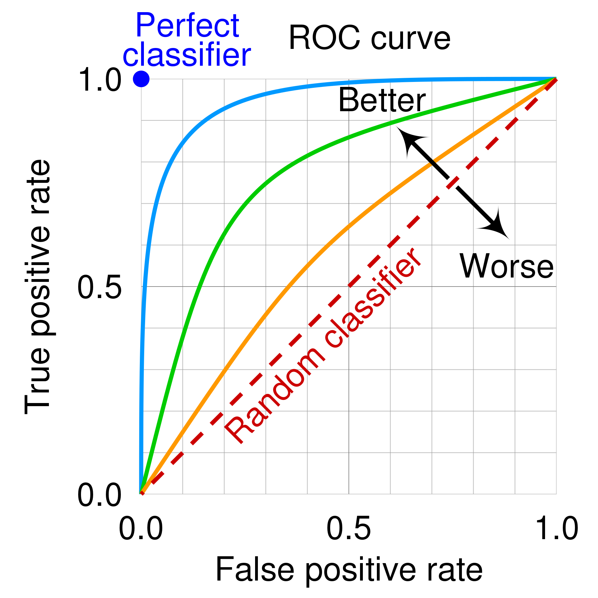

## ROC 곡선, AUC

**ROC 곡선**은 이진분류 문제의 성능을 평가하는 데 주로 사용되는 평가지표이다. ROC 곡선은 0~1 사이의 임계값에서 분류기의 성능을 그래프로 나타낸다.

* X 축에  False Positive Rate(1-특이도)를 표시
* Y 축에  True Positive Rate(재현율)를 표시


### 1-특이도

**특이도(Specificity)**는 실제 음성인 데이터 중에서 음성이라고 예측한 비율을 나타낸다. 즉, 모든 음성 샘플 중에서 정확하게 음성이라고 예측한 샘플의 비율을 나타내는 척도가된다.

1 - 특이도는 False Positive Rate (FPR)와 동일하다. FPR는 실제 음성인 데이터 중에서 양성라고 잘못 예측한 비율을 나타낸다


### X축과 Y축의 관계

ROC곡선은 원래 신호탐지 이론에서 왔다. 신호탐지 이론에서 적중확률(Y 축, True Positive rate)대 오경보확률(X축, False Positive)의 관계를 나타낸다. 

다시말해 오경보를 어느 정도 용인하면서 신호를 얼마나 잘 탐지하는가를 나타내는 의미이다. 이 때문에 FPR이 x축이되며, TPR이 y축이 되는 것이다. 이를 통해 임계값을 어떻게 설정하느냐에 따라 성능이 달라지는지를 파악할 수 있다.

FPR과 TPR의 두 가지 지표는 서로 Trade-off 관계에 있다. **모든 양성케이스**를 찾아내려면 (FPR을 높임) 일부 음성케이스를 잘못해서 양성으로 분류하게될 가능성이 높아지며, 반대로 **거짓양성**을 줄이려고하면 (FPR을 낮춤) 일부 양성케이스를 놓치게 된다. (TPR이 낮아짐)


Wikipedia에서 가져온 ROC 곡선 그래프.



왼쪽으로 갈수록 오탐지가 적고, 위로 갈수록 오거부가 적다.


### 타이타닉 데이터셋 ROC 곡선

타이타닉 데이터셋에서의 목표는 생존(1) 또는 사망(0)을 예측하는 것이므로, ROC 곡선을 이용하여 이진분류 모델의 성능 평가를 진행해본다.

```python
import pandas as pd
from sklearn.model_selection import train_test_split
from sklearn.linear_model import LogisticRegression
from sklearn.metrics import roc_curve, auc
import matplotlib.pyplot as plt
from sklearn.preprocessing import LabelEncoder

df = pd.read_csv('train.csv') # titanic 데이터셋

df = df.fillna(method='ffill')

label = LabelEncoder()
df['Sex'] = label.fit_transform(df['Sex'])

X = df[['Pclass', 'Sex' , 'Age', 'SibSp', 'Parch', 'Fare']]
y = df['Survived']

X_train, X_test, y_train, y_test = train_test_split(X, y, test_size=0.2, random_state=42)

model = LogisticRegression()
model.fit(X_train, y_train)

y_prob = model.predict_proba(X_test)[:,1]

fpr, tpr, thresholds = roc_curve(y_test, y_prob)

plt.figure()
plt.plot(fpr, tpr, label='ROC curve (area = %0.2f)' % auc(fpr, tpr))
plt.plot([0, 1], [0, 1], 'k--')
plt.xlim([0.0, 1.0])
plt.ylim([0.0, 1.05])
plt.xlabel('False Positive Rate')
plt.ylabel('True Positive Rate')
plt.title('Titanic dataset')
plt.legend(loc="lower right")
plt.show()
```


