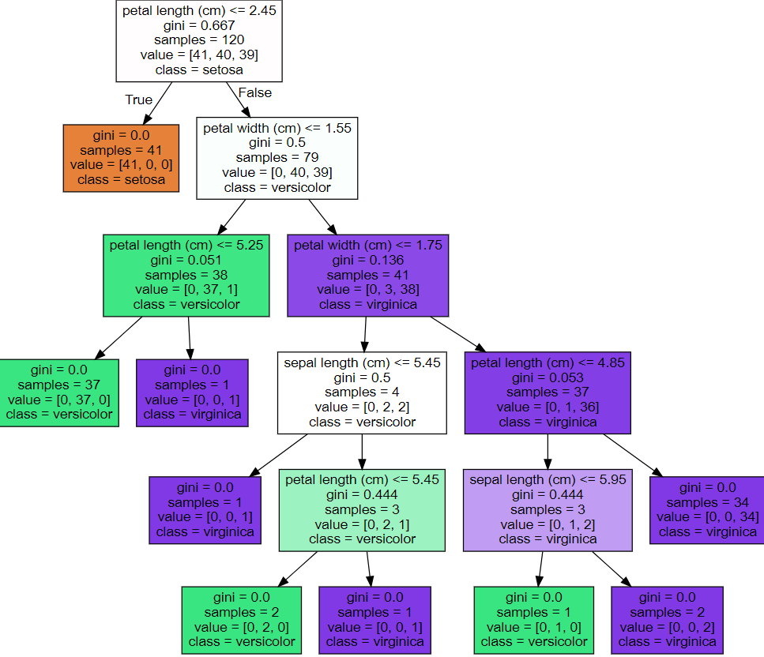

# Classification

분류는 

* **Naive Bayes** : 추론 대상의 사전 확률과 추가적인 정보를 기반으로 해당 대상의 사후 확률을 추론하는 베이즈 추정을 기반으로 
* **Logistic Regression** : 입력 특성의 가중치 합을 계산한 결과에 로지스틱 함수(Sigmoid)를 적용하여 확률을 추정한다.
* **Decision Tree** : 특성 기반으로 계층적인 구조를 만들어 예측을 수행한다. 각 노드에서 특성에 대한 질문을 통해 분기하고, 리프 노드에서 예측을 결정한다.
* **Support Vector Machine(SVM)** : 클래스 사이의 경계에 위치한 데이터 포인트(서포트 벡터)를 찾아내고, 이들 사이의 마진을 최대화하는 경계를 찾는 알고리즘이다.
* **Nearsest Neighbor** 
* **Neural Netwrok** : 인간의 뇌를 모방한 구조를 가지며, 많은 양의 데이터에서 **복잡한 패턴**을 학습할 수 있다. Deep Learning은 이 신경망의 층을 여러 개 쌓아서 학습하는 방법이다.
* **Ensemble**


## Decision Tree

결정트리 알고리즘은 데이터에 있는 규칙을 학습을 통해 자동으로 찾아낸다. 트리기반 분류 규칙이며, If-Else 조건문을 활용한다.

장점으로는 쉽고 직관적이다. 그리고 피쳐의 스케일링이나 정규화 등의 데이터 전처리의 영향도가 크지않다.

결정 트리에는 과적합(overfitting)이라는 주요 단점이 있다. 즉, 트리가 학습 데이터에 너무 맞춰져 있어 새로운 데이터에 대한 예측 성능이 저하될 수 있다. 이 문제를 해결하기 위해 다양한 전략(가지치기, 랜덤 포레스트 등)이 사용된다.

결정트리의 문제점을 나중에 시각화를 통해 파악할 수 있다. 세세한 규칙에 대해 집중해서 분할하게되면 새로운 데이터에 대해서 성능이 떨어진다.


### 균일도

결정트리에서 균일도는 각 노드에 존재하는 **데이터의 동질성을 측정하는 척도**이다. 

노드의 균일도와 클래스 레이블의 관계는

* 노드의 균일도가 높을수록 노드에 존재하는 데이터는 하나의 클래스 레이블로 구성된다.
* 노드의 균일도가 낮을수록 데이터는 다양한 클래스 레이블로 구성된다.


### 균일도 측정방법

균일도를 측정하는 방법에는 엔트로피, 지니계수, 분류오차 등이 있다. 각 방법은 다른 불순도를 측정한다.

* **정보 이득(information gain)** : 정보이득은 부모노드와 자식노드 간의 불순도(엔트로피)의 차이를 측정하는 방법이다. 엔트로피는 주어진 데이터 집합의 혼잡도를 의미하는데, 서로 다른 값이 섞여 있으면 엔트로피가 높고, 같은 값이 섞여 있으면 엔트로피가 낮다.  부모 노드의 엔트로피와 자식 노드들의 엔트로피의 가중치 합계와의 차이로 계산된다. 
* **지니 계수** : 지니계수는 무작위로 선택한 데이터의 레이블이 잘못 분류될 확률을 측정하는 방식으로 작동한다. 계수는 0이 가장 평등하고 1로 갈수록 불평등하다. 지니계수가 낮을 수록 데이터 균일도가 높은 것으로 해석되어 계수가 낮은 속성을 기준으로 분할한다.


### 결정트리 생성과정

1. **루트 노트 생성** : 처음엔 모든 학습 데이터를 포함하는 루트 노드를 생성한다. 이 때, 모든 데이터가 해당 노드에 속하므로 노드의 불순도가 최대가 된다.
2. **특성 분할** : 루트 노드에서 특정한 특성을 선택해 두 개의 자식 노드로 분할한다. 이 때, 선택되는 특성은 불순도를 가장 많이 감소시키는 특성이 된다. 불순도 측정방법은 지니계수 또는 정보이득 등을 사용한다.
3. **분할 반복** : 각 자식 노드에서도 다시 불순도를 감소시키는 특성을 찾아서 분할을 반복한다. 이 과정에서 분할로 더 이상 불순도를 줄일 수 없거나, 노드안에서 데이터가 최소 개수 이하(min_samples_leaf)로 남을 때까지 반복한다.


### 결정트리 시각화 - Graphviz

Graphviz는 그래프 시각화를 위한 오픈 소스 도구이다. 데이터의 구조를 그래프로 시각화해주며, 그래프 형태의 구조를 보기 쉽게 표현하게 해주는 특징이 있다.  특히 결정 트리(decision tree) 같은 알고리즘의 결과를 시각화하는데 유용하게 쓰인다. 예를 들어, sklearn의 `export_graphviz` 함수를 이용하면 학습한 결정 트리 모델을 Graphviz가 읽을 수 있는 언어로 변환하고, 이를 다시 Graphviz를 통해 시각화할 수 있다.

**colab**에 기본적으로 설치되어있다. 따로 설치할 필요없다.

```python
from sklearn.datasets import load_iris
from sklearn.model_selection import train_test_split
from sklearn.tree import DecisionTreeClassifier
from sklearn import tree
import graphviz 

iris = load_iris()
X = iris.data
y = iris.target

X_train, X_test, y_train, y_test = train_test_split(X, y, test_size=0.2, random_state=42)

clf = DecisionTreeClassifier(random_state=42)
clf.fit(X_train, y_train)

dot_data = tree.export_graphviz(clf, out_file=None, 
                                feature_names=iris.feature_names,  
                                class_names=iris.target_names, 
                                filled=True)

graph = graphviz.Source(dot_data) 
graph
```



* petal length(cm) <= 2.45와 같이 조건이 있는 것은 자식노드를 만들기 위한 규칙 조건이다. 이 조건이 없으면 리프노드다.
* samples는 현 규칙에 해당하는 데이터 건수.
* value = []는 클래스 값 기반 데이터 건수. value=[41, 40, 39]에서, iris 데이터 세트는 클래스 레이블 값으로 0, 1, 2이며 순서대로 41개 40개 39개라는 의미다.
* class는 value 리스트내에 가장 많은 건수를 가진 결정값이다.


### 결정트리의 주요 하이퍼 파라미터


* **max_depth** : 트리의 최대 깊이를 규정한다. 이 값이 너무 크면 모델이 과적합될 수 있다.
* **max_features** : 최적의 분할을 위해 고려할 특성의 최대 수가 된다.
  * 디폴드는 None이며 데이터 세트의 모든 피쳐를 사용해 분할한다.
  * int형이면 대상 피쳐의 개수, float형이면 피쳐의 퍼센트
  * sqrt는 sqrt(전체 피쳐수)만큼 선정 (auto와 동일)
  * log는 log2(전체 피쳐수)
* **min_samples_split** : 노드를 분할하기 위한 최소한의 샘플 데이터 수. 이 값이 너무 높으면 과소적합(underfitting)이 발생할 수 있다. 디폴드값은 2.
* **min_samples_leaf** : 리프 노드가 되기 위한 최소한의 샘플 데이터 수. 이 값도 너무 높으면 과소적합이 발생할 수 있다.
* **max_leaf_nodes** : 리프 노드의 최대 수.
* **random_state** : 분할 선택에 영향을 주는 무작위성을 제어하는 값.


### 최적 하이퍼 파라미터 찾기

```python
from sklearn.model_selection import GridSearchCV

params = {
    'max_depth' : [6, 8, 10, 12, 16, 20, 24],
    'min_samples_split': [16]
}

grid_cv = GridSearchCV(dt_clf, param_grid=params, scoring='accuracy', cv=5, verbose=1)
grid_cv.fit(X_train, y_train)
print('Best Score: {0:.4f}'.format(grid_cv.best_score_))
print('Best Params: ', grid_cv.best_params_)
```

```
Fitting 5 folds for each of 7 candidates, totalling 35 fits
Best Score: 0.8549
Best Params: {'max_depth': 8, 'min_samples_split': 16}
```
* cv=5, cv옵션을 사용하여 5-fold 교차검증을 진행한다.