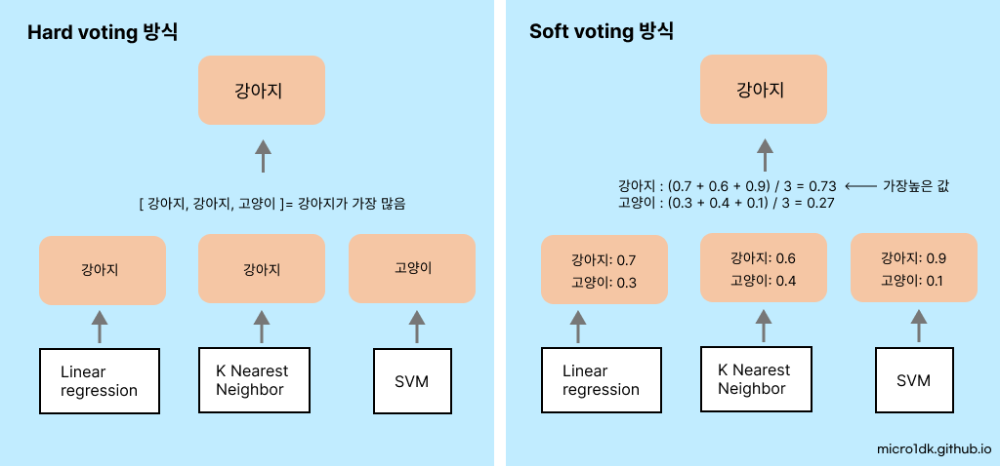
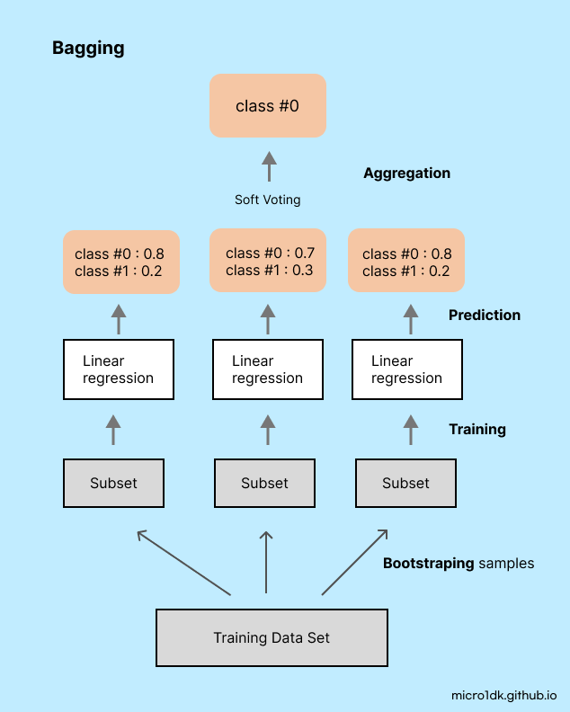
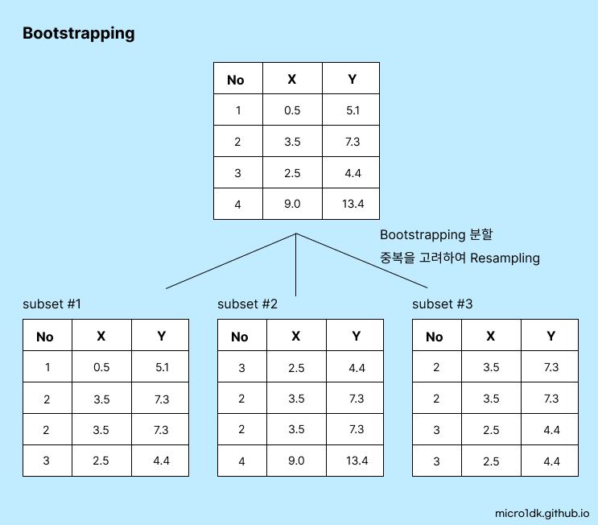

# Ensenble Learning

앙상블 학습(Ensemble Learning)은 여러 개의 분류기(Classifier)를 생성하고, 그 예측을 결합해서 보다 정확한 최종 예측을 도출하는 기법이다. 앙상블 학습의 목표는 여러 다른 모델들의 예측을 결합하여 단일 예측 모델보다 더 나은 예측 성능을 달성하는 것이다.

앙상블 학습의 종류로는

* **Voting** : 여러 개의 분류기가 **투표를 통해** 최종 예측 결과를 결정한다. 두 종류의 보팅방식이 있다.
  * 하드 보팅: 단순 투표방식이다. 가장 많이 나온 예측값을 선택한다.
  * 소프트 보팅: 각 분류기들의 예측 확률을 모두 더한 뒤 이를 평균내어, 가장 높은 확률을 가진 결과를 예측값으로 선택한다.
* **Bagging** : **같은 알고리즘**으로 여러 개의 분류기를 만들어 **보팅(Voting)** 으로 최종 결정하는 방식이다. 대표적인 예로 랜덤 포레스트가 있다. 
* **Boosting** : 여러 개의 분류기가 **순차적으로 학습**을 수행하되, 앞에서 학습한 분류기가 예측이 틀린 데이터에 대해 다음 분류기가 가중치를 부여하여 **오차를 개선**해 나가는 방식이다. 대표적인 예로 Gradient Boosting, XGBoost, LightGBM 등 있다. 정형 데이터의 분류나 회귀에서는 GBM 부스팅 계열 앙상블이 보다 높은 예측 성능을 보인다.
* **Stacking** : 여러가지 다른 모델의 예측 결과값을 **다시 학습데이터로 만들어서** 다른 모델(메타 모델)로 **재학습**시켜 결과를 예측하는 방법

앙상블 학습은 여러 모델을 학습시키므로 학습 시간이 보다 오래걸리고, 모델이 복잡해져 해석 또한 어렵다는 단점이 있다. 결정 트리의 단점인 과적합을 수 많은 분류기를 결합해 보완하고 장점인 직관적인 분류 기준은 강화된다.


## Voting

보팅방식은 크게 두 가지로 나눌 수 있다.


### Hard voting & Soft voting

하드보팅은 모든 분류기가 독립적으로 클래스에 대한 결정을 내리고, 가장 많은 투표를 얻은 클래스가 최종 예측결과로 결정된다.

소프트보팅은 각 분류기의 예측을 확률로 변환하고, 이를 평균내어 가장 높은 확률을 가진 클래스를 최종 예측 결과로 결정한다. 이는 분류기들의 불확실성을 고려하는 방식이다.



일반적으로 하드 보팅보다는 소프트 보팅의 예측 성능이 상대적으로 더 우수하여 주로 사용된다.


위스콘신 유방암 데이터셋으로 분류기의 정확도를 관측해본다.

```python
import pandas as pd

from sklearn.ensemble import VotingClassifier
from sklearn.linear_model import LogisticRegression
from sklearn.neighbors import KNeighborsClassifier
from sklearn.datasets import load_breast_cancer
from sklearn.model_selection import train_test_split
from sklearn.metrics import accuracy_score
import warnings 
warnings.filterwarnings('ignore')

cancer = load_breast_cancer()

# Classifier
lr_clf = LogisticRegression()
knn_clf = KNeighborsClassifier(n_neighbors=5)

classifiers = [lr_clf, knn_clf]
for classifier in classifiers:
    classifier.fit(X_train , y_train)
    pred = classifier.predict(X_test)
    class_name= classifier.__class__.__name__
    print('Accuracy of {0}: {1:.4f}'.format(class_name, accuracy_score(y_test , pred)))

# Voting Classifier
vo_clf = VotingClassifier( estimators=[('LR',lr_clf),('KNN',knn_clf)] , voting='soft' )

X_train, X_test, y_train, y_test = train_test_split(cancer.data, cancer.target, 
                                                    test_size=0.2 , random_state= 156)

vo_clf.fit(X_train , y_train)
pred = vo_clf.predict(X_test)
print('Accuracy of Voting {0:.4f}'.format(accuracy_score(y_test , pred)))
```

```
Accuracy of LogisticRegression: 0.9386
Accuracy of KNeighborsClassifier: 0.9035
Accuracy of Voting 0.9474
```

보팅방식을 사용하여 정확도 개선이 되는것을 확인하였다.


## Bagging - RandomForest

배깅은 'Bootstrap Aggregating'의 줄임말로, 원본 데이터에서 무작위로 샘플을 추출한 뒤(이 과정을 **Bootstraping** 이라 함) 여러 개의 작은 데이터셋을 만든 후, 이렇게 만들어진 각 데이터셋에 대해 독립적으로 분류기를 학습시키는 알고리즘이다.

그런 다음 이 분류기의 예측을 집계(**Aggregating**)하여 최종 예측을 만든다. 분류 문제에서는 **Voting** 방식을, 회귀 문제에서는 **평균**을 사용한다.

Voting과는 다르게 같은 분류기를 여러개 사용한다.




배깅의 중요한 특징은 각 분류기가 독립적으로 학습하므로, **병렬 계산**이 가능하다.

또한 배깅은 모델의 **분산을 줄이는 데 효과적**이다. **이상치에 강건**해진다.


### Random Forest's Bootstrapipping

부트스트래핑이란 원본 데이터에서 무작위로 샘플을 추출하여 새로운 데이터 셋을 생성하는 방법이다. 이 때, 한 개의 데이터가 여러번 선택될 수 있고, 어떤 데이터는 선택되지 않을 수 있다. 이는 원본 데이터의 분포를 유지하면서 데이터의 다양성을 증가시킨다.


랜덤 포레스트 하이퍼 파라미터 `n_estimators=3`의 옵션을 부여했을 때, 데이터 샘플링 과정이다.




### 하이퍼 파라미터

* **n_estimators** : 사용할 결정 트리의 개수. 이 값이 클수록 모델의 성능은 일반적으로는 향상되지만, 계산비용이 증가한다. default값은 10개. 1000개~2000개 사이면 충분하다.

* **max_features**: : 결정 트리에 사용된 max_features와 같다. 각 결정 트리에서 분하렝 사용할 특성의 최대 개수다. 이 값을 줄이면 무작위성이 증가하여 과적합을 줄일 수 있지만, 너무 작으면 모델의 성능이 저하된다.

  랜덤포레스트의 기본 max_features는 None이 아닌 auto, 즉 sqrt와 같다. 따라서 분할하는 피쳐를 참조할 때 전체 피쳐가 아닌 sqrt 개수 만큼 참조한다.

* **max_depth**: 결정트리의 최대 깊이. 깊이가 너무 깊으면 과적합이 발생할 수 있다.

* **min_samples_split** : 노드를 분할하기 위해 필요한 최소 샘플 개수. 이 값이 크면 모델의 복잡성이 감소한다.

* **min_samples_leaf** : 리프 노드가 있어야 하는 최소 샘플 개수. 이 값을 크게 설정하면 과적함을 방지할 수 있다.

* **bootstrap** : 부트스트래핑을 사용할지의 여부. 랜덤 포레스트에서는 default는 True

