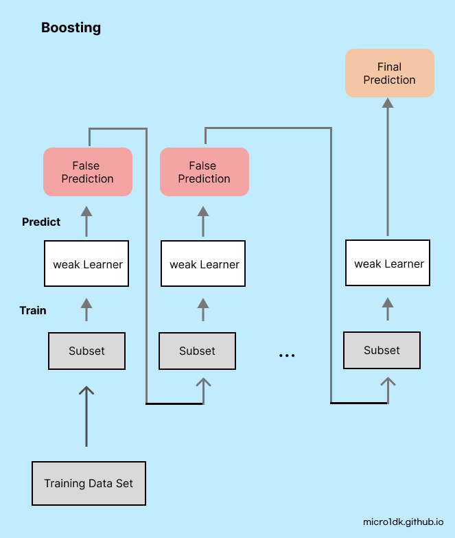
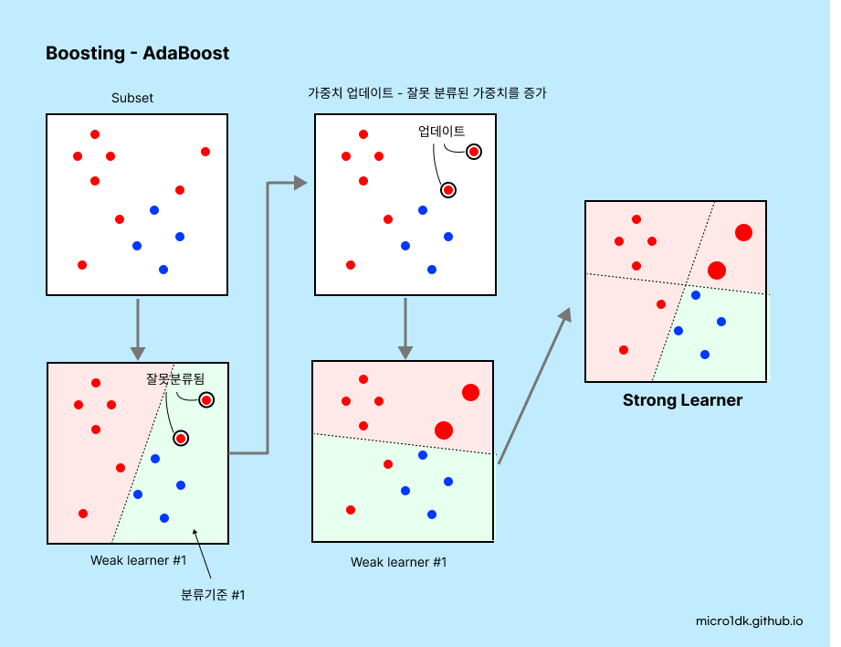
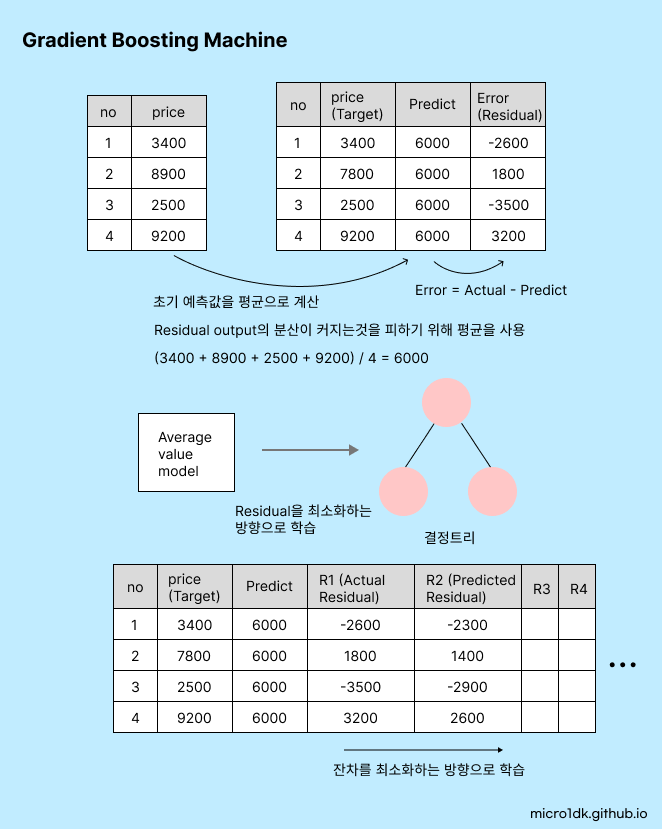
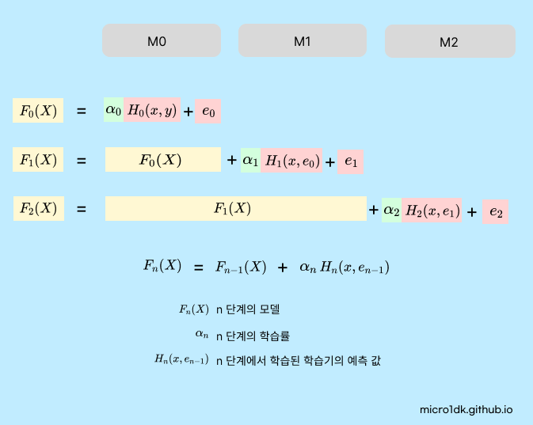
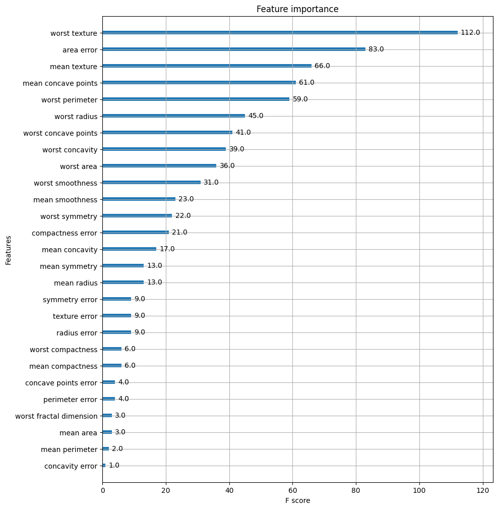

# Ensemble 2

* Boosting
  * AdaBoosting
  * GBM
  * XGBoost
* Stacking


# Boosting

부스팅은 일련의 약한 학습기(weak learnes)를 **순차적으로 학습(train) - 예측(predict)** 시켜 **강한 학습기(strong learner)**를 만드는 기법이다. 순차적으로 학습-예측하면서 잘못예측한 데이터나 학습트리에 **가중치 부여**를 통해 오류를 개선해 나가면서 학습한다.

Bagging은 병렬(Parallel)방식을 사용하는 반면 부스팅은 직렬(Sequential) 방식을 사용한다. 

부스팅 알고리즘의 대표적인 것들은

* **AdaBoost (Adaptive Boosting)** : 각 샘플 가중치를 조절하면서 약한 학습기를 순차적으로 훈련시킨다. 분류를 잘못한 샘플은 가중치가 증가하므로 다음 모델은 잘못분류된 샘플에 더 집중하게 된다.
* **Gradient Boosting** : 이전 모델이 만든 잔차(residual) 즉, 실제 값과 예측 값의 차이를 학습하는 새로운 모델을 추가하는 방식이다. 
* **XGBoost (Extreme Gradient Boosting)** : Gradient Boosting을 최적화하여 고성능을 내는 알고리즘이다. 병렬 처리와 트리 가지치기등 다양한 기능을 제공한다.

 

### weak learner

약한 학습기라는 용어는 머신러닝에서 모델이나 알고리즘이 데이터를 **약간만 학습**할 때 사용하는 단어다. 

예를 들어, 이진 분류문제에서 무작위 추측의 정확도는 대략 50%이다. 이때, 약한 학습기는 이 50%보다는 약간이라도 높은 정확도인, (예를들어) 51% 55% 등을 보여준다. 이러한 약한 학습기는 자체적으로는 성능이 떨어지지만, 여러 개를 조합하여 강한 학습기를 만드는데 사용된다.





## AdaBoosting 

AdaBoost의 핵심 아이디어는 각각의 학습 단계에서 이전에 잘못 분류된 데이터에 포인트들에 더 큰 가중치를 부여하는 것이다. 이렇게 하여, 학습과정에서 잘못분류된 데이터 포인트를 다음 학습기가 더 잘 분류하도록 강제한다. 



이 알고리즘은 일반적으로 높은 정확도를 보여준다. 하지만 몇 가지 단점도 존재한다.

* **이상치에 취약** : 각 단계에서 이전 학습기가 잘못 분류한 데이터에 높은 가중치를 부여하는데, 이상치가 많은 데이터에 대해서는 잘못학습이 이루어질 수 있다. 이상치의 영향을 받아 과적합이 발생할 수 있다.
* **계산복잡** : 병렬처리가 불가능하여 학습시간이 오래걸리며, 대량의 데이터셋에 대한 학습이 어려워진다.


## GBM(Gradient Boosting Machine)

Gradient Boosting Machine은 Gradient Boosting 방법을 기반으로하는 예측 모델이다. 순차적으로 약한 예측 모델 (주로 결정트리)을 훈련시키는 알고리즘으로, 각 단계에서 이전 단계에서의 예측 오차를 최소화하는 방향으로 새로운 모델을 학습한다. 이 때, 오차를 최소화하는 방향을 찾기 위해 **경사하강법(Gradient Descent)**을 사용한다.


다음은 GBM 모델 학습과정을 나타내었다.



1. **초기 예측 생성** : 모든 데이터에 대한 초기 예측값을 생성한다. 평균 값으로 설정한다.
2. **잔차 계산** : 초기 예측값과 실제 타겟 값 사이의 차이(=잔차)를 계산한다.
3. **결정트리 학습** : 이 잔차를 타겟 변수로 하여 결정 트리를 학습한다. 이 트리는 데이터에서 잔차를 최소화 하는 방향으로 학습된다.
4. **예측 업데이트** : 데이터의 예측값을 업데이트한다. 이 업데이트는 **학습률(Learning rate)**이라는 하이퍼 파라미터에 의해 조절된다.
5. **Loop** : 잔차를 다시 계산하고, 결정 트리를 학습하고,  예측을 업데이트 하는 단계를, 원하는 개수의 트리가 학습될 때까지 반복한다.


GBM은 아래의 식의 모델을 사용한다.



GBM에서는 잔차 'e'를 최소화 하는 방향으로 학습한다. 잔차를 예측하는 새로운 모델을 학습하여, 이를 기존 모델 H(X, e)에 추가한다. 이렇게 잔차를 줄여나가면서 예측 성능을 개선한다.

학습과정에서는 경사하강법을 사용하여 최적의 파라미터를 찾는다.


### 하이퍼 파라미터

* **n_estimators** : 부스팅 스테이지 수, 즉 사용되는 개별 모델(결정트리)의 개수를 설정한다. 너무 많은 트리를 사용하면 과적합의 위험이 있다.
* **learning_rate** : 축소계수 (학습률). 
* **loss** : 최적화할 손실 함수를 설정한다.
  * 회귀 문제의 경우 제곱오차 `ls` , 절대오차 `lad`, 휴버손실 `huber` 등이 사용된다.
  * 분류 문제의 경우 이진교차 엔트로피 `deviance`가 사용된다.
* **other** : 결정트리 파라미터와 동일


## XGBoost

XGBoost는 "eXtreme Gradient Boosting"의 약자로 기존의 GBM을 개선한 모델이다.

GBM의 주요 한계점은 다음과 같다.

* **속도와 확장성** : 학습기를 순차적으로 사용하기 때문에, 학습속도가 느리고 병렬처리가 불가능하다.
* **과적합** : 잔차를 줄이기위해 새로운 가설을 추가하는 방식으로 모델을 학습한다. 이 과정에서 모델이 점점 복잡해지고 과적합이 발생한다.
* **정규화 기능 부재** 

XGBoost는 이러한 문제를 해결하기 위해 

* **병렬 처리** : XGBoost는 CPU와 GPU의 병렬처리를 활용해 빠른 학습속도를 제공한다.
* **규제화** : 모델의 복잡성을 제어하기 위한 L1, L2 규제화를 포함한다. 모델의 과적합을 방지한다.
* **결측치 처리** : XGBoost는 결측치를 자체적으로 처리할 수 있다.
* **교차검증 내장** : k-fold 교차 검증이 내장되어 있다.
* **트리 가지치기** : 깊이우선탐색 알고리즘(DFS)을 사용하여 가지치기를 수행하여 효율을 올릴 수 있다.


### 조기중단


### 구현단계

 이진분류 문제로 위스콘신 Breast Cancer 데이터 셋을 통해 양성인지 음성인지 분류하는 모델을 만들어보자.

```python
import pandas as pd
import numpy as np
from sklearn.datasets import load_breast_cancer
from sklearn.model_selection import train_test_split

import xgboost as xgb
from xgboost import plot_importance
```


1. **데이터 준비** : XGBoost는 입력 데이터로 **DMatrix** 형태를 사용한다. 이는 XGBoost의 내부 데이터 구조이다.

   ```python
   cancer_df = load_breast_cancer()
   
   X_features = cancer_df.iloc[:, :-1]
   y_label = cancer_df.iloc[:, -1]
   
   X_train, X_test, y_train, y_test=train_test_split(X_features, y_label, test_size=0.2, random_state=156)
   
   X_tr, X_val, y_tr, y_val= train_test_split(X_train, y_train, test_size=0.1, random_state=156)
   
   dtr = xgb.DMatrix(data=X_tr, label=y_tr)
   dval = xgb.DMatrix(data=X_val, label=y_val)
   dtest = xgb.DMatrix(data=X_test , label=y_test)
   ```

2. **하이퍼파라미터 설정** : 역시 여러가지 하이퍼 파라미터가 존재한다. 

   ```python
   params = { 'max_depth':3,
              'eta': 0.05,
              'objective':'binary:logistic',
              'eval_metric':'logloss'
           }
   num_rounds = 400
   
   eval_list = [(dtr,'train'),(dval,'eval')]
   ```

3. **모델 학습** : 모델을 학습시킨다. DMatrix 형태의 학습데이터와, 설정한 하이퍼 파라미터를 입력으로 받아 모델을 학습한다. 그리고 `early_stopping_rounds` 파라미터를 설정하여 조기중단 기능을 부여할 수 있다. 이 기능을 사용하여 검증 데이터의 성능이 일정 기간동안 향상되지 않을 경우 조기 중단한다. 50을 부여하여 50동안 검증세트의 성능이 향상되지 않으면 종료한다.

   ```python
   # 하이퍼 파라미터와 early stopping 파라미터를 train( ) 함수의 파라미터로 전달
   xgb_model = xgb.train(dtrain=dtr, params=params, num_boost_round=num_rounds,
                         early_stopping_rounds=50, evals=eval_list )
   ```

   ```
   [0]	train-logloss:0.65016	eval-logloss:0.66183
   [1]	train-logloss:0.61131	eval-logloss:0.63609
   [2]	train-logloss:0.57563	eval-logloss:0.61144
   [3]	train-logloss:0.54310	eval-logloss:0.59204
   [4]	train-logloss:0.51323	eval-logloss:0.57329
   ...
   [122]	train-logloss:0.02067	eval-logloss:0.25832
   [123]	train-logloss:0.02045	eval-logloss:0.25808
   [124]	train-logloss:0.02023	eval-logloss:0.25855
   [125]	train-logloss:0.01998	eval-logloss:0.25714
   [126]	train-logloss:0.01973	eval-logloss:0.25587
   ...
   [175]	train-logloss:0.01267	eval-logloss:0.26086
   [176]	train-logloss:0.01258	eval-logloss:0.26103
   ```

4. **예측** : 테스트 데이터에 대한 예측 확률 값을 얻는다. 예제에서는 0.5보다크면 1(양성) , 작으면 0(음성)으로 판단한다.

   ```python
   pred_probs = xgb_model.predict(dtest)
   print(np.round(pred_probs[:10],3))
   
   preds = [ 1 if x > 0.5 else 0 for x in pred_probs ]
   print(preds[:10])
   ```

   ```
   [0.845 0.008 0.68  0.081 0.975 0.999 0.998 0.998 0.996 0.001]
   [1, 0, 1, 0, 1, 1, 1, 1, 1, 0]
   ```

5. **예측 평가** : 오차행렬, 정확도, 정밀도, 재현율, F1 Score, AUC를 평가해본다.

   ```python
   from sklearn.metrics import confusion_matrix, accuracy_score
   from sklearn.metrics import precision_score, recall_score
   from sklearn.metrics import f1_score, roc_auc_score
   
   def get_clf_eval(y_test, pred=None, pred_proba=None):
       confusion = confusion_matrix( y_test, pred)
       accuracy = accuracy_score(y_test , pred)
       precision = precision_score(y_test , pred)
       recall = recall_score(y_test , pred)
       f1 = f1_score(y_test,pred)
       roc_auc = roc_auc_score(y_test, pred_proba)
   
       print(confusion)
       # ROC-AUC print 추가
       print('Accuracy: {0:.4f}, Precision: {1:.4f}, Recall: {2:.4f},\
       F1: {3:.4f}, AUC:{4:.4f}'.format(accuracy, precision, recall, f1, roc_auc))
   
   get_clf_eval(y_test , preds, pred_probs)
   ```

   ```
   [[34  3]
    [ 2 75]]
   Accuracy: 0.9561, Precision: 0.9615, Recall: 0.9740, 
   F1: 0.9677, AUC:0.9937
   ```

   다음, 여러 지표의 결과를 확인한 뒤 **Feature Importance** 를 시각화해본다.

   ```python
   import matplotlib.pyplot as plt
   %matplotlib inline
   
   fig, ax = plt.subplots(figsize=(10, 12))
   plot_importance(xgb_model, ax=ax)
   ```

   


