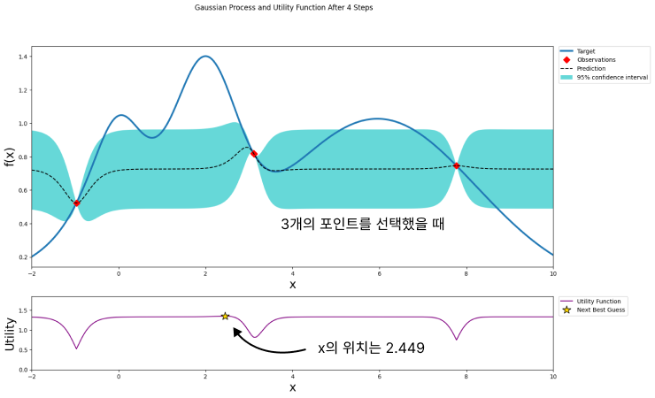
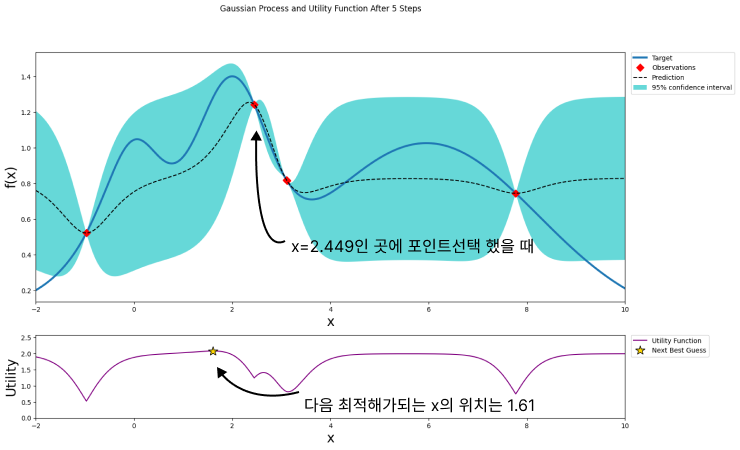
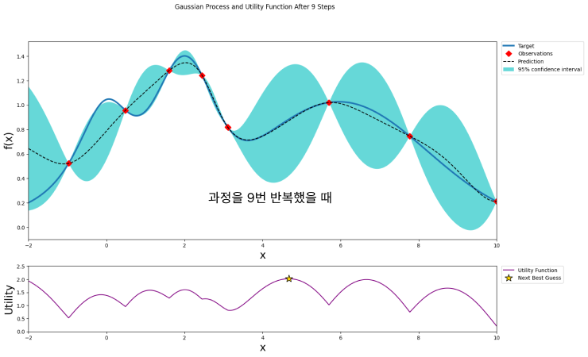

# 하이퍼 파라미터 최적화

하이퍼파라미터 최적화는 머신러닝 모델의 성능을 최대화하기 위해 가장 적합한 하이퍼파라미터(모델 설정)를 찾는 과정이다. 여러 최적화 방법들이 있는데 대표적인 방법들은.

* **Grid Search** - 하이퍼파라미터의 **모든 조합을 시도**하여 최적의 세트를 찾는다. 간단하고 이해하기 쉽지만, 파
* **Bayesian Optimization** - 확률 모델을 사용하여 최적의 하이퍼 파라미터세트를 찾는다.
* **HyperOpt** - 
* **Optuna** - 


## Grid Search


## Bayesian optimization

**베이지안 최적화**는 모델의 하이퍼파라미터 튜닝을 효과적으로 수행하는 데 도움을 준다. 베이지안 최적화에 들어서기 앞서, 하이퍼 파라미터 튜닝의 문제점을 알아보자면


### 하이퍼파라미터 튜닝 이슈

**Grid Search**기반의 하이퍼파라미터 튜닝은 전체 하이퍼파라미터에서 가능한 모든 조합을 테스트한다. 이 방법은 특정조건에서는 유용하지만 몇 가지 문제점을 가지고 있다.

* **계산 비용** : 모든 가능한 조합을 시도하는 것은 계산적으로 매우 비효율적이다. 경우의 수가 너무 많기 때문이다.

  ```python
  params= {
      'max_depth': [10, 20, 30, 40, 50],
      'num_leaves': [35, 45, 55, 65],
      ...
  }
  ```

  거기에 Cross validation 횟수까지 곱해지면 경우의 수가 엄청나다.

  **GridSearchCV**를 사용하려면 하이퍼파라미터는 3~4개로 해준다.

  **RandomizedSearch**를 사용하면 하이퍼파라미터 공간에서 무작위로 선택한다. 시간 및 계산의 효율성은 좋아지겠지만, 정확도부분에서 떨어질 수 있다.

* **모델 성능에 미치는 영향** : 모든 하이퍼파라미터가 모델의 성능에 동일하게 영향을 미치지 않는다. GridSearch는 이러한 사실을 고려하지 않고 모든 하이퍼파라미터에 동일한 중요도를 부여한다.


## 베이지안 최적화

[https://sigopt.com/blog/bayesian-optimization-101/](https://sigopt.com/blog/bayesian-optimization-101/) 

[https://github.com/bayesian-optimization/BayesianOptimization/blob/master/examples/visualization.ipynb](https://github.com/bayesian-optimization/BayesianOptimization/blob/master/examples/visualization.ipynb)

포스트를 참고하였음.

하이퍼파라미터 튜닝의 문제점을 파악했으니, 목표함수가 뭔지 알아야한다.


### 목표함수

**목표함수(Objective Function)**는 최적화 문제에서 **최소화 또는 최대화하려는 함수**다.  이는 보통 알고리즘의 성능을 측정하는 데 사용되며, 알고리즘이 얼마나 잘 작동하는지, 나쁘게 작동하는지를 수치로 표현한다.

* 회귀, 분류문제에서 **손실함수**는 목표함수이며 이를 **최소화**해야한다.
*  베이지안 최적화에서는, 목표함수는 **하이퍼파라미터에 대한 성능**을 나타내는 함수다. 따라서 성능을 **최대화** 하려고 해야한다.


앞서 하이퍼파라미터 튜닝은 경우의 수가 매우 많아 계산비용이 매우 높다고 했다. 이를 해결하기 위해, 베이지안 최적화가 등장하며,  **대체 모델**이라는 개념이 등장한다. 

모든 최적화 문제에서 대체 모델을 사용하는 것은 아니지만, 계산 비용이 높은 목표함수를 최적화 하려는 경우에 사용한다.


### 대체 모델 (Surrogate Model)

계산비용이 높은 함수의 경우 원래의 함수를 계산하는 것을 피하고, 그 **함수의 근사치**를 제공한다. 대체 모델을 사용하면 **불확실성**을 명시적으로 고려할 수 있다. 불확실성을 고려하면 아직 탐색하지 않은 공간에서 최적의 해를 찾을 가능성이 높아지므로 더 효율적인 탐색이 가능해진다. 

대체모델은 주로 **주로 가우시안 프로세스**가 사용된다. 이를 이용하여 최적화 과정을 가이드한다.


그리고 **획득함수**의 개념이 등장한다. 


### 획득 함수(Acquisition Function)

획득함수는 다음 반복에서 탐색할 새로운 입력값을 선택하는 데 사용된다. 이 함수는 각 입력값이 최적화 문제의 해에서 알마나 가까운지와 그 위치에서 얻을 수 있는 정보가 얼마나 많은지를 고려한다.


### 최적화 과정

최종목표는 Predict (점선)이 Target(파란선)과 유사한 형태로 만들면된다.


임의의 관측 3점을 선택했을 때



획득함수의 다음 최적해(별표 표시)는 2.449를 가리킨다. 다음으로 관측할 값은 2.449가 된다.





이 과정을 반복하다보면.. 9번 반복했을 때 모양은



9번 반복했을 뿐이지만 실제 최대값에 상당히 근접할 수 있었다. 이렇게 베이지안 최적화는 새로운 데이터를 입력 받았을 때 최적함수를 예측하는 **사후모델**을 개선해 나가면서 최적함수를 도출함을 알 수 있다. 


## HyperOpt

하이퍼파라미터 튜닝 라이브러리. 베이지안 최적화를 사용

[Hyperopt Wiki](https://github.com/hyperopt/hyperopt/wiki)


## Optuna

하이퍼 파라미터 최적화를 자동화해주는 라이브러리

[HyperOpt vs Optuna 에 대한 글](https://neptune.ai/blog/optuna-vs-hyperopt)

Kaggle에서 자주 사용하는 라이브러리.

Optuna에서 사용하는 용어들에 대해 알아보자


1. **Study**: 최적화 프로세스 전체를 나타낸다. 하나의 Study는 여러 Trial을 포함한다. Study는 최적화의 목적과 방법을 설정한다.
2. **Trial**: Study 내의 개별적인 평가 단위로, 하이퍼파라미터의 특정 조합을 테스트한다. 각 Trial은 성능 평가 결과를 Study에 보고하여 다음 Trial 하이퍼파라미터 선택에 영향을 준다.
3. **Objective Function**: 최적화할 목적 함수로, Trial이 평가할 때 사용하는 함수이다. 이 함수는 하이퍼파라미터를 입력으로 받아 모델의 성능을 수치로 반환한다.
4. **Pruning**: 가지치기라는 뜻으로, Trial을 조기에 중단시키는 과정이다. Pruning은 자원을 절약하고 더 나은 하이퍼파라미터 조합에 더 많은 시간을 할애할 수 있다.
5. **Sampler**: 하이퍼파라미터를 선택하는 방법을 결정한다. Optuna는 다양한 샘플러를 제공한다.