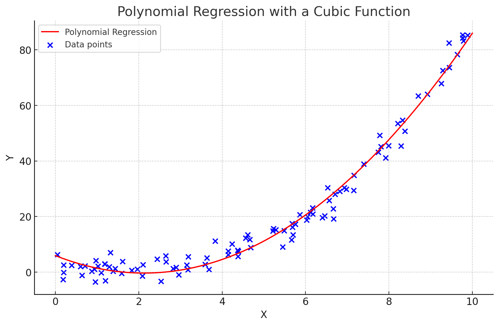
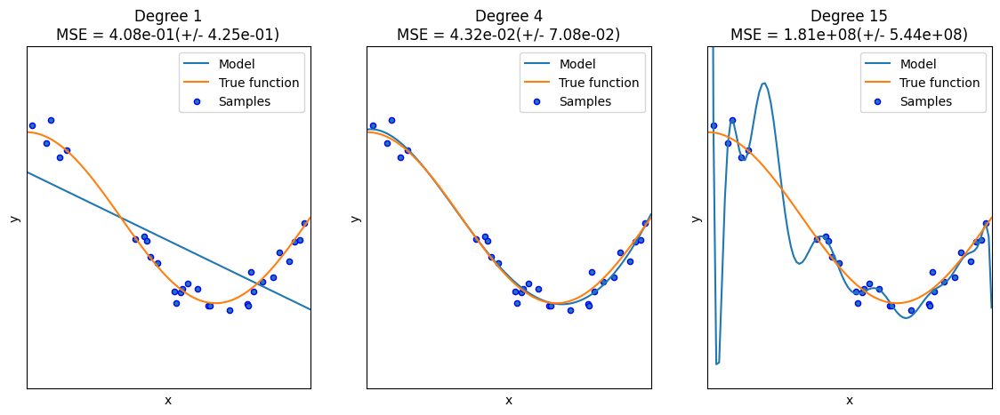

## Polynomial Regression

선형회귀가 데이터를 직선으로 모델링하는 반면, **다항회귀**는 곡선을 사용하여 표현한다.

다항회귀는 **차수(Degree)**를 조절하면서 모델의 유연성을 조절할 수 있다. 차수가 높아질 수록 모델은 더 복잡한 패턴을 포착할 수 있겠지만, 과적합 위험도가 증가한다.





## Underfitting vs. Overfitting

[Underfitting vs. Overfitting 문서](https://scikit-learn.org/stable/auto_examples/model_selection/plot_underfitting_overfitting.html) 

선형 회귀와 다항 특성을 사용하여 비선형 함수에 근사하는 방법과, 이 과정에서 발생하는 과소적합(underfitting)과 과적합(overfitting) 문제를 설명한다.



```
Degree 1 회귀 계수는 [-1.61] 입니다.
Degree 1 MSE 는 0.41 입니다.

Degree 4 회귀 계수는 [  0.47 -17.79  23.59  -7.26] 입니다.
Degree 4 MSE 는 0.04 입니다.

Degree 15 회귀 계수는 [-2.98291000e+03  1.03898880e+05 -1.87415324e+06  2.03715471e+07
 -1.44872830e+08  7.09313489e+08 -2.47065245e+09  6.24559902e+09
 -1.15676336e+10  1.56894743e+10 -1.54005873e+10  1.06457184e+10
 -4.91377255e+09  1.35919593e+09 -1.70380747e+08] 입니다.
Degree 15 MSE 는 181238260.15 입니다.
```

코사인 함수를 사용하여 이러한 개념을 보여준다. 

1차 다항식(선형 함수)은 훈련 샘플을 적절히 적합시키기에 부족하여 과소적합을 일으킨다. 반면에, 4차 다항식은 실제 함수를 거의 완벽하게 근사시킨다.  오차가 매우 작다.

그러나, 더 높은 차수인 15차 다항식은 훈련 데이터의 노이즈까지 학습하게 되어 과적합을 발생시킨다. 회귀계수가 매우크고 오차가 매우크다.


## Sklearn - Pipeline

 Scikit-learn에는 다항 회귀를 직접 수행하는 별도의 API가 없다. 대신, 선형 회귀와 함께 **PolynomialFeatures** 변환기를 사용하여 **(1)다항 특성을 생성**하고, 이를 **(2)선형 회귀 모델에 적용**한다. Pipeline은 이 두 단계를 효율적으로 결합하여 사용할 수 있도록 해준다.


### Pipeline

Scikit-learn의 **Pipeline** 은 **데이터 전처리 단계**와 **모델 학습**을 **연속적**으로 진행할 수 있게 하는 함수다.

```python
from sklearn.pipeline import Pipeline
from sklearn.preprocessing import PolynomialFeatures
from sklearn.linear_model import LinearRegression

# 다항 회귀 파이프라인 생성
polynomial_regression = Pipeline([
    ("poly_features", PolynomialFeatures(degree=2)),
    ("linear_regression", LinearRegression())
])

polynomial_regression.fit(X, y)
y_pred = polynomial_regression.predict(X)
```


## Bias-Variance Trade off

편향-분산 트레이드오프(Bias-Variance Tradeoff)는 머신러닝에서 모델의 오차를 이해하고 최소화하는 중요한 개념이다. 이 개념은 모델의 예측 오류가 크게 두 가지 요소, 즉 편향과 분산에 의해 영향을 받는다는 것을 설명한다.

https://scott.fortmann-roe.com/docs/BiasVariance.html

위 문서에서는 모델의 예측 오류는 편향과 분산 두 가지 주요 구성요소로 나눌 수 있으며, 이들 간의 균형을 맞추는 것이 중요하다고 주장한다.


* **과소적합**은 **높은 편향**과 관련있으며, 모델이 너무 단순해서 데이터의 복잡성을 잘 표현하지 못한다. 편향이 높은 모델은 대체로 학습데이터와 테스트 데이터에서 모두 낮은 성능을 보인다.
* **과대적합**은 **높은 분산**과 관련있으며, 모델이 너무 복잡하고 학습데이터에 과도하게 적응할 때 나타난다. 분산이 높은 모델은 학습 데이터에서는 높은 성능을 보이지만, 새로운 데이터나 테스트 데이터에서는 성능이 저하된다.


바이어스-분산 트레이드오프를 설명하거나 학습할 때 널리 사용되는 특정 이미지(4-표적 이미지) 사용에 대한 비판적인 글이있다. 높은 편향과 높은 분산을 가진 모델의 사례를 찾지 못했으며, 4-표적 이미지 대신 벤다이어그램을 사용하는 것을 제안하고 있다.

[Stop Using The Same Image in Bias-Variance Trade-off Explanation](https://medium.com/@ivanreznikov/stop-using-the-same-image-in-bias-variance-trade-off-explanation-691997a94a54)


좋은 머신러닝 모델은 편향과 분산 사이의 적절한 균형을 찾아 과소적합과 과대적합을 피해야 한다.


