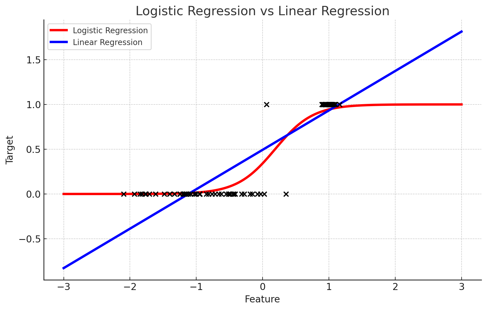

# 로지스틱 회귀

로지스틱 회귀(Logistic Regression)는 **분류**를 위해 사용되는 알고리즘이다. 선형회귀방식을 분류에 적용한 것이다. 선형함수의 최적의 선을 찾는게 아닌, 시그모이드(Sigmoid) 함수의 최적선을 찾고, 결과를 확률로 해석할 수 있는 [0, 1] 범위의 값을 출력한다.

로지스틱 회귀는 **주로 이진분류**에 사용된다. 물론 다중 클래스 분류에도 적용될 수 있다. 이 경우, '다중 로지스틱 회귀' 또는 '소프트맥스 회귀'라고 불리는 방법을 사용한다.

로지스틱 회귀에서 예측확률이 0.5이상이면 1로, 0.5 미만이면 0으로 예측한다.


p는 주어진 입력 x에 대한 이벤트 발생확률을 나타내며  *β*0,*β*1,*β*2,…,βn은 회귀 계수가 된다. 이 수식은 선형회귀의 결과를 시그모이드(로지스틱) 함수를 통해 [0, 1] 범위의 확률로 변환한다.

로지스틱 회귀는 빠르고, 가볍고, 이진분류 예측성능이 뛰어나고, 특히 희소한 데이터 세트 분류에서 성능이 좋다. **텍스트 분류**에 자주 사용된다.





### 로지스틱  회귀 비용함수


첫 번째항은 로그 손실(log loss), 두 번째항은 L2규제 항이다. C는 규제의 강도를 나타내는 파라미터로, 규제항에 반비례 하기 때문에 C가 작을 수록 규제항의 영향이 커진다.


## Sklearn 로지스틱 회귀

[로지스틱회귀 sklearn 문서](https://scikit-learn.org/stable/modules/generated/sklearn.linear_model.LogisticRegression.html )

로지스틱 회귀에 사용되는 주요 하이퍼 파라미터로는

* **C** : 규제의 강도를 결정한다. 값이 작을수록 규제가 강하다. 과적합을 방지하는 데 도움이된다.

  * 로지스틱 회귀에서 C는 규제의 역수로 작용한다. 

* **penalty** : 규제의 종류를 지정한다.  'l1', 'l2', 'elasticnet', None 등이 사용된다. default는 l2규제.

* **solver** : 최적화 문제를 해결하는 알고리즘을 지정한다.  'liblinear', 'sag', 'saga', 'newton-cg', 'lbfgs' 등이 있다. default는 lbfgs. 데이터셋의 크기와 유형에 따라 적절한 솔버를 선택하는 것이 중요하다. 

  * **solver**는 지정한 **penalty**에 따라 사용해야하는 알고리즘이 있다.

  

  * 'lbfgs'를 가장 많이 사용한다. 메모리 공간을 절약할 수 있고, CPU 코어 수가 많다면 최적화를 병렬로 수행한다.
  * **GridSearchCV**를 활용하여 최적의 하이퍼 파라미터를 찾을 수 있지만 


위스콘신 암예측 데이터로 LogisticRegression을 사용해보자면

```python
from sklearn.datasets import load_breast_cancer
from sklearn.model_selection import train_test_split
from sklearn.preprocessing import StandardScaler
from sklearn.linear_model import LogisticRegression
from sklearn.metrics import accuracy_score

# 위스콘신 유방암 데이터셋 로드
cancer = load_breast_cancer()
scaler = StandardScaler()
data_scaled = scaler.fit_transform(cancer.data)
X, y = data_scaled, cancer.target

# 데이터를 훈련 세트와 테스트 세트로 분할
X_train, X_test, y_train, y_test = train_test_split(X, y, test_size=0.3, random_state=1)

# 로지스틱 회귀 모델 생성 및 훈련
logreg = LogisticRegression(max_iter=10000)
logreg.fit(X_train, y_train)

# 테스트 데이터에 대한 예측 및 정확도 평가
y_pred = logreg.predict(X_test)
accuracy = accuracy_score(y_test, y_pred)
```

```
0.9707602339181286
```


최적의 하이퍼 파라미터를 찾는방법

```python
from sklearn.model_selection import GridSearchCV
from sklearn.linear_model import LogisticRegression

# 로지스틱 회귀 모델 생성
logreg = LogisticRegression(max_iter=600)

# 탐색할 하이퍼파라미터 설정
param_grid = {
  'penalty': ['l2', 'l1'],
  'solver': ['liblinear', 'saga', 'lbfgs'],
  'C': [0.001, 0.01, 0.1, 1, 10, 100]
}

# GridSearchCV 설정
grid_search = GridSearchCV(logreg, param_grid, cv=5, scoring='accuracy')

# 최적의 하이퍼파라미터 탐색
grid_search.fit(X, y)

# 결과 출력
print("Best parameters:", grid_search.best_params_)
print("Best score:", grid_search.best_score_)
```

실행하면 에러가 난다!  왜냐하면 sklearn에서는, solver는 사용하는 penalty에 따라 solver 값이 다르면 에러를 출력시킨다.

sklearn 문서를 참고하여 파라미터를 설정해주자.