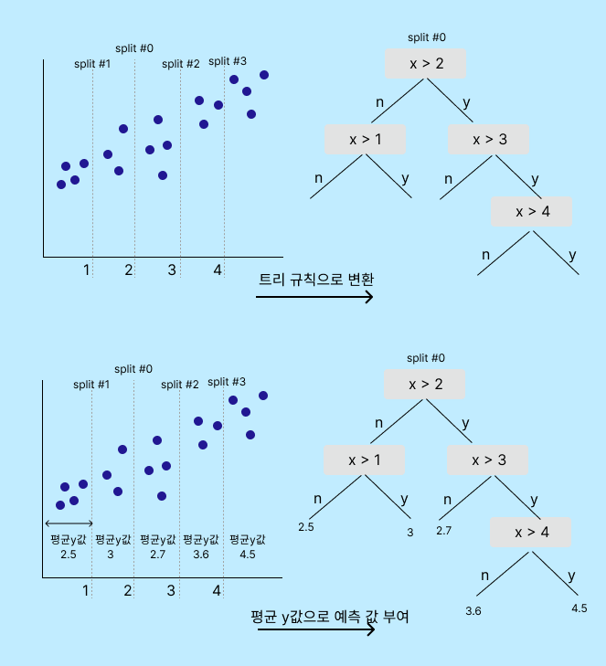
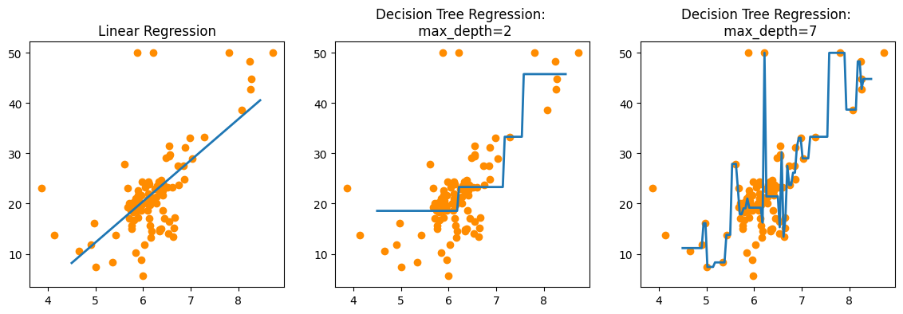

# 회귀트리

결정 트리 및 트리 기반 앙상블 알고리즘은 분류 뿐만 아니라 회귀에서도 가능하다.

트리 기반 모델에서 분할을 결정하는 주요 알고리즘들은 **CART (Classification and Regression Trees)**, **ID3 (Iterative Dichotomiser 3)**, **C4.5 및 C5.0**, **Random Forest** 등 있다.

Scikit-learn에서 제공하는 회귀 트리 알고리즘은 주로 **CART (Classification and Regression Trees) 기반**이다. CART는 데이터를 두 개의 하위 그룹으로 반복적으로 분할하는 방식으로 작동하며, 각 분할은 데이터를 가능한 한 순수한(subgroup)로 만들기 위해 선택된다. 분류 문제에서는 클래스의 **순도(Gini Impurity)**를, 회귀 문제에서는 **평균 제곱 오차(Mean Squared Error)**를 최소화하는 방향으로 분할한다.

## 프로세스

1. **데이터 분할**: 루트 노드에서 시작하여, 각 노드에서 데이터를 두 개의 하위 그룹으로 분할한다. 이 분할은 지니 불순도(Gini Impurity)나 평균 제곱 오차(Mean Squared Error)를 최소화하는 방향으로 이루어진다.
2. **평균 값들로 학습/예측**: 분할된 영역에 있는 값들의 평균값을 구하고 , 분류 기준별로 이 값을 학습하고 예측한다.

## Sklearn의 회귀 트리

* **DecisionTreeRegressor** : 연속적인 값을 예측하는 데 사용되며, 데이터를 특정 기준에 따라 반복적으로 분할한다.
* **GradientBoostingRegressor** : 트리의 앙상블을 사용하여 순차적으로 모델을 구축하며, 이전 트리의 오차를 줄이는 방향으로 새로운 트리를 추가한다.
* **XGBRegressor**:  XGBoost는 결정 트리 기반의 앙상블 학습 방법으로, 기존 모델의 오차를 줄이기 위해 순차적으로 트리를 추가한다.
* **LGBMRegressor**: LightGBM은 XGBoost와 유사한 그래디언트 부스팅 프레임워크이지만, 트리 구축 방식에서 차이가 있다. LightGBM은 효율적인 학습과 더 빠른 속도를 위해 리프 중심 트리 분할(Leaf-wise tree growth)을 사용한다. LGBMRegressor는 대규모 데이터셋과 고차원 데이터에 효과적인 회귀 모델이다. 하지만 소규모 데이터셋에서는 성능이 잘 나오지 않는다.

## 회귀트리 오버피팅

회귀 트리역시 복잡한 트리구조를 가질 경우 과적합이 나타난다. 적절한 트리크기와 노드개수로 제한해서 개선해야한다.

