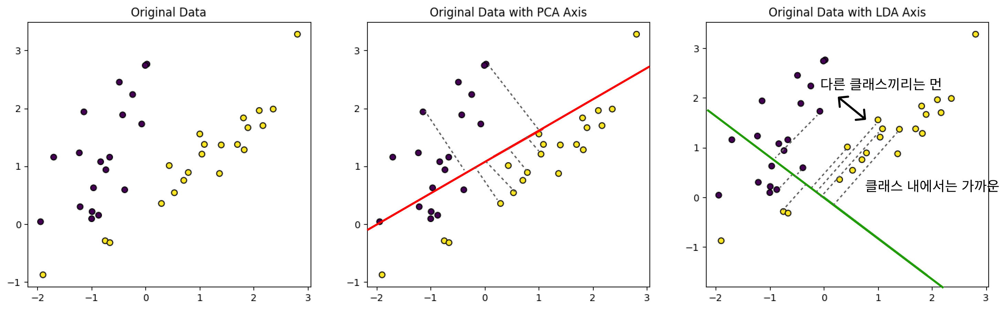
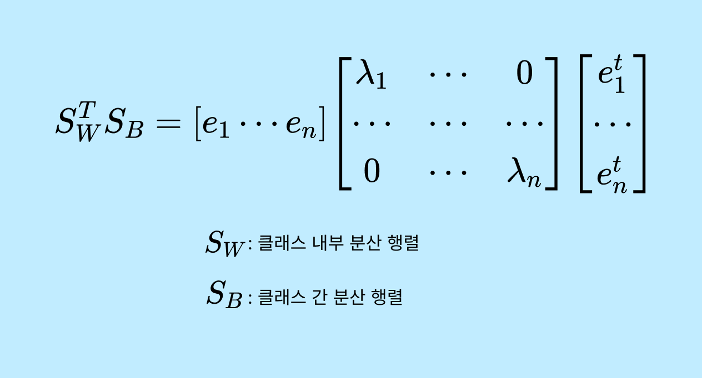

# LDA

**LDA(Linear Discriminant Analysis) 변환**은 분류(Classification) 문제에서 데이터의 차원을 축소하기 위해 사용되는 방법이다. LDA는 **클래스 간 분산은 최대화(between-class scatter)**하고 **클래스 내 분산은 최소화(within-class scatter)**하는 방식으로 데이터를 새로운 축(차원)으로 투영한다. 이를 통해 클래스 간 구분이 더 명확해지도록 데이터를 변환한다. LDA는 주로 지도 학습 방식에서 데이터의 특징을 추출하거나 차원을 줄이는 데 사용되며, 데이터의 분류 성능을 향상시키는 데 도움이 된다.




### PCA와 다른점

LDA는 PCA와 유사하게 입력 데이터를 저차원 공간에 투영한다. 차이점을 설명하자면.

PCA는 데이터의 분산을 최대화하는 방향으로 차원을 축소하며, 클래스 레이블을 고려하지 않는다. 반면, LDA는 클래스 간 분산은 최대화하고 클래스 내 분산은 최소화하는 방향으로 차원을 축소한다.

**PCA는 비지도 학습 방식**으로, 데이터의 주요 패턴을 찾는다. **LDA는 지도 학습 방식**으로, 클래스 레이블 정보를 사용하여 데이터를 분류하는 데 유리한 방향을 찾는다.

LDA는 **공분산 행렬이 아닌** 클래스간 분산과 클래스 내부 분산행렬을 생성한 뒤, 이 행렬에 기반해 **고유벡터**를 구하고 입력 데이터를 투영한다.


## LDA 절차 & 고유값 분해

1. **클래스 내 분산과 클래스 간 분산 계산**:
   - 클래스 내 분산 `S_W`는 각 클래스 내부의 샘플 분산의 합
   - 클래스 간 분산 `S_B`는 각 클래스의 평균과 전체 평균 간의 차이
2. **LDA 목적 함수 최적화**:
   - LDA의 목적은 `S_W^T*S_B` 의 비율을 최대화하는 벡터 를 찾는 것이다. 이는 클래스 간 분산을 최대화하고 클래스 내 분산을 최소화하는 방향을 나타낸다.
3. **고윳값 분해**:
   - 고윳값 분해하여, 최대 고윳값을 갖는 고유벡터를 선택한다. 이 고유벡터는 데이터를 투영할 최적의 축을 나타낸다




## 사이킷런 LDA

**PCA(Principal Component Analysis)**에서는  **주성분의 최대 개수 (max_components)**가 주로 데이터의 특성 수(`n_features`)에 의해 제한된다. PCA는 주어진 데이터의 분산을 최대한 보존하는 방식으로 차원을 축소한다. 이때, 데이터셋의 특성 수보다 많은 수의 주성분을 찾을 수 없다. 즉, 최대 주성분 수는 `n_features`로 제한된다.

LDA에서는 각 클래스 간의 차이를 최대화하는 방향으로 데이터를 투영한다. PCA에서는 주성분 최대개수가 n_features로 제한되었지만 LDA에서는 두 가지 제한이있다.

1. **클래스 수(n_classes)**: 클래스간 차이를 기반으로 하기 때문에,  `n_classes - 1`개의 축 만이 유의미하다.

2. **특성 수(n_features)**:  데이터셋의 특성 수보다 많은 수의 주성분을 찾을 수 없다

따라서 **max_components = min(n_classes-1, n_features)** 이며, 즉 두 제한 중 더 작은 값으로 결정된다.


```python
X = wine.data.astype('float32')
y = wine.target
n_samples, n_features = X.shape
classes = np.unique(y)
n_classes = len(classes)
n_components = 2
max_components = min(n_classes-1,n_features)
print("Number of classes: {}".format(n_classes))
print("Number of features: {}".format(n_features))
```

```
Number of classes: 3
Number of features: 13
```

위의 경우에는 최대 주성분 개수가 min(3 - 1, 13) = **2**로 제한된다.

```python
LDA(n_components=2)
```

2보다 큰 값이면 에러를 출력한다.