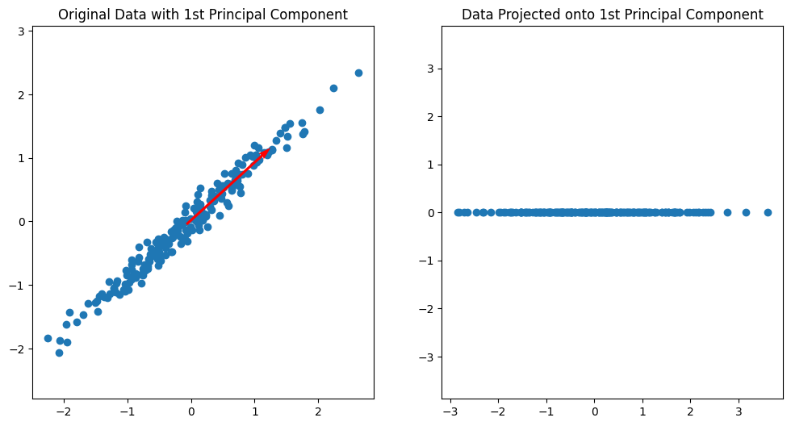
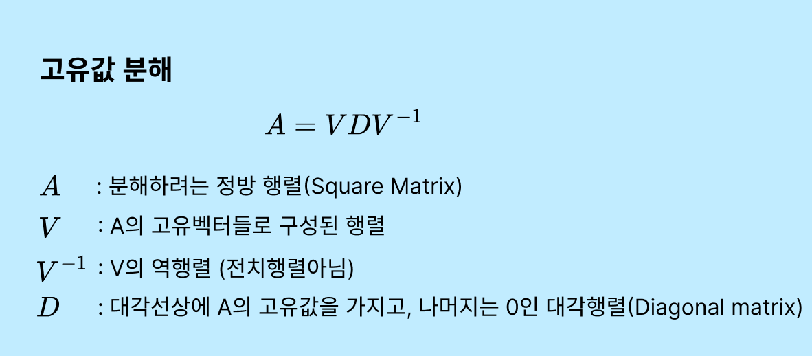
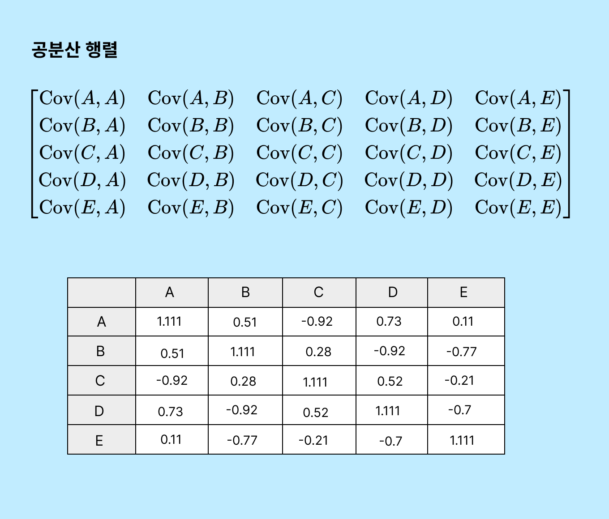
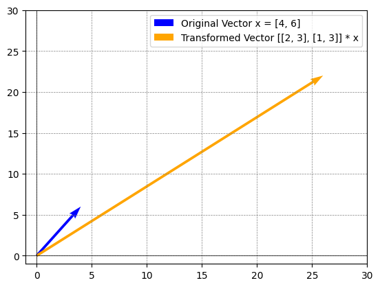
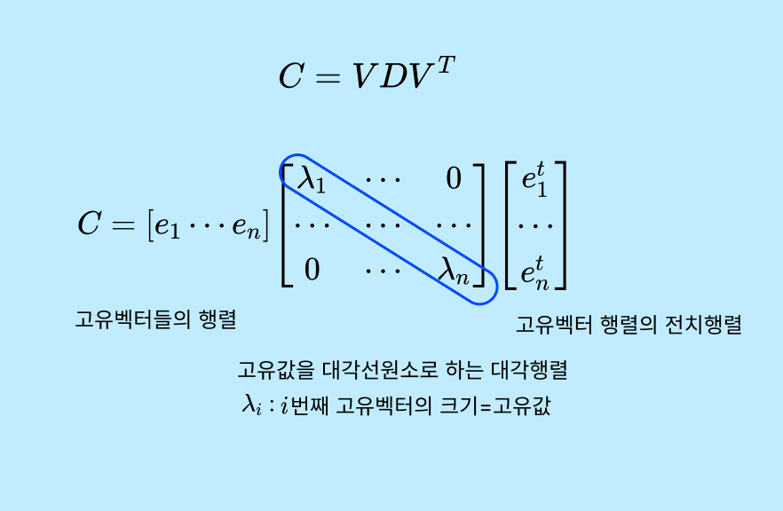

# 차원 축소

수십~수백개의 Feature들을 줄이자. 원본 데이터의 정보를 최대한으로 유지한 채로 차원 축소를 할것인가? 

차원 축소는 크게 두 가지 유형으로 나뉜다.

* Feature Selection - 모델을 잘 설명할 수 있는 피쳐들을 선택
* Feature Extraction - 피처들을 함축적으로 더 잘 설명할 수 있는 다른 공간으로 매핑해 추출하는 것
  * ex) 연령, 소득, 구매이력과 같은 피쳐에서 '경제적 수준', '구매 활동'과 같은 새로운 피쳐를 추출해냄.

차원축소는 단순히 데이터의 압축을 의미하는 것이아닌 데이터를 더 잘 설명할 수 있는 잠재적(Latent)요소를 추출하는 데 있다.

흔히 사용되는 차원 축소 기법에는 

* 주성분 분석(PCA)
* 선형 판별 분석(LDA)
* t-SNE(t-Distributed Stochastic Neighbor Embedding)


## PCA(Principal Component Analysis)

PCA는 주성분 분석이라고 한다. 고차원의 원본 데이터를 저차원의 **부분 공간으로 투영**하여 데이터를 축소하는 기법이다.



분산이 최대인 첫 번째 축을 나타내었다. 데이터가 가장 넓게 퍼져있는 방향을 찾은 것이다.

PCA에서 분산을 기반으로 축을 생성하는 이유는 **데이터의 주요한 패턴**이 **가장 큰 분산을 가진 방향**에 위치하기 때문이다. PCA 축을 정사영했을 때 **겹치는 데이터가 최소**가된다.

 다음은 PCA과정이다. 

1. **PCA1 생성** - PCA는 먼저 원본 데이터에 가장 큰 데이터 변동성(Variance)을 기반으로 첫 번째 벡터 축을 생성한다. PCA1축으로 정사영할 때 겹치는 데이터가 최소가 되게하기 위함.
2. **PCA1 정사영** - 예시로 겹치는 데이터가 100개라고 가정한다.
3. **PCA2 생성** - 이 PCA1축에 겹쳐지는 100개의 포인트를 설명할 수 있는 축 PCA2를 생성해야한다. 

 

따라서 PCA는 **데이터의 분산을 최대화하는 새로운 특성(주성분)**을 찾는 방법이라 볼 수있다. 이는 원래의 특성들이 가진 정보를 가능한 **적은 수의 새로운 특성으로 압축**하려는 시도이다.

이렇게 하면, 원래의 데이터 차원보다 적은 수의 차원을 가지면서도 원래 데이터에서 가장 중요한 정보를 유지할 수 있다. 


## 고유값 분해



정사각행렬 A를 3개의 행렬로 분해할 수 있다. 

**공분산 행렬의 고유값 분해는 차원축소에서 핵심적인 역할을 한다.** 고유값 분해를 통해 고유벡터(변동 방향)와 고유값(변동 크기)을 얻을 수 있다.


공분산 행렬은 여러 변수들과 관련된 공분산을 포함하는 정방형 행렬이며 대칭행렬이다.




## 선형 변환

고유값 분해를 이해하는데 선형변환의 개념이 중요하다.

고유값분해는 행렬을 선형변환으로 해석할 때 의미가 생긴다. 행렬은 벡터 공간에서의 선형변환을 나타내며, 교유벡터와 고유값은 이 변환의 특징을 설명한다.

x라는 벡터가 있고, 이에 A행렬을 곱해(선형변환) 나타내어보자면.. 




그림과 같이 좌표평면상에서 **기존 벡터(파란화살표)**가 **변환(노란화살표)**이 된다.


## 공분산행렬의 고유값 분해

공분산 행렬의 고유값분해는 다음과 같은 수식으로 나타낼 수 있다. 복잡한 선형대수식으로 거치면 아래처럼 분해가된다.



고유벡터 [e1...en] 이게 바로 PCA의 축이다. e1이 가장 큰 변동성을 가지는 PCA축이다. 다음 e2는 e1의 수직이면서 다음으로 변동성이 큰 방향을 가진 PCA축이다.

이렇게 분해된 고유벡터를 이용해 입력데이터를 선형변환한다.


PCA변환 수행절차를 다음과같이 요약하자면

1. 입력 데이터 세트의 공분산 행렬을 생성한다.
2. 공분산 행렬의 고유벡터와 고유값을 계산한다.
3. 고유값이 가장 큰 순으로 K(PCA 변환 차수)만큼 고유벡터를 추출한다.
4. 고유값이 가장 큰 순으로 추출된 고유벡터를 이용해 새롭게 입력 데이터를 변환한다.


## PCA 활용

```python
from sklearn.decomposition import PCA
from sklearn.preprocessing import StandardScaler

cols_bill = ['BILL_AMT'+str(i) for i in range(1, 7)]
scaler = StandardScaler()

df_cols_scaled = scaler.fit_transform(X_features[cols_bill])

pca = PCA(n_components=2)
pca.fit(df_cols_scaled)
print(pca.explained_variance_ratio_)
```

```
[0.90555253 0.0509867 ]
```

PCA를 통해 얻어진 두 주성분이 전체 데이터 분산에서 차지하는 비율을 나타낸다. 첫 번째 주성분이 전체 분산의 약 90.56%를 설명하며, 두 번째 주성분이 약 5.10%를 설명한다. 이는 첫 번째 주성분이 데이터의 대부분의 정보(변동성)를 포착하고 있음을 의미하며, 두 주성분을 합쳐서 전체 데이터 분산의 약 95.66%를 설명할 수 있음을 나타낸다.


랜덤포레스트분류기에 PCA를 적용한것과 그렇지 않은 것의 비교를 해본다.

```python
import numpy as np
from sklearn.ensemble import RandomForestClassifier
from sklearn.model_selection import cross_val_score

rcf = RandomForestClassifier(n_estimators=300, random_state=1)
scores = cross_val_score(rcf, X_features, y_target, scoring='accuracy', cv=3 )

print('CV=3 인 경우의 개별 Fold세트별 정확도:',scores)
print('평균 정확도:{0:.4f}'.format(np.mean(scores)))
```

```
CV=3 인 경우의 개별 Fold세트별 정확도: [0.257  0.8209 0.784 ]
평균 정확도:0.6206
```

```python
from sklearn.decomposition import PCA
from sklearn.preprocessing import StandardScaler

# 원본 데이터셋에 먼저 StandardScaler적용
scaler = StandardScaler()
df_scaled = scaler.fit_transform(X_features)

# 6개의 Component를 가진 PCA 변환을 수행하고 cross_val_score( )로 분류 예측 수행. 
pca = PCA(n_components=6)
df_pca = pca.fit_transform(df_scaled)
scores_pca = cross_val_score(rcf, df_pca, y_target, scoring='accuracy', cv=3)

print('CV=3 인 경우의 PCA 변환된 개별 Fold세트별 정확도:',scores_pca)
print('PCA 변환 데이터 셋 평균 정확도:{0:.4f}'.format(np.mean(scores_pca)))
```

```
CV=3 인 경우의 PCA 변환된 개별 Fold세트별 정확도: [0.7752 0.7993 0.8023]
PCA 변환 데이터 셋 평균 정확도:0.7923
```
