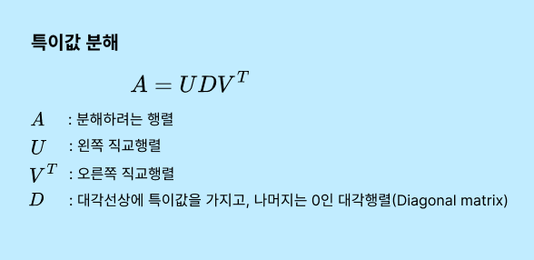
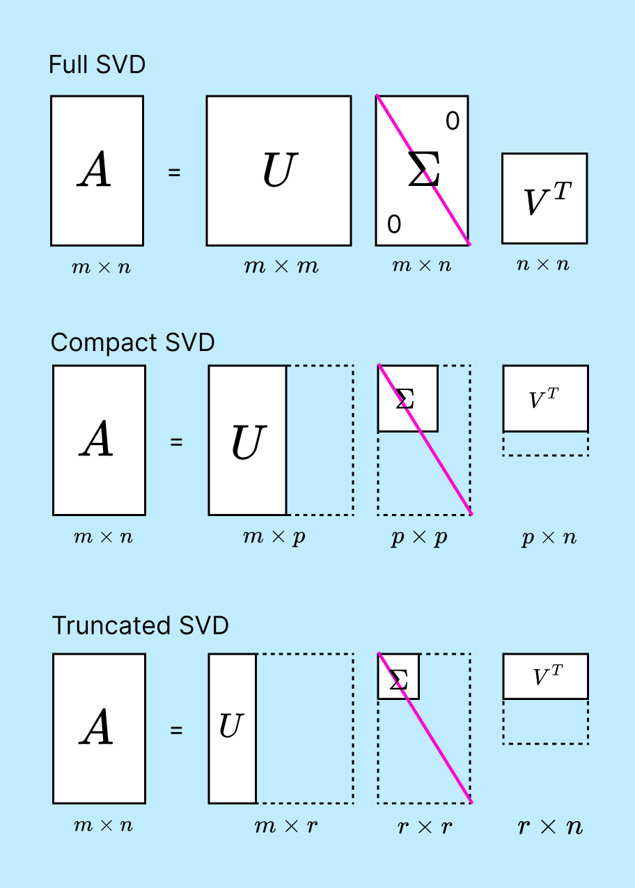

# SVD - 특이값 분해



**특이값 분해 SVD(Singular Value Decomposition)**는 행렬 분해의 한 형태로, 어떤 행렬을 세 개의 특별한 행렬의 곱으로 나타내는 방법이다. 

**고유값 분해**는 정방행렬(행과 열의 수가 같은 행렬)에 적용된다. 반면, SVD는 모든 형태의 행렬(정방행렬, 직사각형 행렬)에 적용할 수 있다.


SVD의 주요 활용분야는 다음과 같다.

1. **추천 시스템**
2. **텍스트 마이닝과 자연어 처리**
3. **이미지 처리**: 이미지 데이터의 차원을 축소하여 필수적인 정보를 추출하고, 이미지 압축 및 노이즈 제거에 활용
4. **생물정보학**: 대규모 유전 데이터에서 중요한 특성을 추출하는 데 사용
5. **신호 처리**: 복잡한 신호에서 중요한 정보를 추출하고 노이즈를 감소시키는 데 활용


## SVD 유형

SVD(특이값 분해)에는 여러 가지 유형이 있다.



1. **풀 SVD(Full SVD)**: 이는 가장 기본적인 형태로, 모든 특이 벡터를 포함한다.

   풀 SVD는 원본 행렬의 모든 특이값과 특이 벡터를 포함하므로, 특히 크기가 큰 행렬의 경우 많은 계산 자원을 요구하며 상당한 메모리를 소비한다. 잘 사용하지 않는다.

2. **컴팩트 SVD(Compact SVD)**: Full SVD에서 0이 아닌 특이값에 해당하는 부분만을 포함하는 간소화된 버전이다.

3. **절단 SVD(Truncated SVD)**: 가장 중요한 몇 개의 특이값과 그에 해당하는 특이 벡터만을 포함한다. 이는 더 작은 차원으로 데이터를 근사하는 데 사용된다


## Truncated SVD

Truncated SVD의 절차는 아래와 같이 나타낼 수 있다.

1. **SVD 수행**: 원본 행렬 *A*를 SVD를 사용하여 세 개의 행렬, *U*, Σ, *V^T*로 분해한다.
2. **특이값 선택**: Σ 행렬에서 가장 큰 *r*개의 특이값을 선택한다. *r*는 원하는 차원의 수이다. 이 특이값들은 데이터의 주요 변동성을 나타내는 **잠재요인(Latent Factor)(함축적인 요소)**으로 간주된다.
3. **행렬 축소**: *U*와 *V* 행렬을 해당 특이값에 대응하는 열까지만 남기고 나머지를 제거한다.
4. **새로운 행렬 생성**: 축소된 *U*, Σ, *V^T*를 사용하여 행렬을 생성한다.

SVD로 차원 축소 행렬을 분해 후 다시 분해된 행렬을 이용하여 행렬을 생성하면, 행렬을 원복할 수 있지만, 데이터 셋은 잡음이 제거된 형태로 재구성될 수 있다. 하지만 원본 데이터도 손실된다.

**잠재 요인(Latent Factor)** 모델은 여러 분야에 널리 사용된다. (추천시스템, 신호처리, 문서의 잠재 의미 분석 등)


## 구현

numpy에서 구현할 수 있고, Scipy에서 구현할 수 있다.

원본 행렬 확인

```python
import numpy as np
from numpy.linalg import svd

np.random.seed(1)
a = np.random.randn(4, 4)
np.round(a, 3)
```

```
array([[ 1.624, -0.612, -0.528, -1.073],
       [ 0.865, -2.302,  1.745, -0.761],
       [ 0.319, -0.249,  1.462, -2.06 ],
       [-0.322, -0.384,  1.134, -1.1  ]])
```

행렬 분해후 shape와 값 확인

```python
U, Sigma, Vt = svd(a)
print(U.shape, Sigma.shape, Vt.shape)
print('\nU matrix:\n',np.round(U, 3))
print('\nSigma Value:\n',np.round(Sigma, 3))
print('\nV transpose matrix:\n',np.round(Vt, 3))
```

```
(4, 4) (4,) (4, 4)

U matrix:
 [[-0.269  0.815 -0.45   0.248]
 [-0.706  0.174  0.678 -0.107]
 [-0.557 -0.347 -0.569 -0.495]
 [-0.345 -0.431 -0.118  0.825]]

Sigma Value:
 [4.036 1.992 1.762 0.198]

V transpose matrix:
 [[-0.276  0.511 -0.569  0.583]
 [ 0.754 -0.325 -0.564  0.092]
 [-0.163 -0.623  0.258  0.72 ]
 [-0.573 -0.496 -0.541 -0.365]]
```

Full Svd가 진행되었다. Sigma가 (4, )인 이유는 대각행렬에서 0을 제외하여 표현한 것이다.

다시 분해된 행렬을 이용하여 원복하면

```python
Sigma_mat = np.diag(Sigma)
a_ = np.dot(np.dot(U, Sigma_mat), Vt)
np.round(a, 3)
```

```
array([[ 1.624, -0.612, -0.528, -1.073],
       [ 0.865, -2.302,  1.745, -0.761],
       [ 0.319, -0.249,  1.462, -2.06 ],
       [-0.322, -0.384,  1.134, -1.1  ]])
```

원본데이터와 일치함을 확인한다.


다음으로 Truncated SVD를 이용한 행렬분해

```python
import numpy as np
from scipy.sparse.linalg import svds
from scipy.linalg import svd

# 원본 행렬을 출력하고, SVD를 적용할 경우 U, Sigma, Vt 의 차원 확인 
np.random.seed(1)
matrix = np.random.random((6, 6))
print('원본 행렬:\n', np.round(matrix, 3))

# Truncated SVD로 Sigma 행렬의 특이값을 2개로 하여 Truncated SVD 수행. 
num_components = 5
U_tr, Sigma_tr, Vt_tr = svds(matrix, k=num_components)
print('\nTruncated SVD 분해 행렬 차원:',U_tr.shape, Sigma_tr.shape, Vt_tr.shape)
print('\nTruncated SVD Sigma값 행렬:', Sigma_tr)

matrix_tr = np.dot(np.dot(U_tr,np.diag(Sigma_tr)), Vt_tr)  # output of TruncatedSVD

print('\nTruncated SVD로 분해 후 복원 행렬:\n', np.round(matrix_tr, 3))
```

```
원본 행렬:
 [[0.417 0.72  0.    0.302 0.147 0.092]
 [0.186 0.346 0.397 0.539 0.419 0.685]
 [0.204 0.878 0.027 0.67  0.417 0.559]
 [0.14  0.198 0.801 0.968 0.313 0.692]
 [0.876 0.895 0.085 0.039 0.17  0.878]
 [0.098 0.421 0.958 0.533 0.692 0.316]]

Truncated SVD 분해 행렬 차원: (6, 5) (5,) (5, 6)

Truncated SVD Sigma값 행렬: [0.3206035  0.5634742  0.63366755 1.33836516 2.78455099]

Truncated SVD로 분해 후 복원 행렬:
 [[0.403 0.732 0.009 0.297 0.132 0.097]
 [0.162 0.366 0.411 0.529 0.395 0.693]
 [0.216 0.868 0.02  0.675 0.43  0.555]
 [0.147 0.193 0.797 0.971 0.32  0.69 ]
 [0.883 0.889 0.081 0.042 0.176 0.876]
 [0.103 0.417 0.955 0.535 0.696 0.314]]
```

* 특이값 k를 작게하면 할 수록 원본데이터에서 손실이 크다.