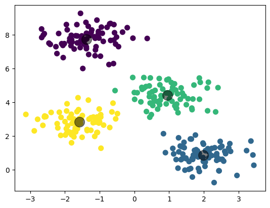

## 군집화 활용 분야

* **고객 세분화(Customer Segmentation)**: 마케팅에서 가장 널리 사용되는 군집화의 활용 사례. 고객의 구매 이력, 행동 패턴, 선호도 등을 기반으로 유사한 특성을 가진 고객을 군집화함으로써 맞춤형 마케팅 전략을 개발하거나 새로운 고객 층을 탐색할 수 있다.
* **이상치 탐지(Anomaly Detection)**: 군집화를 통해 정상적인 데이터 패턴을 학습하고, 이와 다른 패턴을 가진 데이터(이상치)를 탐지할 수 있다. 이는 신용카드 사기 탐지, 네트워크 침입 탐지 등에 사용된다.
* **이미지 분류(Image Segmentation)**: 이미지 처리에서 픽셀의 색상, 밝기 등을 기반으로 유사한 픽셀을 군집화하여 이미지를 세분화하는 데 사용된다.
* **생물학적 분류(Biological Clustering)**: 유전자 분석, 단백질 분석 등 생물학적 데이터의 분류에 군집화가 사용된다. 이를 통해 유사한 기능을 가진 유전자나 단백질을 그룹화하거나, 질병의 유형을 분류할 수 있다.
* **문서 분류(Document Clustering)**: 텍스트 데이터에 대해 유사한 주제나 키워드를 가진 문서를 그룹화하는 데 사용된다. 이는 뉴스 기사 분류, 검색 엔진 결과 그룹화 등에 활용된다.


## 군집화 알고리즘

* **K-Means**: K-Means는 데이터를 K개의 클러스터로 분류하며, 각 클러스터의 중심과 각 데이터 사이의 거리를 최소화하는 방식으로 작동한다.
* **Hierarchical Clustering**: 계층적 군집화는 데이터를 트리와 같은 계층구조로 군집화한다.
* **DBSCAN (Density-Based Spatial Clustering of Applications with Noise)**: 밀도 기반의 군집화 알고리즘으로, 특정 공간 내 데이터 밀도 차이를 기반으로 군집을 형성한다.
* **Spectral Clustering**: 데이터를 고차원 공간에 투영한 후 군집화를 수행하는 알고리즘이다. 이는 복잡한 구조를 가진 데이터나 노이즈가 많은 데이터에 대한 군집화에 적합하다.
* **Gaussian Mixture Models (GMM)**: GMM은 데이터가 여러 개의 가우시안 분포를 가진 혼합체라고 가정하고, 이를 기반으로 군집화를 수행한다.


## K-means

**거리**에 기반한 알고리즘


K-means는 간단하고 이해하기 쉽다. 일반적인 군집화에서 가장 많이 활용되는 알고리즘이다.

하지만 단점도 있으니. K의 수를 미리 설정해야하며, 반복횟수가 많을 수록 느려진다. 또한 거리에 기반하므로 이상치에 취약하다. (거리가 매우 커지므로)


### 사이킷런 KMeans

[사이킷런 KMeans 문서](https://scikit-learn.org/stable/modules/generated/sklearn.cluster.KMeans.html)

주요 하이퍼 파라미터는

* **n_clusters**: 클러스터의 개수, 즉 데이터를 나눌 그룹의 수
* **init**: 초기 클러스터 중심점의 설정 방법을 정의한다. 일반적으로 default 값인 'k-means++'또는 'random'이 사용된다.
* **max_iter**: 최대 반복 횟수로, 알고리즘이 수렴할 때까지의 최대 반복횟수. default는 300


### 주요속성

* **labels_**: 각 데이터 포인트가 속한 군집 중심점 레이블
* **cluster_centers_**: 각 군집 중심점 좌표. 이를 이용하면 군집 중심점 좌표가 어딘지 시각화할 수 있다.


```python
from sklearn.cluster import KMeans
from sklearn.datasets import make_blobs

# 예시 데이터 생성
X, y = make_blobs(n_samples=300, centers=4, cluster_std=0.60, random_state=0)

# KMeans 클러스터링 실행
kmeans = KMeans(n_clusters=4)
kmeans.fit(X)

# 클러스터 중심점과 레이블 얻기
centers = kmeans.cluster_centers_
labels = kmeans.labels_

# 결과 시각화
import matplotlib.pyplot as plt

plt.scatter(X[:, 0], X[:, 1], c=labels, s=50, cmap='viridis')
plt.scatter(centers[:, 0], centers[:, 1], c='black', s=200, alpha=0.5)
plt.show()
```



300번의 반복을 진행하니 결과도출에는 시간이 많이 소요되었다.


### 시각화

feature가 4개면 4차원의, 10개면 10차원의 공간에서 데이터 포인트 간의 거리를 기반으로 클러스터를 형성한다.

이를 2차원 평면에 시각화하기 위해서는 차원 축소 기법을 사용해야 한다. PCA 또는 t-SNE를 이용한다.

```python
from sklearn.decomposition import PCA

pca = PCA(n_components=2)
pca_transformed = pca.fit_transform(iris.data)

irisDF['pca_x'] = pca_transformed[:,0]
irisDF['pca_y'] = pca_transformed[:,1]

# cluster 값이 0, 1, 2 인 경우마다 별도의 Index로 추출
marker0_ind = irisDF[irisDF['cluster']==0].index
marker1_ind = irisDF[irisDF['cluster']==1].index
marker2_ind = irisDF[irisDF['cluster']==2].index

# cluster값 0, 1, 2에 해당하는 Index로 각 cluster 레벨의 pca_x, pca_y 값 추출. o, s, ^ 로 marker 표시
plt.scatter(x=irisDF.loc[marker0_ind,'pca_x'], y=irisDF.loc[marker0_ind,'pca_y'], marker='o') 
plt.scatter(x=irisDF.loc[marker1_ind,'pca_x'], y=irisDF.loc[marker1_ind,'pca_y'], marker='s')
plt.scatter(x=irisDF.loc[marker2_ind,'pca_x'], y=irisDF.loc[marker2_ind,'pca_y'], marker='^')

plt.xlabel('PCA 1')
plt.ylabel('PCA 2')
plt.title('3 Clusters Visualization by 2 PCA Components')
plt.show()
```


## Mean Shift

Mean shift는 **밀도, 분포** 기반의 군집화 알고리즘이다. 밀집된 영역(또는 '모드')을 찾아내는 데 사용된다. 이 알고리즘은 각 데이터 포인트를 중심으로 일정 반경 내의 이웃 데이터 포인트들의 평균 위치를 계산하고, 이 평균 위치로 중심을 이동시킨다. 이 과정을 반복하면서 데이터 포인트들은 가장 밀집된 영역의 중심, 즉 국지적 최대값(local maxima)으로 이동하게 된다.


### 동작 순서


1. 개별 데이터의 특정 반경 내에 주변 데이터를 포함한 데이터 분포도 계산
   * 이때 **KDE(Kernel Density Estimation)**를 사용하며, 주로 각 포인트에 커널 함수를 적용하여 확률 밀도를 계산한다. 
   * **KDE**는 각 데이터 포인트에 커널 함수(보통 가우시안)를 적용하여, 이를 모두 합산함으로써 전체 데이터 집합의 밀도를 추정한다. 이 방법은 데이터의 분포를 부드럽게 표현하며, 이상치의 영향을 줄이고 데이터의 전반적인 분포 형태를 파악하는 데 유용하다.
2. 데이터 분포도가 높은 방향으로 중심점 이동
3. 중심점을 따라 해당 데이터 이동
4. 이동된 데이터의 특정 반경내에 다시 데이터 분포 계산 후 2, 3 스텝을 반복
5. 가장 분포도가 높은 곳으로 이동하면 더이상 해당 데이터는 움직이지 않고 수렴한다.
6. 모든 데이터포인터들을 1~5 스텝을 수행하면서 군집 중심점을 탖는다.


### KDE

KDE(Kernel Density Estimation)는 주어진 데이터 샘플로부터 연속적인 확률 밀도 함수를 추정하는 비모수적 방법이다.

커널의 종류는 여러가지가 있다. x=0에 대해 커널을 적용시키면 


위의 모양이 된다. 그 중에서 가우시안 커널을 사용하는 이유는 밀도 추정에서의 효율성과 부드러운 분포 특성 때문이다. 가우시안 커널은 자연스러운 데이터 분포를 잘 반영하고, 매끄러운 곡선으로 데이터를 모델링한다. 

Bandwidth는 KDE에서 매우 중요한 역할을 한다. 너무 작은 Bandwidth는 과적합(Overfitting)으로 이어져 데이터의 잡음에 민감하게 반응하며, 너무 큰 Bandwidth는 과소적합(Underfitting)을 초래하여 데이터의 중요한 특성을 놓칠 수 있다. 가우시안 커널은 이러한 Bandwidth의 영향을 적절히 조절하면서 데이터의 전반적인 구조를 잘 포착한다.


데이터 포인트 [-2, -1, 0, 5, 7, 8]에 대해 가우시안 커널을 적용시키면


다음 이 모든 커널함수를 더하게 되면 다음과 같이 KDE 함수가 생성된다. 커널이 겹치는 구간에는 KDE 함수의 크기가 커진다.


### Bandwidth에 따른 KDE 변화

Bandwidth의 값 [0.2, 0.6, 1, 2, 5]에 따른 KDE를 생성하면

```python
import numpy as np
import matplotlib.pyplot as plt
from scipy.stats import norm

# 임의의 5개 데이터 포인트 생성
data_points = np.array([-2, -1, 0, 5, 7, 8])

# KDE 범위 설정
kde_range = np.linspace(-5, 12, 1000)

# Subplots 그리기
fig, axes = plt.subplots(5, 1, figsize=(16, 16))

for i, bw in enumerate([0.2, 0.6, 1, 2, 5]):
    ax = axes[i]
    # 각 데이터 포인트에 대한 가우시안 커널 적용
    kde_individual_bw = [norm(loc=point, scale=bw).pdf(kde_range) for point in data_points]
    summed_kde = np.sum(kde_individual_bw, axis=0)
    for idx, kde in enumerate(kde_individual):
        ax.plot(kde_range, kde, label=f'Point {data_points[idx]}', alpha=0.5)
    
    ax.plot(kde_range, summed_kde, label='Summed KDE', color='black', linewidth=2)
    ax.set_title(f'h={bw}')

for ax in axes:
    ax.legend()
    ax.grid(True)

plt.tight_layout()
plt.show()
```


Bandwidth 값이 커질 수록 KDE는 더 넓은 분포를 형성한다. 즉 각 데이터 포인트의 영향 범위거 더 넓어진다.


### Bandwidth에 따른 Mean Shift

[Meanshift 클러스터링을 잘 정리해놓은 글](https://analyticsindiamag.com/hands-on-tutorial-on-mean-shift-clustering-algorithm/)

MeanShift는 Bandwidth가 클수록 적은 클러스터링 중심점을, Bandwidth가 작을수록 많은 수의 클러스터링 중심점을 가지게 된다. 또한 Mean shift는 **군집의 개수를 지정하지 않으며,** 오직 Bandwidth의 크기에 따라 군집화를 수행한다.

- **작은 Bandwidth**: 더 작은 반경으로 더 많은 수의 클러스터가 형성된다. 이는 데이터의 미세한 구조를 포착할 수 있지만, 과적합(overfitting)이나 노이즈에 민감할 수 있다.
- **큰 Bandwidth**: 더 큰 반경으로 더 적은 수의 클러스터가 형성된다. 이는 데이터의 전반적인 구조를 파악하는 데 유리하지만, 중요한 세부 사항을 놓칠 수 있다.

Bandwidth의 선택은 데이터의 특성과 클러스터링의 목적에 따라 달라진다. 적절한 bandwidth 설정은 실험적으로 결정되거나, 휴리스틱 방법을 사용하여 찾을 수 있다.


### MeanShift의 단점과 사용분야

Mean Shift 알고리즘의 주요 단점은 **BandWidth에 민감하다.** 적절한 밴드위드(bandwidth)를 선택하는 것이 중요하지만, 이는 종종 어려울 수 있으며, 밴드위드의 선택이 결과에 큰 영향을 미친다.

Mean shift는 데이터 마이닝보다는 컴퓨터비전분야에 주로 활용된다. 오브젝트 트래킹에 적극 활용된다. Mean shift는 비교적 간단한 계산(주변 데이터 평균계산 후 이동)으로 실시간으로 추적할 수 있고, 밀도를 기반으로 클러스터를 형성하기 때문에, 연속적인 데이터 스트림에서 오브젝트위 위치 변화를 효과적으로 추적할 수 있다.

