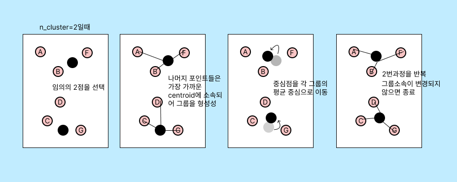

## 군집화 활용 분야

* **고객 세분화(Customer Segmentation)**: 마케팅에서 가장 널리 사용되는 군집화의 활용 사례. 고객의 구매 이력, 행동 패턴, 선호도 등을 기반으로 유사한 특성을 가진 고객을 군집화함으로써 맞춤형 마케팅 전략을 개발하거나 새로운 고객 층을 탐색할 수 있다.
* **이상치 탐지(Anomaly Detection)**: 군집화를 통해 정상적인 데이터 패턴을 학습하고, 이와 다른 패턴을 가진 데이터(이상치)를 탐지할 수 있다. 이는 신용카드 사기 탐지, 네트워크 침입 탐지 등에 사용된다.
* **이미지 분류(Image Segmentation)**: 이미지 처리에서 픽셀의 색상, 밝기 등을 기반으로 유사한 픽셀을 군집화하여 이미지를 세분화하는 데 사용된다.
* **생물학적 분류(Biological Clustering)**: 유전자 분석, 단백질 분석 등 생물학적 데이터의 분류에 군집화가 사용된다. 이를 통해 유사한 기능을 가진 유전자나 단백질을 그룹화하거나, 질병의 유형을 분류할 수 있다.
* **문서 분류(Document Clustering)**: 텍스트 데이터에 대해 유사한 주제나 키워드를 가진 문서를 그룹화하는 데 사용된다. 이는 뉴스 기사 분류, 검색 엔진 결과 그룹화 등에 활용된다.

## 군집화 알고리즘

* **K-Means**: K-Means는 데이터를 K개의 클러스터로 분류하며, 각 클러스터의 중심과 각 데이터 사이의 거리를 최소화하는 방식으로 작동한다.
* **Hierarchical Clustering**: 계층적 군집화는 데이터를 트리와 같은 계층구조로 군집화한다.
* **DBSCAN (Density-Based Spatial Clustering of Applications with Noise)**: 밀도 기반의 군집화 알고리즘으로, 특정 공간 내 데이터 밀도 차이를 기반으로 군집을 형성한다.
* **Spectral Clustering**: 데이터를 고차원 공간에 투영한 후 군집화를 수행하는 알고리즘이다. 이는 복잡한 구조를 가진 데이터나 노이즈가 많은 데이터에 대한 군집화에 적합하다.
* **Gaussian Mixture Models (GMM)**: GMM은 데이터가 여러 개의 가우시안 분포를 가진 혼합체라고 가정하고, 이를 기반으로 군집화를 수행한다.

## K-means

K-means는 간단하고 이해하기 쉽다. 

하지만 단점도 있으니. K의 수를 미리 설정해야하며, 반복횟수가 많을 수록 느려진다. 또한 거리에 기반하므로 이상치에 취약하다.

