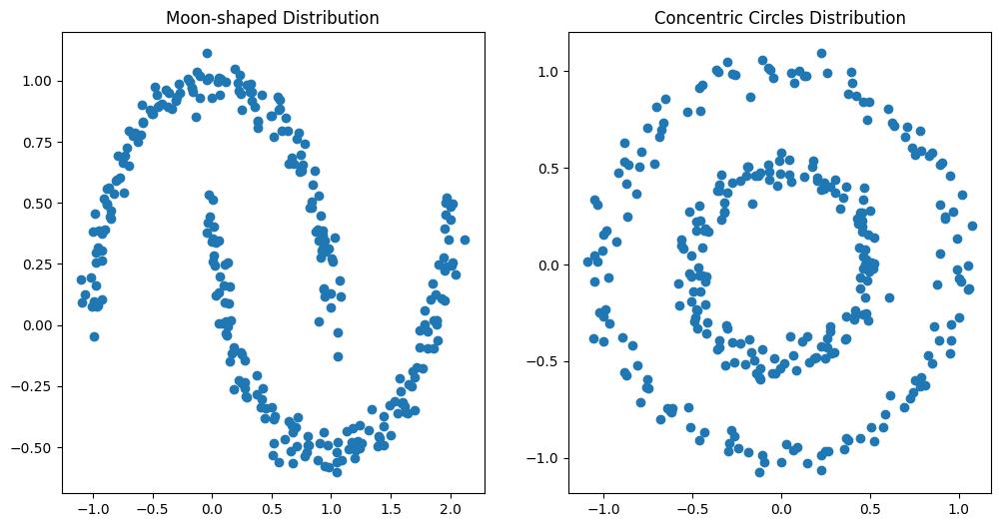
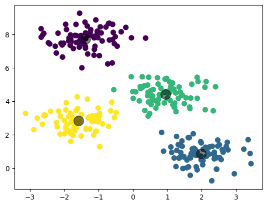
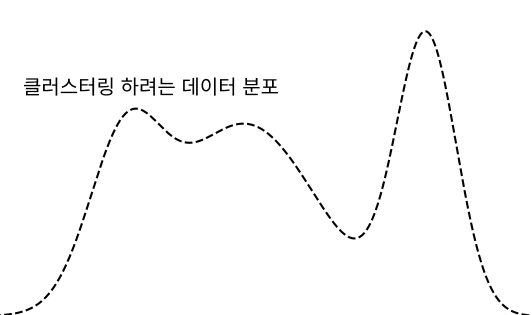
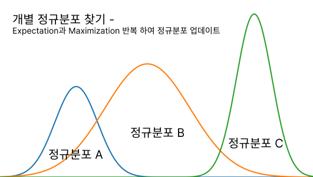
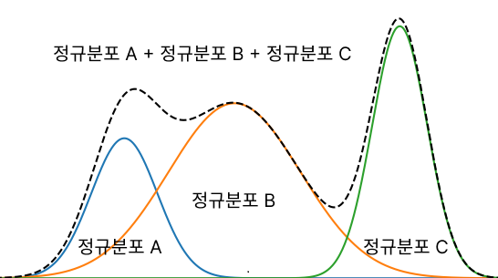
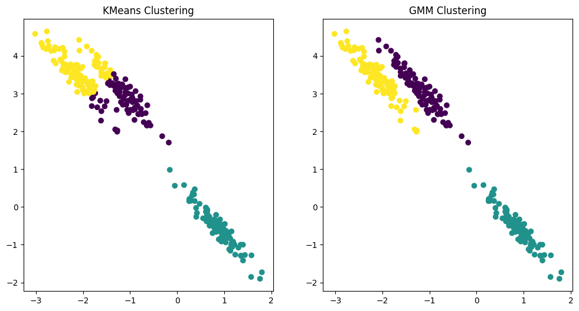

# GMM

**가우시안 혼합모델 GMM(Gaussian Mixture Model)**은 데이터를 여러 개의 가우시안 분포가 혼합된 것으로 모델링하는 알고리즘이다. **K-Means 클러스터링**이 가진 몇몇 제한점을 극복하기 위해 제안되었다. K-Means는 각 데이터 포인트를 가장 가까운 클러스터 중심에 할당하는 **하드 클러스터링 방법**이며, 클러스터의 형태가 **구형(spherical shape)**일 것이라는 가정을 한다. 반면, GMM은 각 데이터 포인트가 여러 클러스터에 소속될 수 있는 확률을 제공하는 **소프트 클러스터링 방법**으로, 클러스터가 다양한 형태와 크기를 가질 수 있다는 **보다 유연한 가정**을 합니다. 따라서 GMM은 K-Means보다 더 복잡하고 다양한 데이터 분포를 모델링할 수 있다.


다음은 K-means 클러스터링의 한계를 잘 보여주는 데이터 분포이다.




다음의 데이터분포는 K-Means로 효율적인 군집화가 가능하다.




## GMM 절차

GMM 군집화는 데이터가 **여러 개의 다른 가우시안 분포를 가지는 모델**로 가정하고 군집화를 수행한다. 1000개의 데이터 세트가 있다면 이를 구성하는 **여러개의 정규 분포 곡선을 추출**하고, 개별 데이터가 이 중 어떤 정규 분포에 속하는지 결정하는 방식이다. 

프로세스는 다음과 같다.

1. **초기화**: 클러스터의 수와 각 클러스터에 대한 초기 가우시안 분포 매개변수(평균, 공분산)를 설정한다.
2. **Expectation(기대) 단계**: 각 데이터 포인트가 각 클러스터에 속할 확률(소프트 클러스터링)을 계산한다. 이는 각 데이터 포인트가 각 가우시안 분포에 속할 가능성을 나타낸다.
3. **Maximization(최대화) 단계**: 클러스터의 매개변수(평균, 공분산)를 업데이트한다. 이는 이전 단계에서 계산된 소속 확률을 바탕으로 수행된다.
4. **반복**: 위의 기대 및 최대화 단계를 수렴할 때까지 반복한다.
5. **수렴**: 알고리즘이 수렴하면 최종 클러스터 매개변수를 사용하여 데이터의 클러스터를 결정한다.


클러스터링 하려는 데이터의 분포를 확인한다.



클러스터의 수와 각 클러스터에 대한 초기 가우시안 분포 매개변수(평균, 공분산)를 설정한다.



어떤 데이터가 어떤 정규분포에 속하는것을 찾기위해서는 GMM의 **모수 단계**를 거쳐야한다.  각 데이터 포인트가 각 클러스터에 속할 확률(소프트 클러스터링)을 계산한다. 다음의 업데이트 과정을 거친다.

1. **Expectation 단계**: 각 데이터 포인트가 각 클러스터에 속할 확률을 계산한다.

   ex) 정규분포 A에 속할 확률 (10%) + 정규분포 B에 속할 확률 (70%) + 정규분포 C에 속할 확률 (20%)

2. **Maximization 단계**: 이 확률을 바탕으로 클러스터의 매개변수(평균, 분산)를 업데이트한다. 해당 데이터가 발견될 수 있는 가능도를 최대화(Maximum likehood) 할 수 있는 방향으로 평균과 분산을 구한다.

   1. **클러스터 평균 업데이트**: 각 클러스터에 대해, 모든 데이터 포인트의 가중 평균을 계산하여 새로운 평균을 구함. 가중치는 Expectation 단계에서 계산된 소속확률임
   2. **클러스터 분산 업데이트**: 각 클러스터의 분산도 소속 확률을 가중치로 사용하여 업데이트함. 데이터 포인트와 클러스터 평균 간의 차이를 기반으로 계산함



개별 정규분포의 모수인 평균과 분산이 더 이상 반영되지 않고 각 개별 데이터들의 소속이 더 이상 변경되지 않으면 그것으로 최종 군집화를 결정한다.


## 군집화 비교

GMM군집화와 K-Means군집화를 비교하기 위해 타원형으로 늘어선 임의의 데이터 세트를 생성한다.

```python
from sklearn.datasets import make_blobs
from sklearn.cluster import KMeans
from sklearn.mixture import GaussianMixture
import matplotlib.pyplot as plt

# 길게 늘어선 모양의 데이터셋 생성
X, y = make_blobs(n_samples=300, n_features=2, centers=3, cluster_std=0.5, random_state=0)
transformation = [[0.60834549, -0.63667341], [-0.40887718, 0.85253229]]
X_aniso = np.dot(X, transformation)

# KMeans 클러스터링
kmeans = KMeans(n_clusters=3, random_state=42)
kmeans_labels = kmeans.fit_predict(X_aniso)

# GMM 클러스터링
gmm = GaussianMixture(n_components=3, random_state=42)
gmm_labels = gmm.fit_predict(X_aniso)

# 결과 시각화
plt.figure(figsize=(12, 6))

# KMeans 결과
plt.subplot(1, 2, 1)
plt.scatter(X_aniso[:, 0], X_aniso[:, 1], c=kmeans_labels, cmap='viridis')
plt.title("KMeans Clustering")

# GMM 결과
plt.subplot(1, 2, 2)
plt.scatter(X_aniso[:, 0], X_aniso[:, 1], c=gmm_labels, cmap='viridis')
plt.title("GMM Clustering")

plt.show()
```

