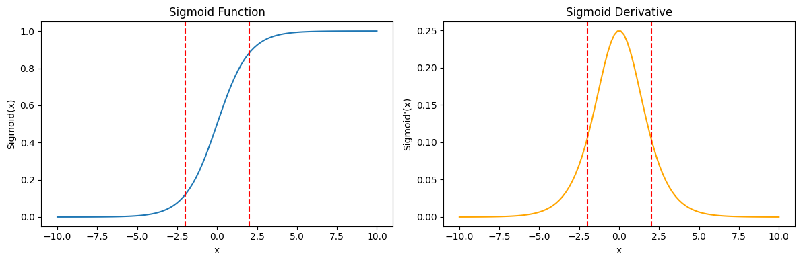
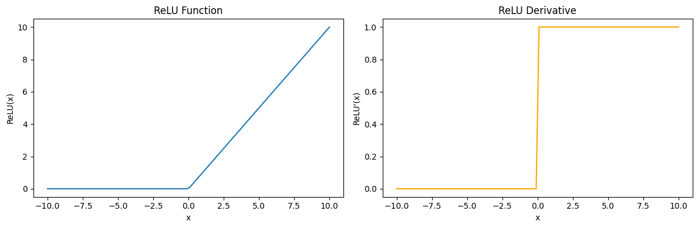
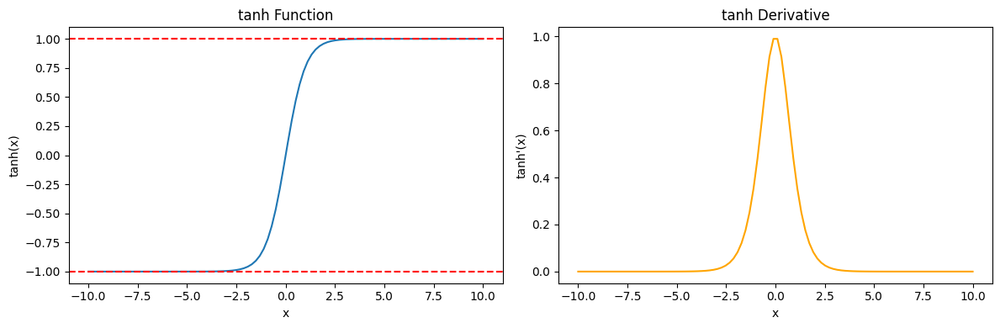

# Activation

**활성화 함수(Activation function)**는 비선형성을 도입하여 신경망이 비선형 문제를 학습할 수 있게 한다.

* Sigmoid
* ReLU
* Tanh
* Softmax


### 비선형화를 하는이유

왜 비선형 함수여야할까? x^2의 square함수를 사용하면 안될까? 이 함수를 사용하게되면 두 선형회귀 모형이 각각 -2와 2를 출력했다고 했을 때, square에 입력하면 두 값 모두 4가된다. 따라서 애초에 두 값이 -2, 2는 서로 달랐다는 정보가 소실된다.

또한 역전파 알고리즘을 사용하여 가중치를 업데이트하게 되는데, 선형 함수를 사용하면 기울기가 상수 값으로 유지된다. 신경망이 깊어질 수록 기울기 소실문제를 겪게된다. 비선형함수를 사용하면 역전파 과정에서 기울기가 적절하게 전파된다.

선형 함수는 입력과 가중치의 선형결합으로 이루어지므로 표현력이 한정적이다. 비선형 함수를 추가하면 신경망은 더 다양한 형태로 학습할 수 있다.


## 활성화 함수 선택하기

### Sigmoid

활성화 함수가 적합한 이유는 위에서 설명했다.

* 단조함수이며 비선형 함수다.
* 중간 특징의 값을 유한한 구간으로 제한해서 모델에 제약을 건다.

Sigmoid함수에도 단점은 있다. 기울기가 `hyperbolic Tangent` 에 비해서 상대적으로 평탄하기 때문에 역방향 계산에서 불리하다. 



sigmoid 함수의 최대 기울기는 0.25다. 역방향 계산에서 한 단계를 통과할 때마다 기울기값이 아무리 커도 1/4로 줄어들 수 밖에없다. 또한 sigmoid 함수의 입력 x값이 -2보다 작거나 2보다 크면 기울기는 0에 수렴한다.

(기울기 값이 크다는 것은 학습하는 데 있어 큰 장점)

**매우작은 기울기 파라미터를 전달받으면 신경망의 학습이 늦어진다.** 만약 다음 층에도 sigmoid함수를 사용한다면 기울기가 훨씬더 작아질 것이다.


sigmoid, sigmoid 미분 구현 코드

```C++
__device__ inline float sigmoid(float a) {
    return 1.0f / (1.0f + std::exp(-a));
}

__device__ inline float d_sigmoid(float a) {
    float d = 1.0f / (1.0f + std::exp(-a));
    return (1.0f - d) * d;
}
```


### ReLU

ReLU는 sigmoid와 장점과 단점이 정반대이다. ReLU의 함수값은 입력x가 0보다 작으면 0, 그렇지 않으면 x가 된다.



ReLU 함수도 선형함수처럼 생각할 수 있지만 선형함수는 `f(x) = ax + b`와 같은 형태를 가진다. ReLU는 0을 경계로 식이 달라지기 때문에 비선형함수다. ReLU는 0을 경계로 기울기가 갑자기 변하는 형태를 가진다. 이는 선형함수와는 다른 형태를 가진다. 

ReLU의 평균기울기는 0.5로 sigmoid의 0.25의 2배다.  따라서 기울기가 커진다는 장점이 있다.

이 함수는 0을 기준으로 명확하게 성질이 갈린다. 입력이 음수인 경우 항상 0이므로 학습문제가 생길 수 있다.


ReLU, ReLU 미분 구현 코드

```C++
__device__ inline float relu(float a) {
    return a > 0.0f ? a : 0.0f;
}

__device__ inline float d_relu(float a) {
    return a > 0.0f ? 1.0f:0.0f;
}
```


### Tanh

**Hyperbolic Tangent** 줄여서 **Tanh**함수는 Sigmoid와 ReLU의 중간에 위치한다고 보면된다.



일단 기울기는 sigmoid의 기울기보다 훨씬 가파르다. 최대 기울기값은 1이다.

또한 함수의 출력값으로 sigmoid는 0~1사이의 값을 가지는데 반해 tanh는 -1 ~ 1사이의 값을 가진다.


Tanh, Tanh 미분 구현 코드

```C++
__device__ inline float tanh_(float a) {
    return std::tanh(a);
}

__device__ inline float d_tanh(float a) {
    return 1.0f - std::tanh(a) * std::tanh(a);
}
```


### Softmax

**softmax**는 시그모이드와 비슷하게, 0~1사이로 변환하여 출력하지만, 출력값들의 합이 1이 되도록 하는 함수다.

주로 다중클래스 분류에서 사용하는데, 다중 클래스 분류 문제에서는 각 클래스에 대한 확률 값을 추정한다. 이 때 각 원소를 0과 1사이의 확률 값으로 변형시켜준다.


**softmax 함수에 max를 적용하는이유는?**

softmax 함수에서는 각 입력값에 대한 지수 함수를 계산한다. 지수함수의 입력값이 큰 경우 매우 큰 출력 값이 생성되며 부동 소수점 오버플로우가 발생할 수 있다. 이것을 방지하기 위해 softmax의 모든 입력값에서 max값을 빼주는 작업을 수행한다. 이렇게 출력값을 안정화 할수있다.


**log-sum-exp**

logsumexp 방법도 출력값의 안정화 방법이다. 소프트맥스 출력의 로그 값이 필요할 때 사용한다.


Softmax의 구현은 3가지 단계로 진행된다. 

softmax는 손실함수의 직전에 사용된다. 입력은 (batch_size, out_size)의 크기로 주어진다고 했을 때. 

* **max값 구하기** - 각 batch 별로 max값을 구해야한다. max[batch_size] 만큼 배열 생성
* **지수함수 적용** - 각 batch 별 분수를 구해야한다. 행 별로 요소들의 합을 구한다.
* **softmax 계산 ** - 수식대로 나눗셈을 적용한다.


```C++
__device__ inline void MyAtomicMax(float* address, float value) {
    int ret = __float_as_int(*address);
    while (value > __int_as_float(ret)) {
        int old = ret;
        if ((ret = atomicCAS_block((int*)address, old, __float_as_int(value))) == old) {
            break;
        }
    }
}

__device__ inline float softmax(float a, float sum) {
    // if (sum < 1e-7) return a / 1e7;
    return a / (sum + 1e-7);
}

// x가 0에 가까우면 log(x)는 음의 무한대.
// x가 1에 가까우면 log(1 - x)는 양의 무한대.
// x의값을 10**-7 이상 10**7 이하로 조정해야함.

__global__ void kernel_Softmax(
    float* Dst, const float* sum,
    int nrow, int ncol
) {
    int gx = blockIdx.x * blockDim.x + threadIdx.x;
    int gy = blockIdx.y * blockDim.y + threadIdx.y;

    if (gy < nrow && gx < ncol) {
        int idx = gy * ncol + gx;
        Dst[idx] = softmax(Dst[idx], sum[gy]);
    }
}

__global__ void kernel_GetMax(
    float* max, const float* Src, 
    int nrow, int ncol
) {
    int gx = blockIdx.x * blockDim.x + threadIdx.x;
    int gy = blockIdx.y * blockDim.y + threadIdx.y;

    if (gy < nrow && gx < ncol) {
        int idx = gy * ncol + gx;
        MyAtomicMax(&max[gy], Src[idx]);
    }
}

__global__ void kernel_GetSum(
    float* sum, float* Dst, const float* Src, const float* max, 
    int nrow, int ncol
) {
    int gx = blockIdx.x * blockDim.x + threadIdx.x;
    int gy = blockIdx.y * blockDim.y + threadIdx.y;

    if (gy < nrow && gx < ncol) {
        int idx = gy * ncol + gx;
        float v = std::exp(Src[idx] - max[gy]);
        atomicAdd(&sum[gy], v);
        Dst[idx] = v;
    }
}

void exec_kernel_Softmax(
    float* Dst, const float* Src, 
    int nrow, int ncol,
    const int BLOCK_SIZE
) {
    dim3 dimBlock(BLOCK_SIZE, BLOCK_SIZE, 1);
    dim3 dimGrid(
        (ncol + dimBlock.x - 1) / dimBlock.x,
        (nrow + dimBlock.y - 1) / dimBlock.y,
        1
    );
    // nrow is batchSize;
    float* max;
    float* sum;
    cudaMalloc((void**)&max, nrow * sizeof(float));
    cudaMalloc((void**)&sum, nrow * sizeof(float));
    cudaMemset(max, 0x00, nrow * sizeof(float));
    cudaMemset(sum, 0x00, nrow * sizeof(float));
    
    // GetMax
    kernel_GetMax<<<dimGrid, dimBlock>>>(
        max, Src, nrow, ncol
    );
    cudaDeviceSynchronize();

    // GetSum
    kernel_GetSum<<<dimGrid, dimBlock>>>(
        sum, Dst, Src, max, nrow, ncol
    );
    cudaDeviceSynchronize();

    // Softmax
    kernel_Softmax<<<dimGrid, dimBlock>>>(
        Dst, sum, nrow, ncol
    );
    cudaDeviceSynchronize();

    cudaFree(max);
    cudaFree(sum);
}

```


### Clip 작업

Softmax를 통과하면 Cross Entropy 식을 통과하여 Cost를 구하게된다. 

Cross Entropy 식에는 `log(x)`가 사용된다.  x가 0에 가까우면 log(x)는 음의 무한대로 발산한다. 따라서 softmax 출력 값을 제한해주는 작업이 필요하다.

```C++
Matrix softmax_pred = pred.Softmax();
softmax_pred.Clip(1e-7, 1 - 1e-7);
```


