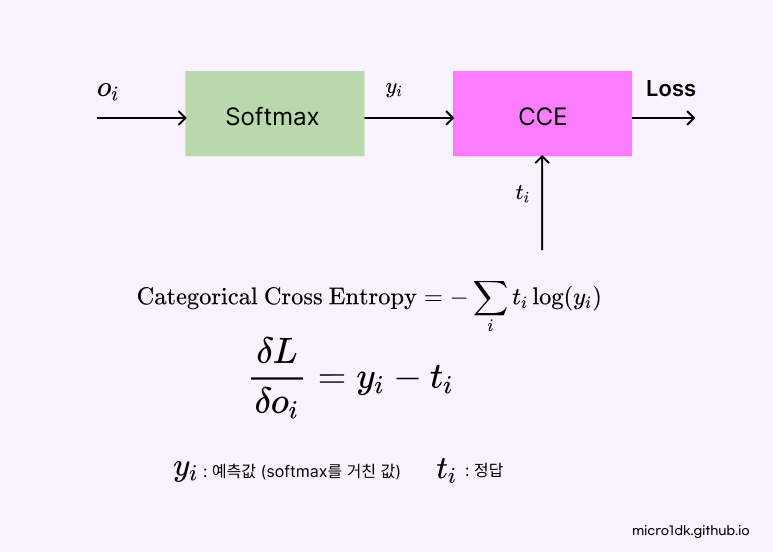
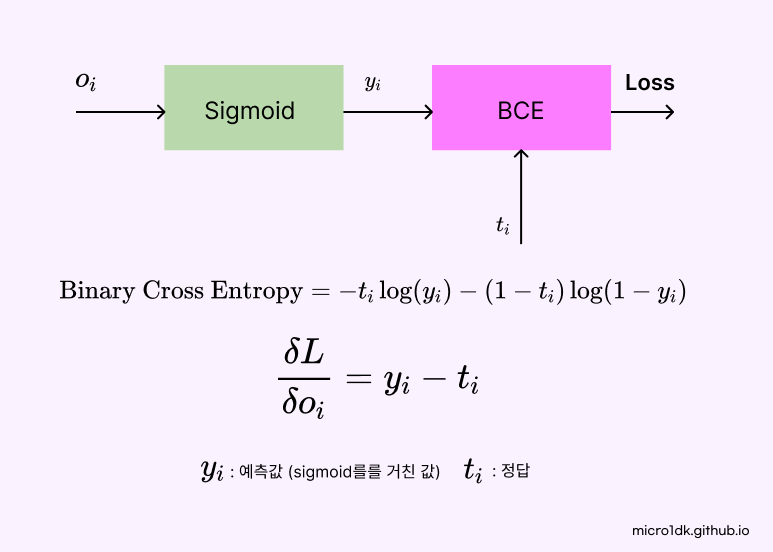

# Loss

신경망의 예측 결과와 실제값을 비교하여 예측의 오차 혹은 손실을 계산한다. 이 손실 값은 신경망이 얼마나 잘 학습하고 있는지를 측정하는 지표로 사용되며 학습 과정에서 이 손실 값을 최소화하는 방향으로 가중치를 업데이트 한다.

주로 사용되는 손실함수는

* **Mean squared Error**
* **Cross Entropy Loss**
* **Binary Cross Entropy Loss**


손실함수는 mini-batch에서 계산된다. 따라서 손실오차와 손실기울기를 계산할 때 batch_size를 나누어 주어야한다. 


## Mean Squared Error (MSE)

평균 제곱 오차는 회귀문제에서 많이 사용한다. MSE는 예측값과 실제값 차이를 제곱한 값들의 평균을 계산한다. 제곱을 하기때문에 큰 오차를 심각하게 받아들이며 큰 오차에 대해 더 큰 패널티를 부과한다.


Back Propagation의 시작은 입력에 대한 오차의 기울기부터 시작한다.

```c
__device__ inline float mse(float a, float b, float n) {
    return powf(a - b, 2) * 0.5 / n; 
}

__device__ inline float d_mse(float a, float b, float n) {
    return (a - b) / n;
}
```

* n은 batch_size


## Categorical Cross-Entropy

다중클래스분류 문제에서 사용. ex) 동물 맞추기, 쓰레기 분별




Categorical Cross-Entropy 는 각 클래스에 대한 확률 예측을 출력하는 모델에 사용한다. 손실은 One-Hot 인코딩된 레이블(정답)과 모델에 예측된 확률의 차이를 측정한다. 

각 클래스에 대한 확률은 softmax 활성화 함수를 통해 계산된다.  softmax는   


### 기울기 유도


크로네커 델타(Kronecker delta)는 수학적인 기호로 나타낸다. 행렬에서 두 인덱스가 같을 때 1이되고, 다를 때 0이되는 값을 가지는 함수이다. softmax 함수의 미분에서 해당 클래스와 관련된 항목에 대한 미분값을 선택적으로 사용하기 위해 크로네커 델타를 사용한다. i, j 인덱스가 같은경우와 아닌경우 두 가지로 분리된다.

* i = j (같은 클래스인 경우)

  이 경우 미분값은 `y_i * (1 - y_j)`가 된다. 미분 결과에 영향을 준다.

* 다른경우

  이 경우 미분값은 `- y_i * y_j`가 된다. 이때 크로네커 델타는 0을 나타낸다. 즉 미분결과에 영향을 주지 않는다.


함수의 자세한 코드는 깃 참고

```c
__device__ inline float categoricalCrossEntropy(float a, float b) {
    float t = b;
    if (b < 1e-7) t = 1e-7; // Clipping - lower bound
    return -1.0f * a * std::log(t);
}

__device__ inline float d_categoricalCrossEntropy(float a, float b, float n) {
    return (a - b) / n;
}
```

```c
// Layer - loss
float CategoricalCrossEntropy::_Output(Matrix& pred, Matrix& target) {
    softmax_pred = pred.Softmax();
    Matrix softmax_cross_entropy = softmax_pred.CategoricalCrossEntropy(target);
    float loss = softmax_cross_entropy.MatSum() / pred.ncol;
    return loss;
}
Matrix CategoricalCrossEntropy::_Grad(Matrix& pred, Matrix& target) {
    // (softmax_pred - target) / pred.ncol 와 같은 연산 
    return softmax_pred.d_CategoricalCrossEntropy(target);
}
```

* Loss 클래스에는 Softmax연산이 포함되어 있다.
* Softmax 함수를 통과한 후 categorical연산에서 Clipping 작업을 진행한다. 
* Categorical Cross Entropy 연산의 `std::log(t)` 부분에서  log의 입력이 0에 가까우면 음의 무한대로 발산한다.  따라서 너무작은 값을 1e-7로 잘라줘야한다.


## Binary Cross-Entropy

이진 분류 문제에서 사용. 예측해야 하는 클래스가 두 개인경우 ex) 스팸 이메일 탐지, 감성분석




이진교차 엔트로피는 주로 이진 분류 모델에서 사용되는 손실함수이다.  이진 분류에서 출력 계층은 sigmoid 함수를 거친다.


### 기울기 유도


Binary Cross Entropy의 기울기는 정답과 예측의 차이로 쉽게 구할 수 있다. 여기서 주의해야할 점은 SIgmoid를 통과한 예측에 대한 Loss의 변화량이아닌 Sigmoid의 입력값에 대한 Loss의 변화량이라는 점이다. 


자세한 코드는 깃허브 참고!.

```c
__device__ inline float binaryCrossEntropy(float a, float b) {
    float t = b;
    if (b < 1e-7) t = 1e-7; // clip - lower bound
    else if (b > 1 - 1e-7) t = 1 - 1e-7; // clip - upper bound
    return -1.0f * a * std::log(t) - (1 - a) * std::log(1 - t);
}

__device__ inline float d_binaryCrossEntropy(float a, float b, float n) {
    return (a - b) / n;
}
```

```c
float BinaryCrossEntropy::_Output(Matrix& pred, Matrix& target) {
    sigmoid_pred = pred.Sigmoid();
    Matrix softmax_cross_entropy = sigmoid_pred.BinaryCrossEntropy(target);
    float loss = softmax_cross_entropy.MatSum() / pred.ncol;
    return loss;
}
Matrix BinaryCrossEntropy::_Grad(Matrix& pred, Matrix& target) {
    // (sigmoid_pred - target) / pred.ncol 와 같은 연산 
    return sigmoid_pred.d_BinaryCrossEntropy(target);
}
```

* Loss 클래스에는 Sigmoid연산이 포함되어 있다.
* Sigmoid의 출력값은 0부터 1사이의 값이다.  
* Binary Cross Entropy 연산의 `std::log(t)` 와 `std::log(1-t)` 부분에서
  * log(t)에서 t가 0에가까우면 음의무한대로 발산
  * log(1-t)에서 t가 1에가까우면 음의무한대로 발산
  * 이를 종합하여 t의값은 `1e-7` 보다 크며 `1 - 1e-7` 보다 작은 값으로 제한한다.


