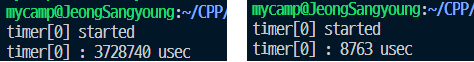

# 개발환경 구성

Cuda, C++, Linux

# Cuda

Python에서는 numpy 배열을 쉽게 다룰 수 있었다. 하지만 CUDA에서는 GPU 메모리에 직접접근하여 연산을 처리한다. 구현은 까다롭지만 고성능 컴퓨팅을 위해 배워볼 가치가 충분하다.

CUDA는 NVIDIA에서 개발한 병렬 컴퓨팅 플랫폼 및 프로그래밍 모델이다. CUDA는 기본적으로 **C 언어**를 기반으로 한다. GPU에서 동시에 많은 작업을 처리할 수 있도록 쓰레드 Block과 Grid 개념을 이용한다.

Cuda를 사용하는 목적에는

* 큰 데이터의 효율적인 연산
* 단순한 연산을 많이 수행할 때
* 복잡한 연산도 효율적으로 처리할 수 있음

예를 들어 행렬의 내적연산(Dot product)은 복잡한 연산 중 하나이다. GPU에서 병렬적으로 처리하는것이 CPU에서 처리하는 것보다 훨씬 빠르다.

1024 * 1024 의 두 행렬의 내적연산을 했을 때 측정시간 비교다. (좌 CPU, 우 GPU) 

GPU 병렬프로그래밍에서 효율성을 극대화하여 커널을 구현한것과 CPU에서 연산을 한 것과 비교하면 엄청난 차이다. 이로써 대량의 데이터와 복잡한 연산을 빠르게 처리할 수 있음을 확인하였다.

신경망과 같은 기계학습 알고리즘에서도 CUDA를 사용하여 가속화할 수 있다. 신경망은 수 많은 연산이 필요한데, 신경망 연산을 병렬적으로 수행하여 학습 및 추론속도를 향상시킬 수 있다.

# C++

딥러닝 프레임워크를 직접 만드는 목적으로 C++를 선택했다. CUDA는 기본적으로 C언어를 기반으로하며  **nvcc**라는 엔비디아에서 제공하는 컴파일러를 이용하여 cuda와 c를 동시에 컴파일할 수 있다.

그리고 본인은 지금까지 Python, Javascript와 같이 메모리를 자동으로 관리해주는 언어만 다뤄왔다.  C++로 객체지향 프로그래밍을 해보고 메모리 할당해제까지 해보는 기회가 생긴것.

# Linux

Linux환경을 선택한 이유는 다음과같다.

* CUDA 디버깅이 가능하다. (Window는 불가) CUDA-GDB 도구를 사용하여 가능하다.
* 메모리누수 체크가 가능하다. Valgrind 도구를 이용하여 메모리 누수검사, 스레드 오류감지를 할 수 있다.

