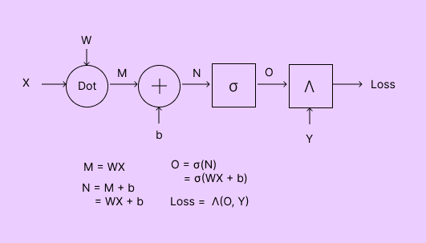
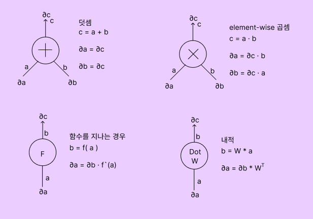
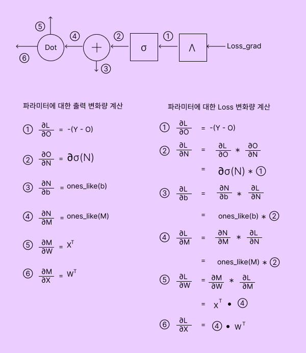

# 퍼셉트론

퍼셉트론은 인공신경망의 종류이다.  퍼셉트론은 입력 값을 받아 가중치와 계산한 후, 그 결과를 활성화 함수로 보내 결과를 출력하는 구조로 되어있다.

Multi-layer Perceptron은 인공신경망의 한 종류로, 여러개의 은닉층을 포함하는 신경망 구조다. 은닉층은 입력층과 출력층 사이에 존재하며, 입력 데이터에대한 비선형 변환을 수행한다.

다층 퍼셉트론의 학습과정은  순전파(forward propagation)와 역전파(back propagation)로 이루어진다.

## 순방향계산

### 계산 그래프

Linear layer 모델의 순전파

## 역방향계산 - 미분의 연쇄법칙

기본적인 역전파의 계산패턴을 시각적으로 나타내었다.

### 계산 그래프

Linear layer 모델의 역전파

복잡한 네트워크 (나중에 배울 LSTM, GRU등)에서 역전파가 되면 약간 혼란스러워진다. 신경망을 도식화하고 연쇄법칙을 차근차근 적용하면 어렵지 않다.

