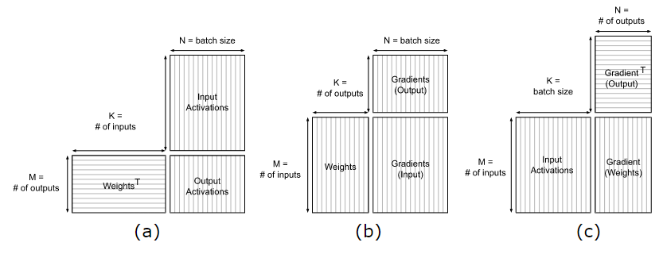
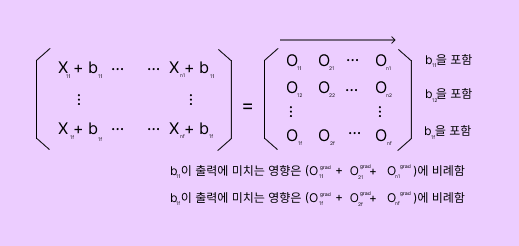

# Fully-Connected Layer

Linear Layer로도 불리는 전결합층은 딥러닝 모델에서 가장 기본적으로 사용된다. 동일한 의미로 Dense라고도 불린다.

전결합층은 입력과 가중치 행렬간의 행렬 곱으로 연산을 수행하고, 편향을 더하는 식으로 선형변환을 적용한다. 여기서 비선형변환을 수행하고, 다양한 특징을 추출해낸다.

전결합층은 주로 중간(Hidden)층으로 사용되어 다양한 특성을 학습하는데 적합하다. 마지막 출력층에서는 클래스 분류나 회귀 등의 작업을 수행할 수 있다.

하지만 모델의 파라미터가 많아지는 단점이 있어, 과적합문제가 발생할 수 있다. 따라서 적절한 정규화 기법과 Dropout으로 대책을 세워야한다.


## 파라미터 설계

[엔비디아 공식문서](https://docs.nvidia.com/deeplearning/performance/dl-performance-fully-connected/index.html)를 참고하여 개발했음.





(a) 순방향일 때 행렬연산, (b) 입력에 대한 기울기를 구할 때 연산, (c) 가중치에 대한 기울기를 구할 때 연산


Linear Layer 인스턴스를 생성했을 때 파라미터를 초기화한다. 행렬의 크기는 엔비디아에서 제공하는 페이지를 참고하여 만들었다.

```c
Linear::Linear(int input_size, int output_size, WeightInit weight_init) {
    this->W = Matrix(input_size, output_size);
    this->b = Matrix(output_size, 1);
    this->W_grad = Matrix(input_size, output_size);
    this->b_grad = Matrix(output_size, 1);
    operation = new OperationLinear(W, b, W_grad, b_grad);
    
    if (weight_init == WeightInit::HE) {
        this->W.SetRandomNormalizeData(0., sqrt(2.0/(float)input_size));
        this->b.SetRandomNormalizeData(0., sqrt(2.0/(float)input_size));
    } else if (weight_init == WeightInit::GLOROT) {
        this->W.SetRandomNormalizeData(0., 2.0/sqrt((float)(input_size + output_size)));
        this->b.SetRandomNormalizeData(0., 2.0/sqrt((float)(input_size + output_size)));
    } else {
        this->W.SetRandomNormalizeData(0., 1);
        this->b.SetRandomNormalizeData(0., 1);
    }
}
```

```
SetRanomNormalizeData(평균, 표준편차)
```

행렬을 정규분포화 하는 코드다. SetRanomNormalizeData(0, 1)은 평균을 0으로하고 표준편차가 1일 때 행렬의 원소를 정규분포화한것이다.

가중치와 편향의 초기화 코드를 볼 수 있는데, 가중치 초기화는 매우 중요한 단계다. 적절한 가중치가 초기화되면 모델의 수렴 속도와 성능에 긍정적인 영향을 미친다. 몇 가지 대표적인 가중치 초기화가 있다.


* 균등 분포(Uniform Distribution) 초기화
  * 가중치를 [-r, r] 범위의 균등 분포에서 무작위로 선택한다.
  * 
* 정규 분포(Normal Distribution) 초기화
  * 표준편차가 1일 경우 활성화함수를 통과했을 때 0과 1에 가까운 값만 출력될 수 있다. 이렇게 되면 학습이 일어나지 않는다. 기울기소실 문제.
* 글로럿 초기화(Glorot Initialization 또는 Xavier Initialization)
  * 이전 층의 뉴런 수와 다음 층의 뉴런 수를 고려하여 가중치를 초기화한다.
  * 활성화 함수를 통과했을 때 고르게 분포된다.
  * S자형 활성화 함수, 예를들어 시그모이드와 하이퍼블릭 탄젠트함수와 함께 사용한다.
  * ReLU를 사용하는 경우 데이터의 분포가 한쪽으로 치우치는 경향이있다. 이렇게되면 기울기 소실 문제가 발생한다.
* 하비에르 초기화(He Initialization)
  * 이전 층의 뉴런 수를 고려하여 가중치를 초기화한다.
  * 주로 ReLU와 함께사용한다.


## 순전파 역전파 구현

```c
Matrix OperationLinear::_Output() {
    Matrix X = inputs.at(0);
    return W.Transpose().Dot(X) + b;  // 그림 (a)
}
Matrix OperationLinear::_Grad(Matrix& output_grad) {
    Matrix X = inputs.at(0);
    W_grad += X.Dot(output_grad.Transpose()); // 그림 (c)
    b_grad += output_grad.Sum(1); // 그림 (c)
    return W.Dot(output_grad); // 그림 (B)
}
```

_Output()은 순전파의 결과를 출력하고, _Grad()는 역전파의 결과를 출력한다.


* **순전파의 출력**: 그림에서 처럼 입력(inputs, batch_size)에 가중치를 내적하여 출력(outputs, batch_size)을 리턴한다.
* **파라미터에 대한 기울기**:
  * 각 파라미터에 대한 Loss의 변화량을 저장해야한다. Layer 인스턴스의 W_grad, b_grad 멤버변수에 할당한다. (Operation 클래스에서 멤버변수를 참조자 형태로 W_grad와 b_grad를 초기화했음)
  *  편향에 대한 손실의 기울기는 Sum(1) 연산을 통해 열간 합으로 (output_size, 1)의 결과를 저장함.
    * numpy의 Sum 함수의 axis와 기능이 일치하도록 만들었음
* **입력에 대한 기울기**:
  * 입력 X에 대한 Loss의 변화량을 리턴한다. 


## 편향에 대한 손실의 기울기

신경망에서 편향을 더한다는 것은 다음을 의미한다. (features, batch_size)의 행렬로 표현되는 데이터 배치가 있고, features마다 어떤 값을 더하는 것이다. 따라서 모든 열에 같은 값이 더해진다.

역방향 계산에서 열에 해당하는 축 방향에 따라 기울기를 더한다. 




