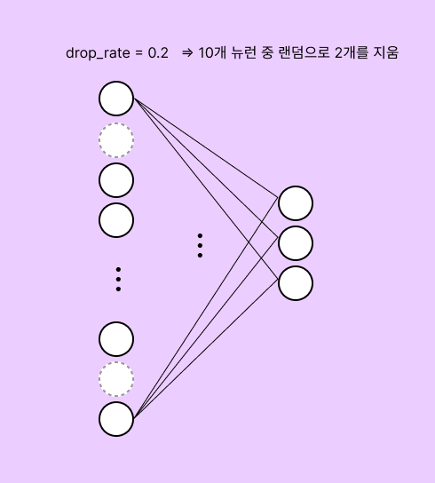
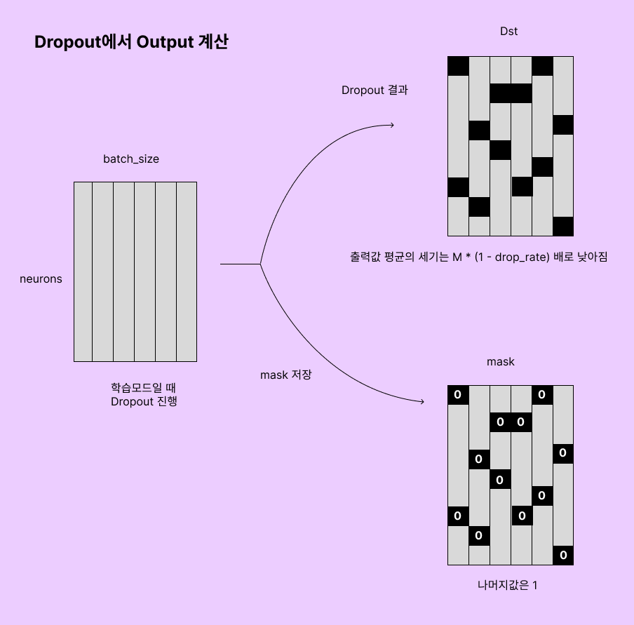
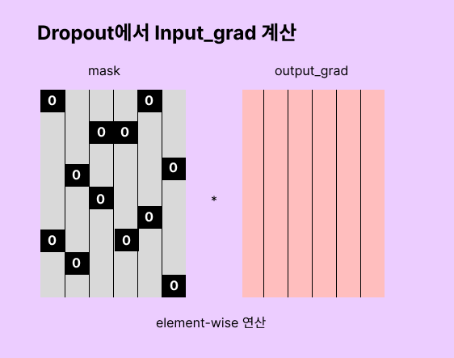

# Dropout

드롭아웃은 신경망 모델에서 과적합을 방지하는 데 사용되는 테크닉이다. 과적합이란 모델이 학습데이터에 너무 잘 맞춰져 있어서, 새로운 데이터에 대한 예측 성능이 떨어지는 현상이다.

학습 과정에서 신경망의 노드를 임의로 비활성화하여, 각 학습단계에서 다른 모델을 학습시키는 것과 같은 효과를 낸다. 이것은 학습 데이터에만 과도하게 의존하는 것을 방지한다.

드롭아웃 클래스에는 학습모드(training mode)와 추론모드(inference mode) 두 가지가 있다. 학습 모드일때는 드롭아웃이 적용되지만, 추론 모드에서는 드롭아웃이 적용되지 않는다. (검증단계에서는 적용 X)



보통 입력층에서 drop_rate를 0.3근처, 중간층에서 drop_rate를 0.5근처로 조정하며 출력층에는 드롭아웃을 하지 않는다. 그리고 입력 데이터가 적은 경우에도 드롭아웃을 하지 않는 경우도 흔히 있다.


### 오버피팅을 막을 수 있는 이유

* **복잡성감소** : 드롭아웃으로 차원이 감소해서, 학습할 때 원래 있어야 할 뉴런의 주변 뉴런이 역할을 대신 떠맡도록 학습이 진행된다. 이는 더 낮은 차원으로 학습하게된다.
* **앙상블 효과** : 훈련과정에서 서로 다른 구조의 네트워크를 여러 번 훈련시키는 것과 유사한 효과를 제공한다.


## 학습과정

Dropout은 보통 활성화 함수를 통과한 이후, 다음 레이어로의 입력 전에 적용한다.



순전파과정에서 각 배치마다 drop_rate를 적용하여 비활성화 시킨다. 




mask를 저장한 이유는 역전파에서 활용하기 위함이다. mask를 통과하여 0인 부분은 기울기를 반영하지 않겠다는 의미다.


### 커널 코드

```c++
#include <curand_kernel.h>
__device__ float dev_rate = 0.0f;

__device__ int hash(int a) {
    // http://burtleburtle.net/bob/hash/integer.html
    // 입력 정수 a를 완전히 다른 정수로 변환. 데이터를 고유하게 식별하기 위함
    a = (a ^ 61) ^ (a >> 16);
    a = a + (a << 3);
    a = a ^ (a >> 4);
    a = a * 0x27d4eb2d;
    a = a ^ (a >> 15);
    return a;
}

__global__ void kernel_Dropout(
    float* Dst, float* Mask, const float* Src, 
    int nrow, int ncol, int seed
) {
    int gy = blockIdx.y * blockDim.y + threadIdx.y;
    int gx = blockIdx.x * blockDim.x + threadIdx.x;
    if (gy < nrow && gx < ncol) {
        int nSeed = hash(seed);
        curandState_t state;

        int threadId = 
            (blockIdx.x + blockIdx.y * gridDim.x) * (blockDim.x * blockDim.y) 
            + (threadIdx.y * blockDim.x) + threadIdx.x;
        
        curand_init(seed + threadId, 0, 0, &state);
        float randn = curand_uniform(&state);

        float m = randn >= dev_rate ? 1.0 : 0.0f;
        float multiplier = (1.0 / (1.0 - dev_rate)) * m;

        Mask[gy * ncol + gx] = m;
        Dst[gy * ncol + gx] = Src[gy * ncol + gx] * multiplier;
    }
}
```

* CUDA에서 제공되는 난수발생 라이브러리 cuRAND를 이용한다.
* 커널실행 함수에서 매번 다른 seed를 인자로 받아야한다. 같은 seed를 받게되면 난수 생성기가 같은값을 계속 생성한다.
* Dropout 결과와 함께 Mask의 이진 값이 결정된다. Mask는 역전파에서 활용된다.


### 커널실행 코드

```c++
void exec_kernel_Dropout(
    float* Dst, float* Mask, const float* Src, 
    int nrow, int ncol,
    float drop_rate,
    const int BLOCK_SIZE
) {
    dim3 dimBlock(BLOCK_SIZE, BLOCK_SIZE, 1);
    dim3 dimGrid(
        (ncol + dimBlock.x - 1) / dimBlock.x,
        (nrow + dimBlock.y - 1) / dimBlock.y,
        1
    );

    struct timespec tm;
    clock_gettime(CLOCK_REALTIME, &tm);
    int seed = tm.tv_nsec;

    cudaMemcpyToSymbol(dev_rate, &drop_rate, 1 * sizeof(float), 0, cudaMemcpyHostToDevice);
    kernel_Dropout<<<dimGrid, dimBlock>>>(
        Dst, Mask, Src, nrow, ncol, seed
    );
    cudaDeviceSynchronize();
}
```

* 매번 다른 시드를 생성해서 커널함수에 전달한다.
* mask는 각 뉴런이 활성화되는지 비활성화되는지 결정하는데 사용되는 이진배열이다. 이진배열도 저장해야한다.
* mask는 입력행렬과 같은 모양을 갖는다. 마스크의 0인 위치의 뉴런은 비활성화되고, 1인 위치의 뉴런이 활성화된다는 것이다. 


### Dropout Layer 코드

```c++
Matrix Dropout::Forward(Matrix& input, bool inference) {
    if (!inference) { // 학습
        return operation->Forward(input);
    }
    return input; // 추론
}
```

* 모델 학습시 Dropout이 발동된다.
* 모델 테스트에는 발동되지 않는다.


### Dropout Operation 코드

```c++
Matrix OperationDropout::_Output() {
    Matrix X = inputs.at(0);
    if (mask.nrow == 0) {
        mask = X;
        mask.SetNum(0);
    }
    Matrix res = X.Dropout(mask, drop_rate);
    return res;
}
Matrix OperationDropout::_Grad(Matrix& output_grad) {
    Matrix X = inputs.at(0);
    return output_grad * mask;
}
```

